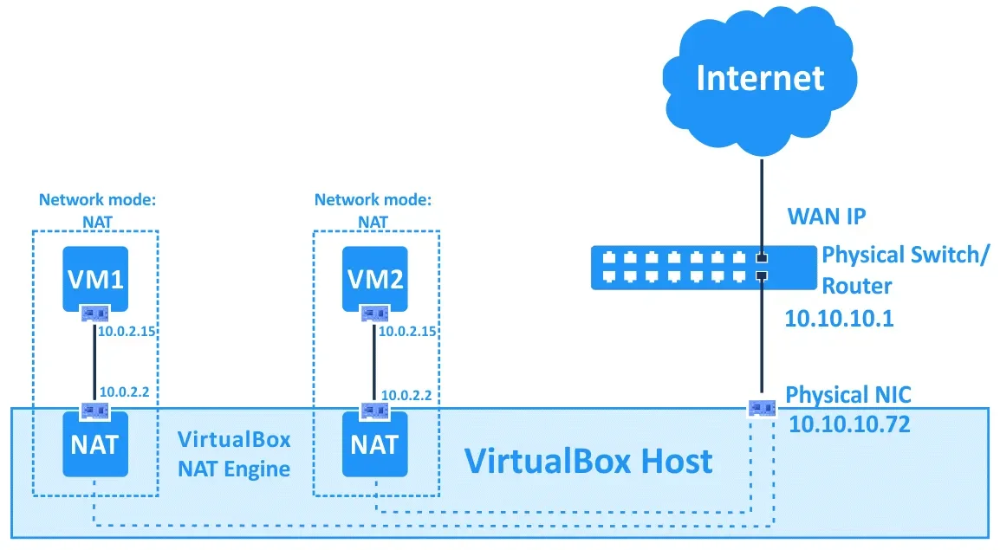
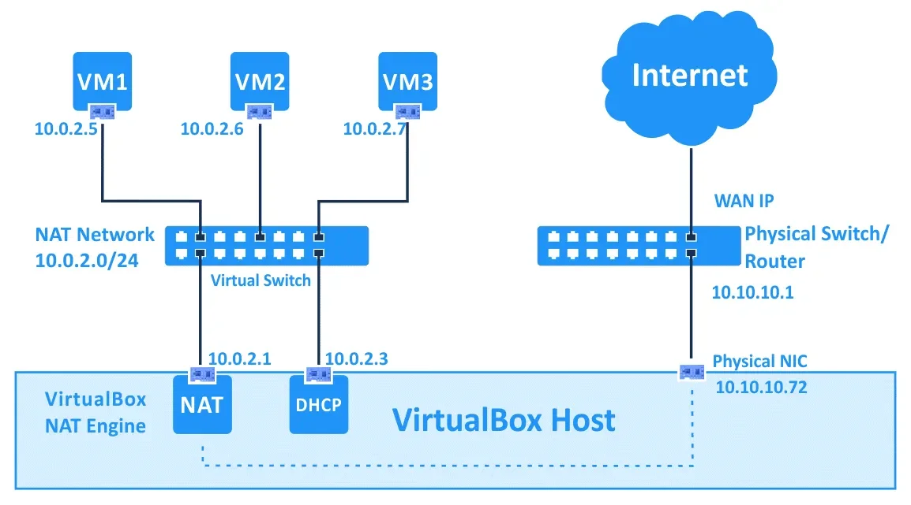
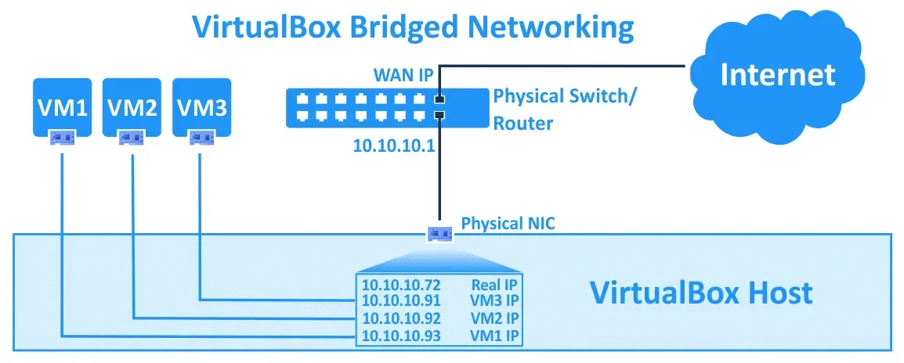
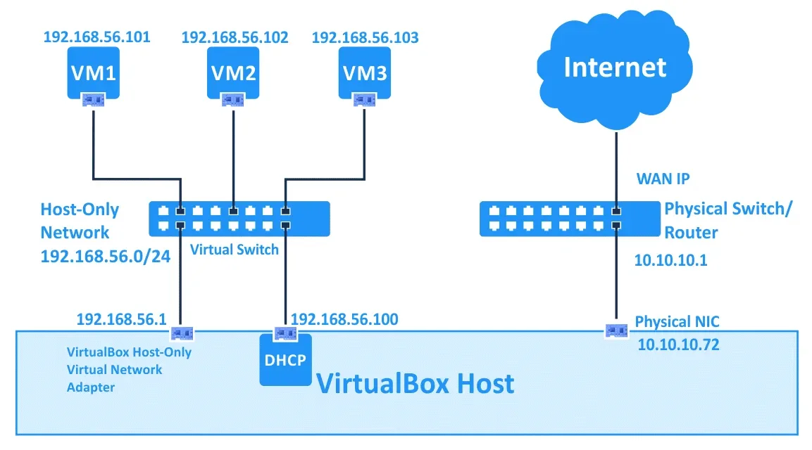

# VirtualBox 网络模式

VitualBox 具有多种网络模式，每种网络模式都可以独立配置每个虚拟网络适配器。

> 参考文章：https://www.nakivo.com/blog/virtualbox-network-setting-guide/

## NAT

这种网络模式是虚拟机适配器默认启用的，虚拟机可以通过虚拟 NAT 设备访问物理 LAN 上的主机。当 VirtualBox 网络使用 NAT 模式时，虚拟机不可以直接被主机或者网络中的其他机器访问（若要允许主机访问，必须在虚拟机网络设置**端口转发**）。虚拟机 NAT 设备使用主机的物理网络适配器作为外部网络接口。NAT 模式下使用的虚拟 DHCP 服务器的默认地址是 10.0.2.2，这个地址同样也是虚拟机的默认网关。如果配置多个虚拟机，每个虚拟机都将在私有的NAT设备后的独立网络中获得 10.0.2.15  地址在各自的独立的网络中。如果仅需要虚拟机访问互联网，这种模式就足够。

## NAT Network

这种模式与 NAT 类似，在 NAT Network 模式下，虚拟机之间可以相互访问。虚拟机可以访问在物理网络中的主机，也可以访问外部网络，而外部网络以及连接物理网络的主机不能够访问虚拟机。若要从主机访问虚拟机，必须在 Virtualbox 全局网络配置中启用**端口转发**。与 NAT 模式一样，虚拟机 NAT 设备使用主机的物理网络适配器作为外部网络接口。

## Bridged Adapter

这个模式用于将虚拟机的虚拟网卡连接到 VirtualBox 主机的物理网卡所连接的物理网络中，虚拟网络适配器使用主机网络接口来进行网络连接。VirtualBox 使用特殊的驱动程序以过滤主机物理网络适配器的数据。在这种模式下，虚拟机可以访问外部网络，以及物理网络上的主机，同时虚拟机也可以被其他虚拟机以及外部网络访问。虚拟机的 IP 地址和主机的 IP 属于同一个网络，如果网络中有 DHCP 服务器，则虚拟机网络适配器会自动获得 IP。

## Internal Network

在这种模式下虚拟机之间可以互相访问，但是不能访问物理网络上的主机以及外部网络。虚拟机也不能被主机以及任何设备访问。

在这个例子中，每个虚拟机都配置了虚拟网络适配连接到内部网络。这些虚拟网络适配器的 IP 地址由 Virtualbox 内部网络的子网定义（应该手动划分子网）。其中一个虚拟机定义了第二个虚拟网络适配器，使用了 NAT 模式。如果 VM1 的内部网络适配器的 IP 地址在 VM2 和 VM3 的网络设置中设置为网关，那么 VM2 和 VM3 就可以访问外部网络。

## Host-only Adapter

这个模式可以让虚拟机和主机之间相互访问，虚拟机之间也可以相互访问，但是不可以访问 host-only 网络之外的设备。

# 网络模式之间的比较

|                  | VM -> VM | VM -> Host |  VM <- Host  | VM -> LAN |  VM <- LAN   |
| :--------------- | :------: | :--------: | :----------: | :-------: | :----------: |
| NAT              |    🚫     |     ✅      | Port Forward |     ✅     | Port Forward |
| NAT Network      |    ✅     |     ✅      | Port Forward |     ✅     | Port Forward |
| Bridged          |    ✅     |     ✅      |      ✅       |     ✅     |      ✅       |
| Internal Network |    ✅     |     🚫      |      🚫       |     🚫     |      🚫       |
| Host-only        |    ✅     |     ✅      |      ✅       |     🚫     |      🚫       |

