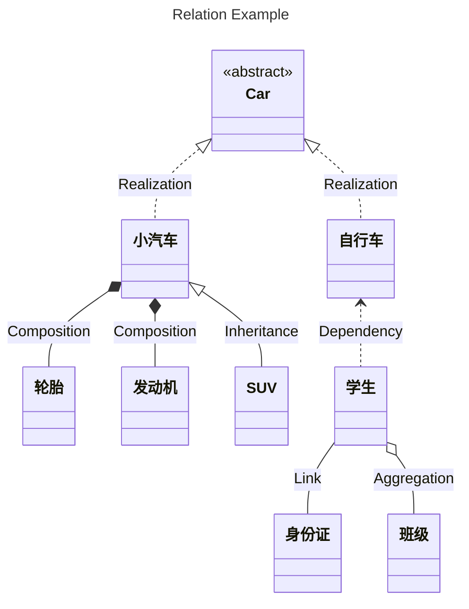
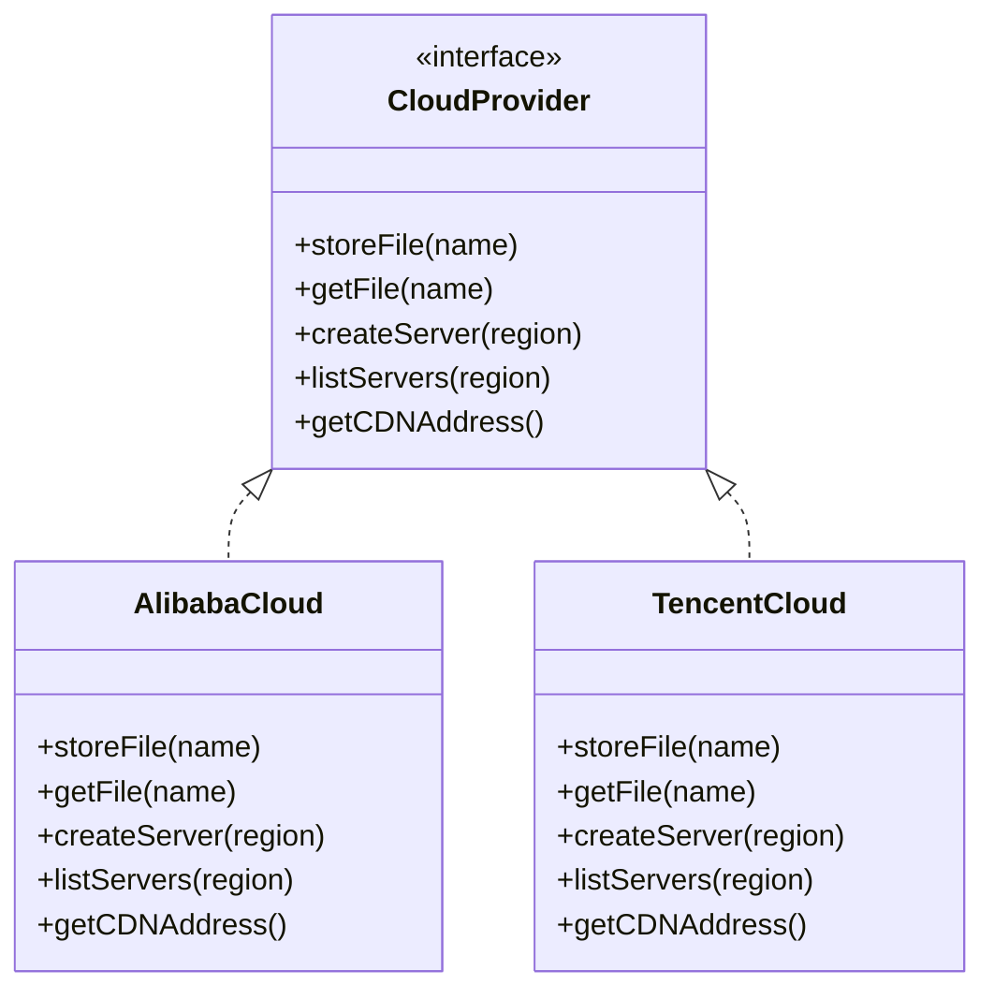
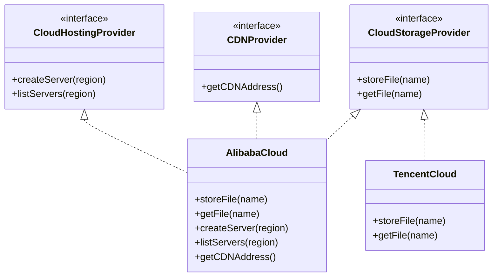
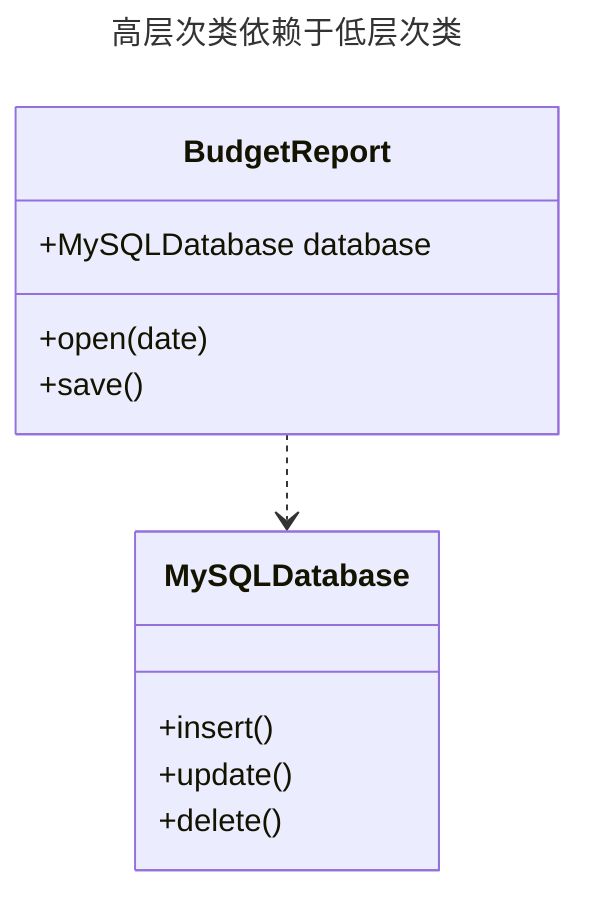
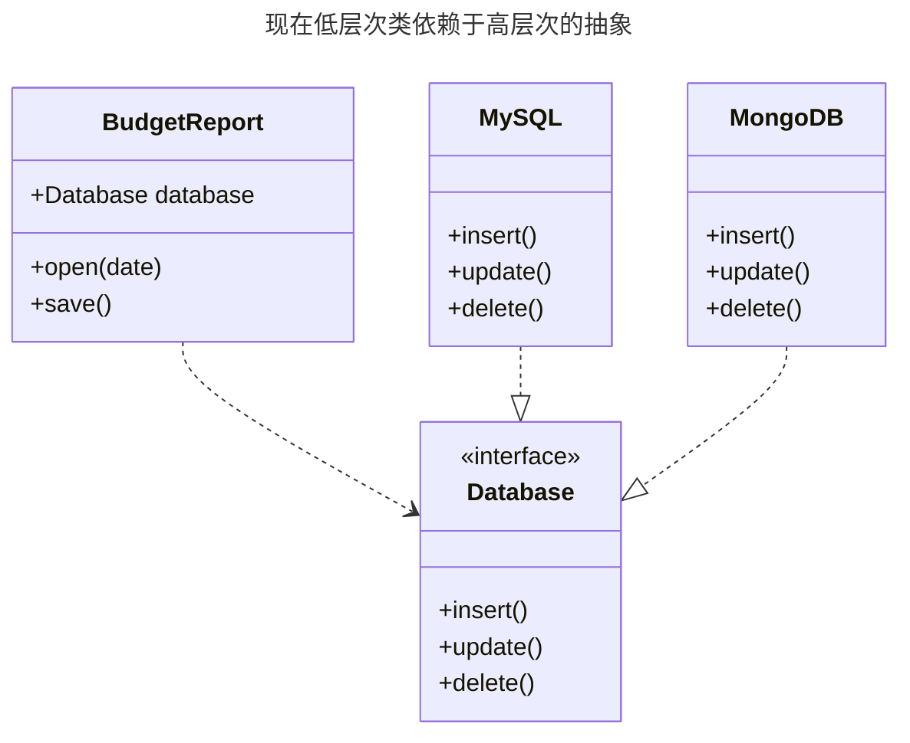
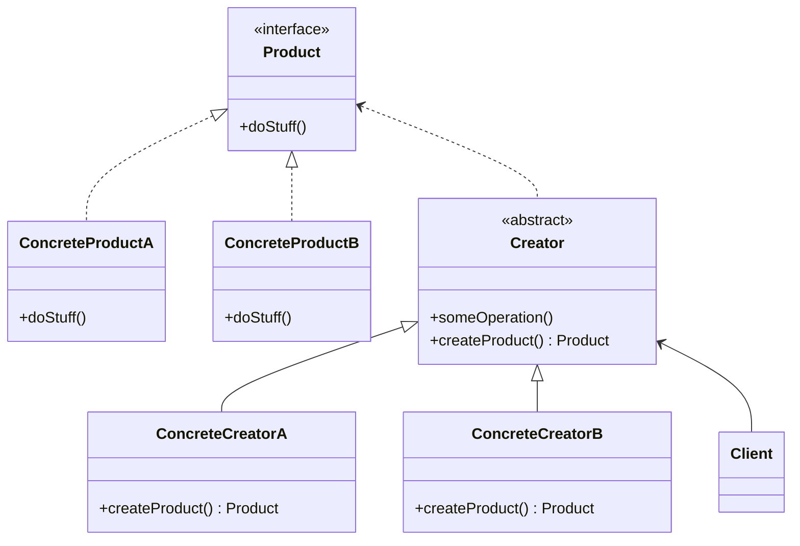
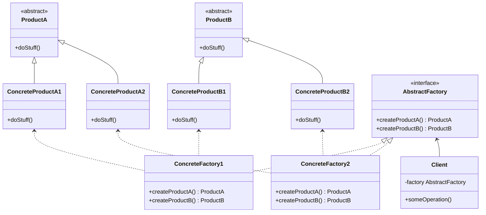
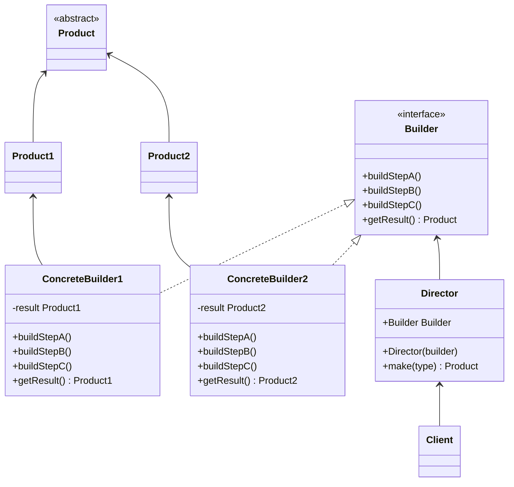

# 对象之间的关系



- 车是一个抽象类。
- 车有两个实现，小汽车和自行车与车之间的关系为**实现**（*Realization*）关系。
- 小汽车为与 SUV 之间也是继承关系，它们之间的关系为**继承**（*Inheritance*）关系。
- 小汽车与发动机之间是**组合**（*Composition*）关系。
- 学生与班级之间是**聚合**（*Aggregation*）关系。
- 学生与身份证之间为**关联**（*Association*）关系。
- 学生上学需要用到自行车，与自行车是一种**依赖**（*Dependency*）关系。

> 聚合关系用于表示实体对象之间的关系，表示整体由部分构成的语义。与组合关系不同的是，整体和部分不是强依赖的，即使整体不存在了，部分仍然存在。组合关系同样表示整体由部分构成的语义，但组合关系是一种强依赖的特殊聚合关系，如果整体不存在了，则部分也不存在了。

# SOLID 原则

## 单一职责原则（*Single Responsibility Principle*）

尽量让每个类只负责软件中的一个功能，并将该功能完全封装在该类中。

## 开闭原则（*Open-Closed Principle*）

对于扩展，类应该是“开放”的， 对于修改， 类则应是“封闭”的。本原则的主要理念是在实现新功能时能保持已有代码不变。如果你可以对一个类进行扩展，可以创建它的子类并对其做任何事情（如新增方法或成员变量、重写基类行为等）， 那么它就是开放的。有些编程语言允许你通过特殊关键字（例如`final`）来限制对于类的进一步扩展， 这样类就不再是“开放”的了。如果某个类已做好了充分的准备并可供其他类使用的话（即其接口已明确定义且以后不会修改），那么该类就是封闭的。

## 里氏替换原则（*Liskov Substitution Principle*）

当你扩展一个类时，应该要能在不修改客户端代码的情况下将子类的对象作为父类对象进行传递，这意味着子类必须保持与父类行为的兼容。在重写一个方法时，你要对父类行为进行扩展，而不是将其完全替换。替换原则是用于预测子类是否与代码兼容，以及是否能与其父类对象协作的一组检查。

- 子类方法的参数类型必须与其父类的参数类型相匹配或更加抽象。

- 子类方法的返回值类型必须与父类方法的返回值类型或是其子类相匹配。

- 子类中的方法不应抛出基础方法预期之外的异常类型。

- 子类不应该加强其前置条件。

    例如，父类的方法有一个`int`类型参数，如果子类重写该方法，要求传递的参数必须为正数，否则抛出异常，这就是加强了前置条件。客户端代码之前将负数传递给该方法时程序能够正常运行，但现在使用子类的对象时会使程序出错。

- 子类不能削弱其后置条件。

    假如你的某个类中有个方法需要使用数据库，该方法应该在接收到返回值后关闭所有活跃的数据库连接。现在创建了一个子类并对其进行了修改，使得数据库保持连接以便重用，但客户端可能对你的意图一无所知，由于它认为该方法会关闭所有的连接，因此可能会在调用该方法后就马上关闭程序，使得无用的数据库连接对系统造成“污染”。

- 父类的不变量必须保留。

- 子类不能修改父类中的私有成员变量的值。

## 接口隔离原则（*Interface Segregation Principle*）

客户端不应该被强迫依赖于其不使用的方法。尽量缩小接口的范围，使得客户端的类不必实现其不需要的行为。



不是所有客户端都能满足复杂接口的要求，例如有些云服务提供商没有部分方法所提供的功能。更好的方法是将接口拆分为多个部分：



## 依赖倒置原则（*Dependency inversion principle*）

实体必须依赖于抽象，而不是具体。即高层次的类不应该依赖于低层次的类，两者都应该依赖于抽象接口。

低层次类实现基础操作（例如磁盘操作、传输网络数据和连接数据库），高层次类包含复杂业务逻辑以指导低层次类执行特定操作。有时人们会先设计低层次的类，然后才会开发高层次的类，当你在新系统上开发原型产品时，这种情况很常见。由于低层次的东西还没有实现或不确定，你甚至无法确定高层次类能实现哪些功能。如果采用这种方式，业务逻辑类可能会更依赖于低层次的类。



高层次类`BudgetReport`使用低层次类`MySQLDatabase`来读取和保存数据，低层次的类发生任何改变都会影响到高层次的类，但是高层次的类不应该关注数据存储的细节。要解决这个问题，可以创建一个描述读写操作的高层接口，并让`BudgetReport`使用这个接口来代替低层次类，然后可以修改或者或者扩展低层次类来实现业务逻辑接口：



# 创建型模式

创建型模式提供了创建对象的机制，能够提升已有代码的灵活性和可复用性。

## 工厂方法

工厂方法模式将创建产品的代码与实际使用产品的代码分离， 从而能在不影响其他代码的情况下扩展产品创建部分代码。



- `Product`表示产品接口。

- `ConcreteProduct`表示具体产品。

- `Creator`声明返回产品对象的工厂方法。

    ```
    // 使用ConcreteCreatorA类的工厂方法
    Creator creator = new ConcreteCreatorA();
    Product product = creator.createProduct();
    product.doStuff();
    ```

- `ConcreteCreator`表示具体的工厂方法类，会重写父类工厂方法，使其返回不同类型的产品。

    ```
    // ConcreteCreatorA类
    Product createProduct(){
    	return new ConcreteProductA();
    }
    
    // ConcreteCreatorB类
    Product createProduct(){
    	return new ConcreteProductB();
    }
    ```
    
- 客户端`Client`通过调用高层次的抽象来创建产品：

    ```
    Creator creator = new ConcreteCreator();
    Product product = creator.createProduct();
    product.doStuff();
    ```

## 抽象工厂



- **抽象产品**`Product`，例如椅子、沙发。

- **具体产品**`ConcreteProduct`是抽象产品的多种不同类型的实现，例如现代风格椅子、维多利亚椅子。

- **抽象工厂**`AbstractFactory`声明了一组创建各种抽象产品的方法。

- **具体工厂**`ConcreteFactory`实现了抽象工厂中的方法，每个具体工厂都对应特定的产品变体，且仅创建此种产品变体。例如现代风格工厂只创建现代风格椅子和沙发。

- 客户端代码只需通过抽象接口调用工厂和产品对象，就能和任何具体工厂、产品变体交互。

    ```
    ProductA product = factory.createProductA();
    ```

## 生成器

生成器模式将一个复杂对象的构建与它的表示分离，使得同样的构建过程可以创建不同的表示。例如 Java 中`java.lang.Appendable`接口的实现`java.lang.StringBuffer`、`java.lang.StringBuilder`。



- 生成器接口`Builder`声明了在所有类型生成器中通用的产品构造步骤。

- 具体生成器`ConcreteBuilder`提供构造过程的不同实现，具体生成器也可以构造不遵循通用接口的产品。

- 产品`Product`是最终生成的对象，由不同生成器构造的产品无需属于同一类层次结构或接口。

- 主管`Director`定义调用构造步骤的顺序，这样就可以创建和复用特定的产品配置。

    ```
    make(type){
        if(type == 'simple'){
    		builder.buildStepA();
        }else{
    		builder.buildStepA();
    		builder.buildStepB();
        }
    }
    ```

- 客户端`Client`将某个具体生成器对象与主管类关联，此后主管类就能使用生成器对象完成后续所有的构造任务。

    ```
    Builder builder = new ConcreteBuilder();
    Director direcotr = new Director(builder);
    Product product = director.make(type);
    ```

## 原型

原型模式能够复制已有对象，而又无需使代码依赖它们所属的类。

```

```


## 单例

# 结构型模式

# 行为模式
