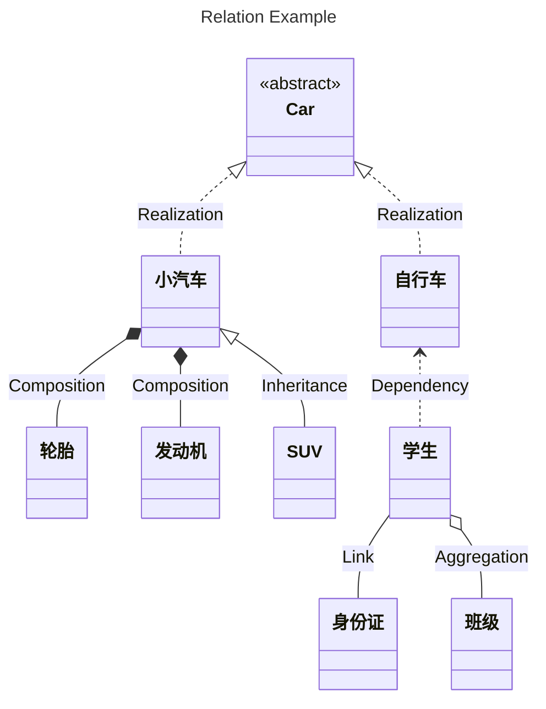
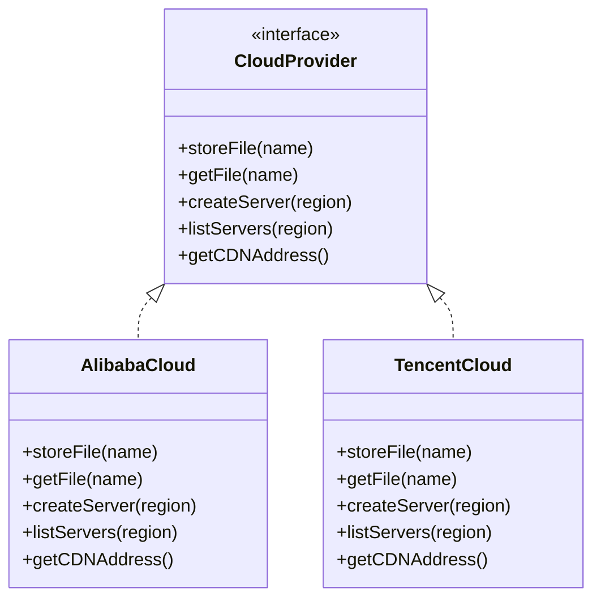
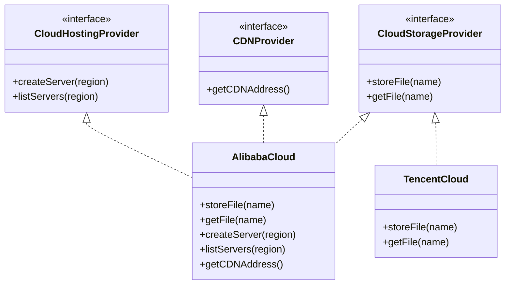
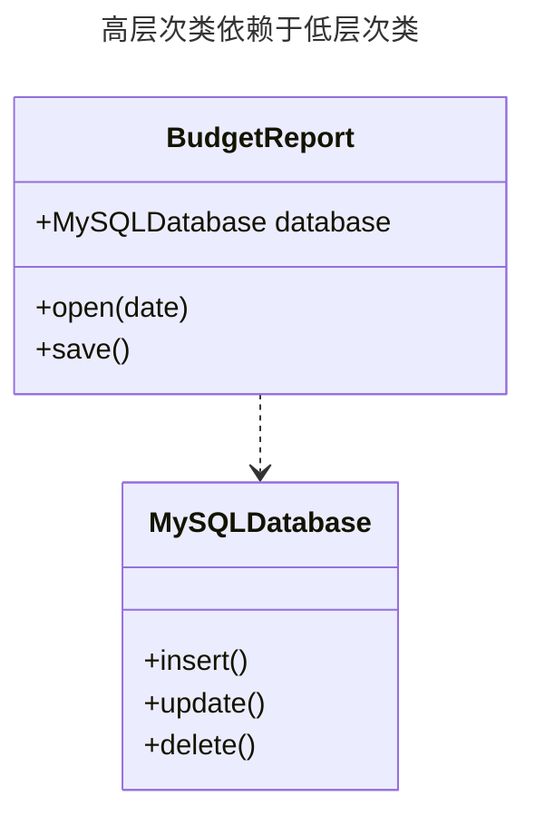
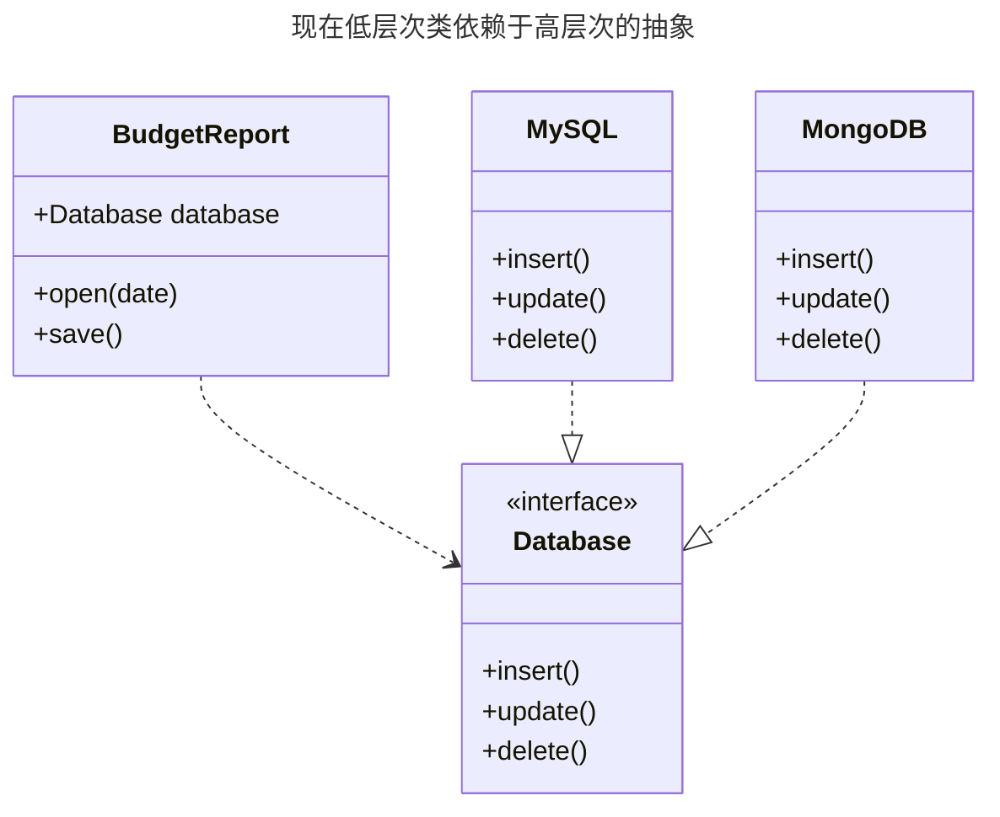

# 对象之间的关系

- 车是一个抽象类。
- 车有两个实现，小汽车和自行车与车之间的关系为**实现**（*Realization*）关系。
- 小汽车为与 SUV 之间也是继承关系，它们之间的关系为**继承**（*Inheritance*）关系。
- 小汽车与发动机之间是**组合**（*Composition*）关系。
- 学生与班级之间是**聚合**（*Aggregation*）关系。
- 学生与身份证之间为**关联**（*Association*）关系。
- 学生上学需要用到自行车，与自行车是一种**依赖**（*Dependency*）关系。

> 聚合关系用于表示实体对象之间的关系，表示整体由部分构成的语义。与组合关系不同的是，整体和部分不是强依赖的，即使整体不存在了，部分仍然存在。组合关系同样表示整体由部分构成的语义，但组合关系是一种强依赖的特殊聚合关系，如果整体不存在了，则部分也不存在了。

# SOLID 原则

## 单一职责原则

尽量让每个类只负责软件中的一个功能，并将该功能完全封装在该类中。

## 开闭原则

对于扩展，类应该是“开放”的， 对于修改， 类则应是“封闭”的。本原则的主要理念是在实现新功能时能保持已有代码不变。如果你可以对一个类进行扩展，可以创建它的子类并对其做任何事情（如新增方法或成员变量、重写基类行为等）， 那么它就是开放的。有些编程语言允许你通过特殊关键字（例如 `final`）来限制对于类的进一步扩展， 这样类就不再是“开放”的了。如果某个类已做好了充分的准备并可供其他类使用的话（即其接口已明确定义且以后不会修改），那么该类就是封闭的。

## 里氏替换原则

当你扩展一个类时，应该要能在不修改客户端代码的情况下将子类的对象作为父类对象进行传递，这意味着子类必须保持与父类行为的兼容。在重写一个方法时，你要对父类行为进行扩展，而不是将其完全替换。替换原则是用于预测子类是否与代码兼容，以及是否能与其父类对象协作的一组检查。

- 子类方法的参数类型必须与其父类的参数类型相匹配或更加抽象。

- 子类方法的返回值类型必须与父类方法的返回值类型或是其子类相匹配。

- 子类中的方法不应抛出基础方法预期之外的异常类型。

- 子类不应该加强其前置条件。

    例如，父类的方法有一个 `int` 类型参数，如果子类重写该方法，要求传递的参数必须为正数，否则抛出异常，这就是加强了前置条件。客户端代码之前将负数传递给该方法时程序能够正常运行，但现在使用子类的对象时会使程序出错。

- 子类不能削弱其后置条件。

    假如你的某个类中有个方法需要使用数据库，该方法应该在接收到返回值后关闭所有活跃的数据库连接。现在创建了一个子类并对其进行了修改，使得数据库保持连接以便重用，但客户端可能对你的意图一无所知，由于它认为该方法会关闭所有的连接，因此可能会在调用该方法后就马上关闭程序，使得无用的数据库连接对系统造成“污染”。

- 父类的不变量必须保留。

- 子类不能修改父类中的私有成员变量的值。

## 接口隔离原则

客户端不应该被强迫依赖于其不使用的方法。尽量缩小接口的范围，使得客户端的类不必实现其不需要的行为。

不是所有客户端都能满足复杂接口的要求，例如有些云服务提供商没有部分方法所提供的功能。更好的方法是将接口拆分为多个部分：

## 依赖倒置原则

实体必须依赖于抽象，而不是具体。即高层次的类不应该依赖于低层次的类，两者都应该依赖于抽象接口。

低层次类实现基础操作（例如磁盘操作、传输网络数据和连接数据库），高层次类包含复杂业务逻辑以指导低层次类执行特定操作。有时人们会先设计低层次的类，然后才会开发高层次的类，当你在新系统上开发原型产品时，这种情况很常见。由于低层次的东西还没有实现或不确定，你甚至无法确定高层次类能实现哪些功能。如果采用这种方式，业务逻辑类可能会更依赖于低层次的类。

高层次类 `BudgetReport` 使用低层次类 `MySQLDatabase` 来读取和保存数据，低层次的类发生任何改变都会影响到高层次的类，但是高层次的类不应该关注数据存储的细节。要解决这个问题，可以创建一个描述读写操作的高层接口，并让 `BudgetReport` 使用这个接口来代替低层次类，然后可以修改或者或者扩展低层次类来实现业务逻辑接口：

# 设计模式

具体设计模式请看 https://refactoringguru.cn/design-patterns/catalog。
