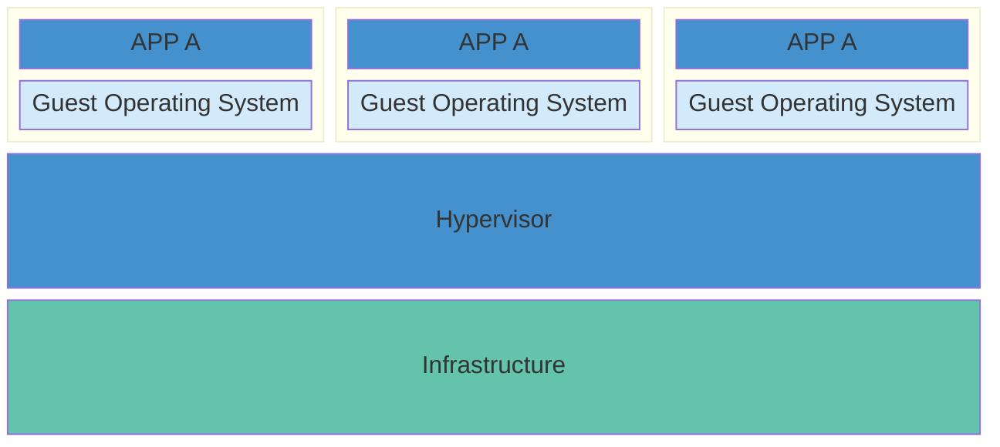
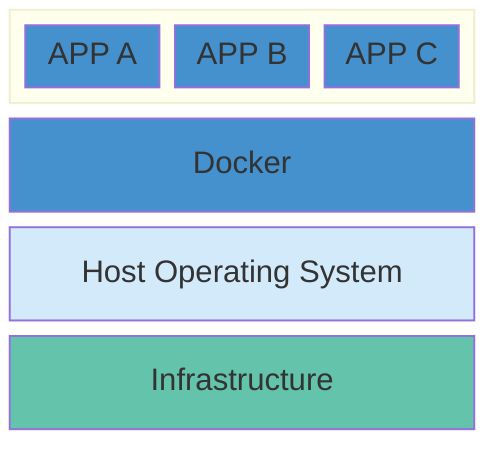
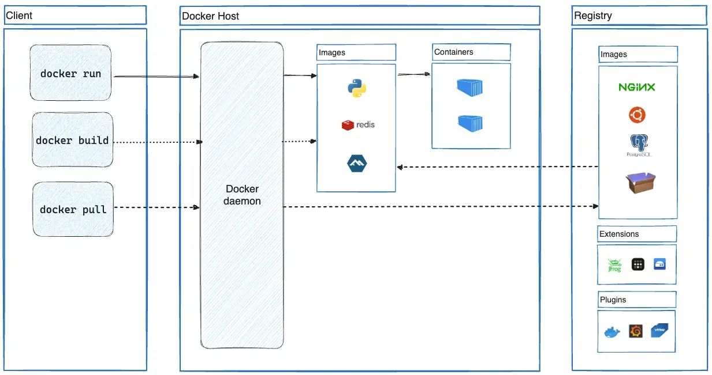

# 概括

**虚拟机**（VM）是将一台服务器转换为多台服务器的物理硬件的抽象。Hypervisor 允许多个 VM 在一台机器上运行。每个 VM 都包含一个操作系统、应用程序、必要的二进制文件和库的完整副本，这些文件占用了数十 GB，VM 启动也可能很慢。



**容器**是软件的标准单元，是应用程序层的一个抽象，它将代码和依赖关系打包在一起，以便应用程序在不同的计算环境之间快速可靠地运行。多个容器可以运行在同一台机器上，并与其他容器共享操作系统内核，每个容器都作为用户空间中的独立进程运行。容器比 VM 占用更少的空间，可以处理更多的应用程序。



Docker 是一个把开发的应用程序自动部署到容器的开源引擎，Docker 在虚拟化的容器执行环境中增加了一个应用程序部署引擎，用来提供一个轻量、快速的环境用来运行开发者的程序。



Docker 核心组件：

- The Docker daemon

  Docker 守护程序（dockerd）监听 Docker API 请求，并管理 Docker 对象，如图像、容器、网络和卷。守护程序还可以与其他守护程序通信来管理 Docker 服务。

- The Docker client

  Docker 客户端是和 Docker 交互的主要方式，当使用 docker run 等命令时，客户端会将这些命令发送到 dockerd，dockerd 会执行这些命令，docker 命令使用 Docker API。Docker 客户端可以与多个守护程序进行通信。

- Docker Registry

  Docker 使用 Registry 来保存用户构建的镜像，Registry 分为公共和私有两种，Docker 公司运营的公共 Registry 叫做 Docker Hub，用户可以分享保存自己的镜像。

- Docker 镜像

  用户基于镜像（image）来运行自己的容器。


- Docker 容器

  容器（container）是基于镜像启动的，容器可以运行一个或多个进程。每个容器都包含一个软件镜像，容器中的软件可以进行一些操作，如创建、启动、关闭和销毁。Docker 在执行操作时，不关心容器中到底塞进了什么，所有容器都按照相同的方式将内容装载进去。

# 安装

参考官网[安装说明](https://docs.docker.com/engine/install/)，或者镜像站[安装说明](https://mirrors.tuna.tsinghua.edu.cn/help/docker-ce/)。安装完成后可以使用 `docker info` 来查看信息。

# 镜像

搜索一个镜像：

```shell
# 搜索镜像，默认搜索官方仓库中的镜像
docker search <NAME>
```

从 registry 中下载一个镜像，如果不指定 tag，默认会选择 latest 标签，下载仓库中最新版本：

```shell
docker pull <NAME[:TAG]>
# 可以选择从其他 registry 的仓库下载
docker pull <REGISTRY/NAME[:TAG]>
```

可以使用 `docker iamges` 命令来查看本机已有的镜像，其中列出的信息中 IMAGE ID 表示镜像 ID，是镜像的唯一标识。

```shell
# 查看已有的镜像
docker images
```

为了方便后续使用镜像，可以使用 `docker tag` 来为本地镜像添加新的标签

```shell
docker tag <SOURCE_IMAGE[:TAG]> <TARGET_IMAGE[:TAG]>
```

> [!NOTE]
>
> 这些不同标签的镜像的 ID 是完全⼀致的，说明它们实际指向了同一个镜像文件，标签在这⾥起到了引⽤或快捷⽅式的作⽤。

使用 `docker inspect` 可以查看镜像的详细信息，这里返回的是一个 JSON 格式的消息。

```shell
# 可以使用名称或者ID
docker inspect <NAME|ID>
```

使用 `docker rmi` 来删除一个镜像：

```shell
# 删除镜像
docker rmi NAME[:TAG]
# 删除所有指向该镜像的标签，然后删除镜像
# 当该镜像创建的容器存在时，镜像文件默认是无法删除的，可以使用 -f 参数强制删除
docker rmi <ID>
```

> [!WARNING]
>
> 不推荐使用 `-f` 强制删除一个存在容器依赖的镜像，这样可能会造成一些遗留问题。

当需要导出或导入镜像时，可以将一个或者多个镜像归档到一个文件中，再从这个文件中导入镜像。

```shell
# 保存一个或者多个镜像到STDOUT中，-o表示指定归档文件代替标准输出流
docker save [OPTIONS] IMAGE [IMAGE...]
# 从 STDIN 中加载一个镜像，-i 表示指定归档文件代替标准输入流
docker load [OPTIONS] <archive>
```

> [!TIP]
>
> 可以简写为：
>
> ```shell
> docker save IMAGE_1 IMAGE_2 > archive.tar
> docker laod < archive.tar
> ```

如果需要上传镜像到仓库，首先需要登陆，默认会上传到官方仓库中。

```shell
# -u 表示用户名，-p 表示密码
docker login [OPTIONS] [SERVER]
# 退出登陆
docker loginout
# 上传镜像到仓库中
docker push NAME[:TAG]
```

# 容器

若要查看容器，使用 `docker ps`：

```shell
# 默认显示正在运行的容器，-a 表示显示所有的容器
docker ps [OPTIONS]
```

使用 `docker create` 可以创建一个容器，新建的容器处于停止状态。可以使用 `docker start` 来启动这个容器。

```shell
# 创建容器
docker create [OPTIONS] <IMAGE> [COMMAND] [ARG...]
# 启动容器
docker start <CONTAINER>
# 停止容器
docker stop <CONTAINER>
# 重启容器
docker restart <CONTAINER>
# 删除容器，-f表示强制终止并删除一个容器，-v表示同时删除容器挂载的匿名数据卷
docker rm [OPTIONS] <CONTAINER> [CONTAINER...]
# 显示日志
docker logs <CONTAINER>
```

> [!NOTE]
>
> 常用命令选项如下：
>
> - `-i`：保持标准输入流一直打开。
> - `-t`：分配一个伪终端并绑定到容器的标准输入流，通常与 `-i` 一起使用。
> - `-d`：在后台运行容器同时打印容器 ID。
> - `--name`：给容器分配一个名字。
> - `-p`：指定端口映射，例如 `-p 80:90`，将容器的80端口映射到主机的90端口。
> - `-P`：随机端口映射，容器内部端口映射到主机随机端口。
> - `--rm`：退出时自动移除容器。
> - `-v`：创建一个数据卷，多次使用可以创建多个数据卷。
> - `-e`：指定环境变量。

更快捷的方式，使用 `docker run` 直接从一个镜像中创建和运行一个容器，这个命令首先检查本地是否存在指定镜像，不存在就在公共仓库下载，然后使用镜像创建并启动一个容器，分配文件系统，并在只读的镜像层外面挂载一层可读可写层，从宿主主机配置的网桥接口中桥接一个虚拟接口到容器中，从地址池配置一个 IP 地址给容器，执行完用户指定的应用程序，执行完后容器被终止。

```shell
docker run [OPTIONS] <IMAGE> [COMMAND] [ARG...]
```

> [!NOTE]
>
> 当容器中指定的应用程序终结时，容器也会自动终止。例如启动一个终端 `docker run -it ubuntu /bin/bash`，当退出这个终端时这个容器也就处于终止状态。

有时候需要进入容器进行操作，这时可以使用  `docker attach` 或者 `docker exec` 命令。使用 `attach` 时，当多个窗口同时 `attach` 到一个容器的时候，所有窗口都会同步显示，当某个窗口因命令阻塞时，其他窗口就无法执行操作了。更常见的是使用 `docker exec`。

```shell
docker attach CONTAINER
docker exec <CONTAINER> <COMMAND> [ARG...]
```

可以基于已有的容器来创建一个新的镜像：

```shell
# -a 表示作者信息，-m 表示提交信息，-p 表示创建时暂停容器运行
docker commit [OPTIONS] CONTAINER [REPOSITORY[:TAG]]
```

若要导入或者导出容器快照到本地镜像库中：

```shell
# 导出容器文件系统作为 tar 归档文件，-o 表示输出到文件代替标准输出流
docker export [OPTIONS] CONTAINER
# 导入容器
docker import [OPTIONS] file|URL|- [REPOSITORY[:TAG]]
```

> [!NOTE]
>
> `docker commit` 用于将一个容器的状态保存为一个新的镜像，当你在一个容器内进行了某些修改（例如安装软件、更改配置等），可以通过这个命令把这些修改保存到一个新的镜像中。当你需要基于现有容器快速创建包含特定修改的新镜像时这种方式非常有用。不过需要注意的是，这种方式创建的镜像缺乏透明性和可重复性，因为没有明确记录构建过程中的具体操作步骤。
>
>  `docker export` 仅导出容器当前文件系统的快照，不保存容器的历史记录或元数据。

# 数据管理

用户在使用 Docker 过程中，往往需要查看容器内应用产生的数据，或者需要把容器内的数据进行备份，甚至多个容器之间进行数据的共享，这些涉及到容器的数据管理操作，容器中管理数据主要有两种方式：**数据卷**和**数据卷容器**。

## 数据卷

数据卷（*Data Volumes*）是一个可供容器使用的特殊目录，它绕过系统文件，可以提供很多特性：

- 数据卷可以在容器之间共享和重用。
- 对数据卷的修改会立马生效。
- 对数据卷的更新不会影响容器。
- 数据卷会一直存在，直到没有容器使用。

数据卷的使用类似于 Linux 下对目录或者文件进行 mount 操作。

1. 卷映射

   在使用 `docker run` 命令时可以使用 `-v` 选项来创建一个数据卷，多次使用 `-v` 可以创建多个数据卷。

   ```shell
   # 创建一个数据卷挂载到容器的 /dir 目录
   docker run -v /dir IMAGE
   ```

   被创建的数据卷可以使用 `docker volume` 来管理：

   ```shell
   # 查看所有数据卷
   docker volume ls
   # 创建数据卷
   docker volume create [volume]
   # 删除所有未使用的的本地数据卷
   docker volume prune
   # 显示数据卷详细信息
   docker volume inspect <volume> [volume...]
   # 删除数据卷
   docker volume rm <volume> [volume...]
   ```

2. 目录挂载

   可以指定挂载一个本地已有的目录到容器中作为数据卷，本地目录的路径必须是绝对路径。

   ```shell
   # 
   docker run -v /dir:/dir IMAGE
   docker run -v ~/file:/file IMAGE
   ```

   

> Docker 挂载数据卷的默认权限是读写`rw`，可以通过`ro`指定为只读，例如`-v /dir:/dir:ro`，这样容器内挂载的数据卷的数据就无法修改了。

## 数据卷容器

如果需要在容器之间共享一些持续更新的数据，可以使用**数据卷容器**。数据卷容器就是一个普通的容器，专门用它提供数据卷供其他容器挂载使用。

```shell
# 创建一个数据卷容器dbdata，并在其中创建一个数据卷挂载到/dbdata中
docker run -it -v /dbdata --name dbdata ubuntu
# 在其他容器中来挂载dbdata容器中的数据卷
docker run -it --volumes-from dbdata --name db1 ubuntu
docker run -it --volumes-from dbdata --name db2 ubuntu
```

此时容器 db1 和 db2 都挂载同一个数据卷到相同的`/dbdata`目录，这三个容器任何一方在该目录下的写入，其他容器都可以看见。

如果删除了挂载的容器，数据卷并不会被自动删除，如果要删除一个数据卷，必须在删除最后一个还挂载着它的容器时使用`docker rm -v CONTAINER`来指定同时删除关联的容器。

# 网络配置

在启动容器时，如果不指定对应参数，在容器外部是无法通过网络来访问容器内的网络应用和服务的。要让外部访问容器内部的应用，可以通过`-P`或`-p`选项来指定端口映射。当使用`-P`标记时，Docker 会随机映射一个49000~49900的端口至容器内部开放的网络端口。

## 端口映射

1. 映射所有接口地址

    使用`hostPort:containerPort`格式将本地端口映射到容器的端口。此时会绑定本地所有接口上的所有地址。

2. 映射到指定地址的指定端口

    使用`ip:hostPort:containerPort`格式指定映射使用一个特定地址。

3. 映射指定地址的任意端口

    使用`ip::containerPort`绑定指定地址的任意端口到容器的端口，指定的地址会自动分配一个端口。

> 可以使用 udp 标记来指定 udp 端口。例如`5000:5000/udp`。

```shell
# 列出容器的端口映射
docker port CONTAINER
```

# Dockerfile

Dockerfile 由一行行命令语句组成，`#`开头的为注释行。一般 Dockerfile 分为四部分：基础镜像信息、维护者信息、镜像操作指令和容器启动时执行指令。


## 指令

指令的一般格式为`INSTRUCTION arguments`，指令如下：

1. `FROM`

    ```dockerfile
    FROM <image>
    ...
    FROM <image>:<tag>
    ```

    第一条指令必须为`FROM`，如果在同一个 Dockerfile 中创建多个镜像时，可以使用多个 From 指令（每个镜像一次）。

2. `MAINTAINER`

    ```dockerfile
    # 指定维护者信息
    MAINTAINER <name>
    ```

3. `RUN`

4. `CMD`

5. `EXPOSE`

6. `ENV`

7. `ADD`

8. `COPY`

9. `ENTRYPOINT`

10. `VOLUME`

11. `USER`

12. `WORKDIR`

13. `ONBUILD`


## 创建镜像

