# 版本控制

版本控制（*VCSVersion Control Systems*）是一种记录一个或若干文件内容变化，以便将来查阅特定版本修订情况的系统。

1. 集中化的版本控制系统（*CVCS, Centralized Version Control Systems*）

   集中化的版本控制系统诸如 CVS，都有一个单一的集中管理的服务器，保存所有文件的修订版本，而协同工作的人们通过客户端连接到这台服务器，取出最新的文件或提交更新。这种做法的缺点是中央服务器的单节点故障，如果宕机一小时，那么这一小时内谁都无法提交更新。如果中央数据库所在的磁盘发生损坏，又没有做备份，那么会丢失所有数据（包括项目的整个改变历史），只剩下人们各自机器上保留的单独快照。

2. 分布式版本控制系统（*DVCS, Distributed Version Control System*）

   在分布式版本控制系统中，客户端并不是提取最新版本的文件快照，而是把代码仓库完整地镜像下来，这样任意一处服务器发生故障，都可以用任何一个镜像出来的本地仓库恢复。

#  Git 基础

对于其它版本控制系统，这类系统将它们保存的信息看作是一组基本文件和每个文件随时间逐步积累的差异。

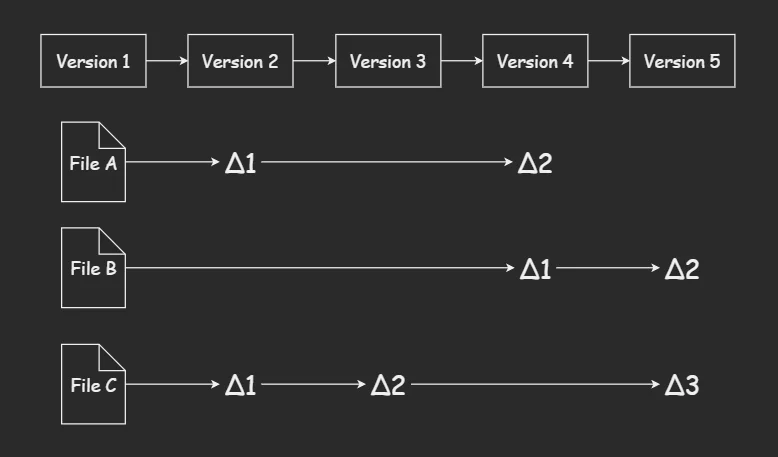

Git 不按照以上方式对待或保存数据，Git 把数据看作是对小型文件系统的一组快照。每次提交更新，或在 Git 中保存项目状态时，它主要对当时的全部文件制作一个快照并保存这个快照的索引。为了高效，如果文件没有修改，Git 不再重新存储该文件，而是只保留一个链接指向之前存储的文件。

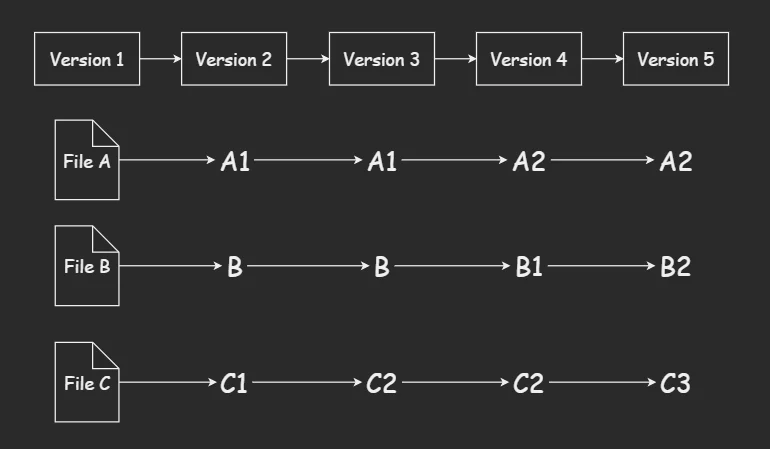

## Git 保证完整性

Git 中的所有数据在存储之前都计算校验和，然后以校验和来引用。这意味着不可能在 Git 不知情时更改任何文件内容或目录内容。若在传送过程中丢失信息或损坏文件，Git 就能发现。

Git 用以计算校验和的机制叫做 **SHA-1 散列**，这是一个由40个16进制字符组成的字符串，基于 Git 中文件的内容或目录结构计算出来。实际上，Git 数据库中保存的信息都是以文件内容的哈希值来索引，而不是文件名。

## 三种状态

Git 有三种状态，文件可能处于其中之一：

- 已提交（*committed*）：表示数据已经安全的保存在本地数据库中。
- 已修改（*modified*）：表示修改了文件但还没有保存到数据库中。
- 已暂存（*staged*）：表示对一个已修改文件的当前版本做了标记，使之包含在下次提交的快照中。

使用 Git 时文件的生命周期如下：

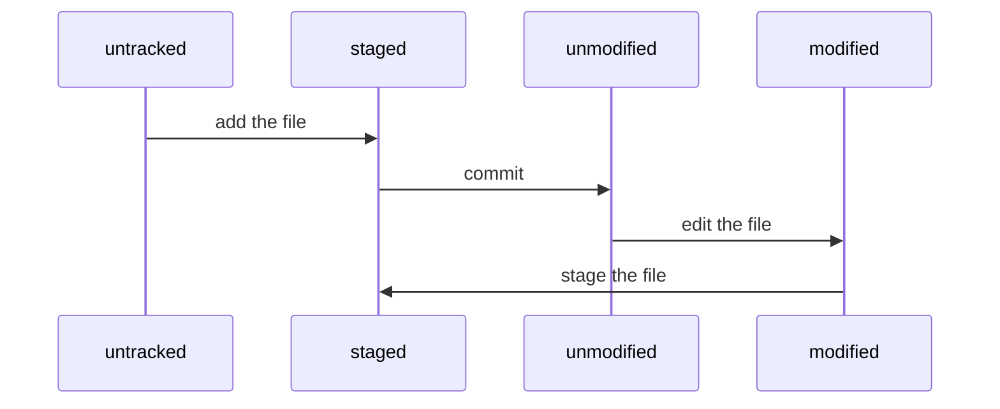

Git 的三个工作区域的概念：

- Git 仓库：用来保存项目的元数据和对象数据库的地方，从其它计算机克隆仓库时，拷贝的就是这里的数据。

- 工作目录：是对项目的某个版本独立提取出来的内容。

- 暂存区域：暂存区域（*index*）是一个文件，保存了下次提交的文件列表信息。

## 初次运行 Git 前的配置

Git 自带一个 `git config` 的工具来设置控制 Git 外观和行为的配置变量。这些变量存储在三个不同的位置：

1. 全局配置

   `/etc/gitconfig` 文件，包含系统上每一个用户及他们仓库的通用配置。使用 `--system` 选项写入。

2. 用户配置

   `~/.gitconfig` 或 `~/.config/git/config` 文件，只针对当前用户。使用 `--global` 写入。

3. 仓库配置

   当前仓库的 `.git/config` 文件，只针对该仓库。

> [!NOTE]
>
> 每一个级别会覆盖上一个级别的配置。

安装完成后应该设置用户名称与邮件地址：

```shell
git config --global user.name xxx
git config --global user.email xxx@xx.com
```

设置默认的文本编辑器，如果未配置，Git 会使用操作系统默认的文本编辑器：

```shell
git config --global core.editor <editor_name>
```

Git 会忽略文件名大小写，如果需要设置不忽略，修改当前仓库设置：

```shell
git config core.ignorecase false
```

如果把此项指定为你的系统上某个文件的路径，当你提交的时候，Git 会使用该文件的内容作为提交的默认信息，即提交模板：

```shell
git config --global commit.template <file_path>
```

当 `core.autocrlf` 为 `true` 时，会在提交时转换为 LF，检出时根据当前系统决定转换为 CRLF，或者不转换。为 `false` 时，在提交和检出时不做任何转换。

```shell
git config --global core.autocrlf true
```

`core.safecrlf` 设置为 `true` 时，如果文件混用 LF 和 CRLF 则拒绝提交。如果不设置，默认提交包含混合换行符的文件时给出警告。

```shell
git config --global core.safecrlf true
```

## 获取仓库

1. 在现有目录中初始化仓库

   在当前工作目录输入 `git init`，将初始化 Git 仓库中所有的必须文件。

2. 或者克隆现有仓库

   使用 `git clone` 来获取一份已经存在的仓库的拷贝，这会在当前目录下创建一个名为仓库名的目录，并在该目录下初始化一个 `.git` 文件夹，从远程仓库拉取所有数据放入 `.git` 文件夹中。如果想在拉取的时候自定义本地仓库的名字，只需要在上述命令的结尾加上自定义的名字即可。

   ```shell
   git clone <url> [<dir>]
   ```

   可以使用 `--depth` 选项来创建一个指定提交次数的浅克隆：

   ```shell
   git clone --depth <depth> <url>
   ```

## 暂存文件

初始化一个仓库时，当前目录的所有文件都属于**未跟踪**状态。使用命令 `git add` 开始跟踪一个文件，并处于**暂存**状态。

```shell
# 使用文件名或目录作为参数
git add <file_name>
```

## 查看文件状态

检查文件的当前状态：

```shell
git status
git status -s	# 使用简略输出
```

> [!NOTE]
>
> 简略输出：`??` 表示文件未跟踪，`A` 表示新添加到暂存区的文件，左边的 `M` 表示文件被修改并放入暂存区，右边的 `M` 表示文件被修改了但没有放入暂存区。

查看还未暂存的文件更新了哪些部分：

```shell
git diff <file>
```

要查看已暂存的文件将要添加到下次提交里的内容：

```shell
git diff --cached <file>
```

## 提交文件

提交暂存区的文件使用命令 `git commit`：

```shell
# 这样会启动文本编辑器以便输入本次提交的说明
git commit
# 将提交信息与命令放在同一行
git commit -m <message>
# 跳过暂存直接提交
git commit -a
git commit -am <message>
```

## 移除文件

移除文件可以使用命令`git rm`，这会将文件从暂存区移除，并且从工作目录中删除指定的文件：

```shell
git rm <file>
```

> [!NOTE]
>
> 如果文件已修改，则必须使用 `-f` 强制删除，这是为了保护还没有添加到快照的数据。

当希望把文件从暂存区删除但仍保留在当前目录中，使用 `--cached` 选项：

```shell
git rm --cached <file>
```

## 移动文件

Git 不会显式跟踪移动文件，如果在 Git 中重命名了某个文件，Git 会推断发生了什么。要对文件改名，可以使用：

```shell
git mv <file_from> <file_to>
```

`git mv` 相当于三条命令：

```shell
mv <file_from> <file_to>
git rm <file_from>
git add <file_to>
```

## 忽略文件

如果不需要将某些文件纳入 Git 的管理，可以创建一个名为 `.gitignore` 的文件，列出要忽略的文件模式。文件 `.gitignore` 的格式规范如下：

- 所有空行或以 `# `开头的行都被忽略。
- 可以使用标准的 glob 模式匹配。
- 匹配模式可以以 `/` 开头和结尾。
- 要忽略指定模式以外的文件或目录，可以在模式前加上 `!` 取反。

glob模式是指shell所使用的简化的正则表达式。`*` 表示匹配0个或多个任意字符。`[abc]` 表示匹配任何一个在方括号其中的字符。`?` 表示匹配一个任意字符。`**` 表示匹配任意中间目录，例如 `work/**/test`。

```properties
# 忽略所有以.a结尾的文件
*.a
# 忽略除lib.a以外的文件
!lib.a
# 仅忽略在当前目录下的build文件，不忽略子目录下的build
/build
# 忽略所有的build目录
build/
```

## 查看提交历史

在提交了若干次后，如果想回顾提交历史，可以使用 `git log` 命令。

```shell
git log						# 列出所有的更新
git log -n					# 列出最近n次更新
git log --oneline			# 将每个提交显示在一行
git log --since=2.weeks		# 显示最近两周的提交
git log --graph				# 图形输出
```

## 撤销操作

如果在提交完成后才发现有几个文件未提交或者提交信息写错了，可以使用带 `--amend` 选项的提交命令尝试重新提交，这个命令会将暂存区中的文件提交：

```shell
git commit --amend
```

当需要取消**已暂存**的文件，使用下面的命令让文件回到**未暂存**状态：

```shell
# 具有相同的效果
git restore --staged <file>
git reset <file>
```

如果想要撤销对文件的修改，将它还原成上次提交的样子，使用命令：

```shell
# 具有相同的效果
git restore <file>
git checkout -- <file>
```

## 远程仓库

1. 查看远程仓库

   查看已经配置的远程仓库服务器使用 `git remote` 命令，会列出指定的每一个远程服务器的简写。如果已经克隆了自己的仓库，至少应该能看见 `origin`，这是 Git 给克隆仓库服务器的默认名字。

   ```shell
   # 查看远程仓库简写
   git remote
   # 显示远程仓库的简写与其对应的URL
   git remote -v
   # 查看远程仓库的更多信息
   git remote show <remote_name>
   ```

2. 添加远程仓库

   添加远程仓库，同时指定一个简写，可以使用这个简写来代替整个 URL。

   ```shell
   git remote add <shortname> <url>
   ```

3. 从远程仓库拉取

   ```shell
   # 抓取远程分支到本地分支上，如果本地分支不存在则会创建
   git fetch <remote_name> <remote_branch_name>:<local_branch_name>
   # 抓取远程分支master到远程跟踪分支上
   git fetch origin master
   # 抓取某个远程仓库中的所有分支
   git fetch <remote_name>
   # 抓取所有的远程仓库
   git fetch --all
   ```

   `git fetch` 访问远程仓库，从中拉取所有你还没有的数据，**它不会自动合并或修改你当前的工作**，当准备好时必须手动将其并入工作。如果使用 `clone` 命令克隆了一个仓库，将自动添加其为远程仓库并默认以 `origin` 为简写。

   如果有一个分支设置为跟踪一个远程分支，可以使用 `git pull` 命令来自动抓取然后合并远程分支到当前分支。默认情况下，`git clone` 命令会自动设置本地 `master` 分支跟踪克隆的远程仓库的 `master` 分支（或者不管是什么名字的默认分支），运行 `git pull` 通常会从最初克隆的服务器上抓取数据并尝试合并到当前分支。

   `git fetch` 只从服务器抓取本地没有的数据，并不会修改工作目录中的内容，只会让你自己合并。而 `git pull` 的含义是 `git fetch` 后接着一个 `git merge`。

4. 推送到远程仓库

   当分享项目时，必须将其推送到上游。

   ```shell
   # 将本地分支推送到远程分支
   git push <remote_name> <local_branch_name>:<remote_branch_name>
   # 推送本地的serverfix分支来更新远程仓库的serverfix分支，这个命令等价于git push origin serverfix:serverfix
   git push origin serverfix
   # 将本地的分支推送到远程服务器，并且将这个分支设置为跟踪分支
   git push -u <remote_name> <branch_name>
   # 推送所有的分支
   git push <remote_name> --all
   ```

   只有当你有所克隆服务器的写入权限，并且之前没有人推送时这条命令才能生效。当你和其他人在同一时间克隆，别人先推送到上游然后你再推送到上游，你的推送会被拒绝，你必须先将别人的工作拉取下来合并进你的工作才能推送。

   > [!NOTE]
   >
   > 强制推送使用 `-f` 选项，更加安全的强制推送选项 `--force-with-lease`，这会先检查远程分支是否有新的提交，如果有则会拒绝推送，必须合并新的提交才能推送。

5. 远程仓库的删除和重命名

   ```shell
   # 重命名
   git remote rename <old_name> <new_name>
   # 删除
   git remote rm <remote_name>
   ```

## 打标签

Git 可以给历史中的某一个提交打上**标签**，通常使用这个功能来标记发布节点。Git 使用两种主要类型的标签：**轻量标签**和**附注标签**。

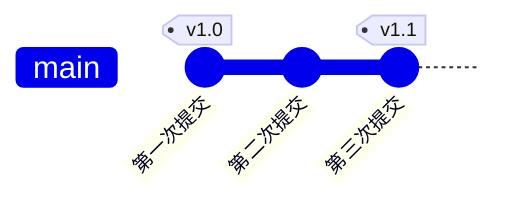

1. 列出标签

   ```shell
   # 列出所有标签
   git tag
   # 查看标签信息与对应的提交信息
   git show <tag_name>
   ```

2. 创建标签

   **轻量标签**是一个特定提交的引用，本质是将提交校验和存储到一个文件中，没有保存任何其他信息。

   ```shell
   # 创建轻量标签
   git tag <tag_name>
   ```

   **附注标签**是存储在 Git 数据库中的一个完整对象，其中包括打标签者的名字、电子邮件、日期时间，还有一个标签信息。
   
   ```shell
   # 创建附注标签
   git tag -a <tag_name> -m "commit message"
   ```
   
3. 后期打标签

   在命令的末尾指定提交的部分校验和：

   ```shell
   git tag -a <tag_name> 9fceb
   ```

4. 共享标签

   默认情况下，`git push` 是不会把标签推送到远程服务器上的，在创建完标签后必须显式推送标签到服务器上。

   ```shell
   # 推送单个标签
   git push <remote_name> <tag_name>
   # 推送所有标签
   git push <remote_name> --tags
   ```

5. 删除标签

   ```shell
   # 删除本地仓库上的标签
   git tag -d <tag_name>
   # 删除服务器上的标签
   git push <remote_name> :refs/tags/<tag_name>
   ```

# Git 分支

暂存操作会为每一个文件计算校验和，然后会把当前版本的文件快照保存到 Git 仓库中（Git 使用 *blob* 对象来保存它们），最终将校验和加入到暂存区域等待提交。

在进行提交操作时，Git 会先计算每一个子目录的校验和，然后在 Git 仓库中这些校验和保存为**树对象**，随后，Git 会创建一个**提交对象**，包含了作者的姓名和邮箱、提交时输入的信息、指向它的父对象的指针和这个树对象的指针（首次提交产生的提交对象没有父对象）。做些修改之后再次提交，这次产生的提交对象会包含上次提交对象的指针。

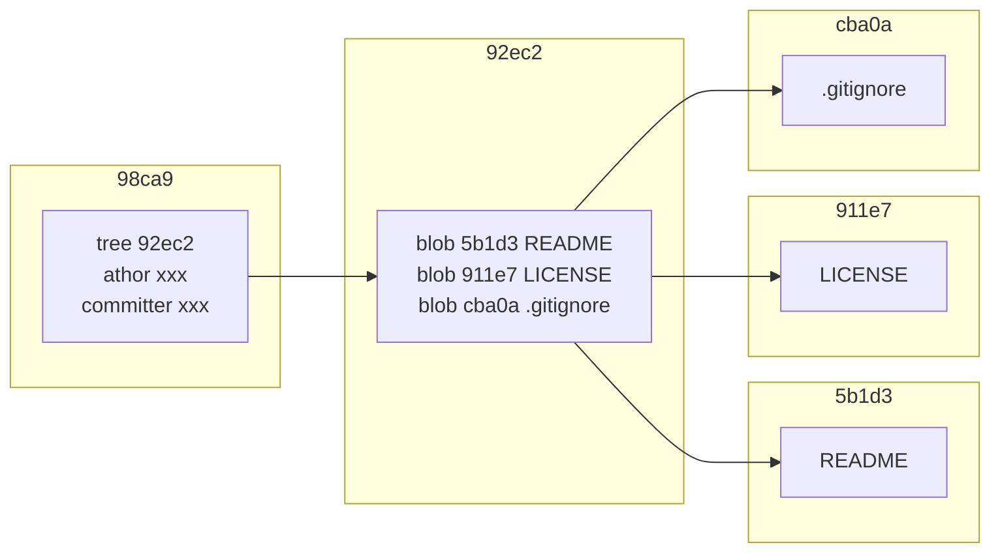

Git 分支本质上是指向提交对象的可变指针，分支默认的名字是 `master`，它会在每次提交操作自动向前移动。

## 创建分支

创建新的分支会在当前提交对象上创建一个指针。

```shell
git branch <name>
```

Git 有一个名为 **HEAD** 的指针，指向当前所在的本地分支，创建新的分支并不会自动切换到新分支中去。

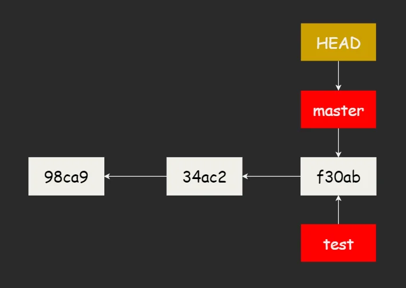

## 分支切换

使用 `git checkout` 命令切换到新的分支中。

```shell
git checkout <name>
```

创建分支的同时并且切换到那个分支上：

```shell
git checkout -b <name>
```

## 分支合并

将当前分支合并到新的分支：

```shell
git merge <branch>
```

当试图合并两个分支时，如果顺着一个分支走下去能够到达另一个分支，那么 Git 在合并两者的时候，只会简单的将指针向前推进。这种情况下的合并操作没有需要解决的分歧，这就叫做快进（*fast-forward*）。 

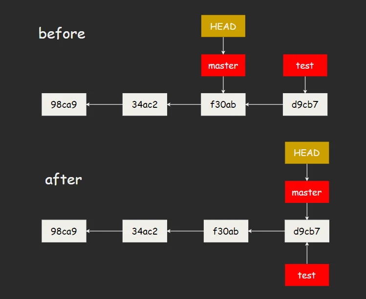

再看另一种情况，开发历史从一个更早的地方开始分叉，Git会用两个分支的末端所指的快照以及这两个分支的祖先做一个简单的三方合并。 

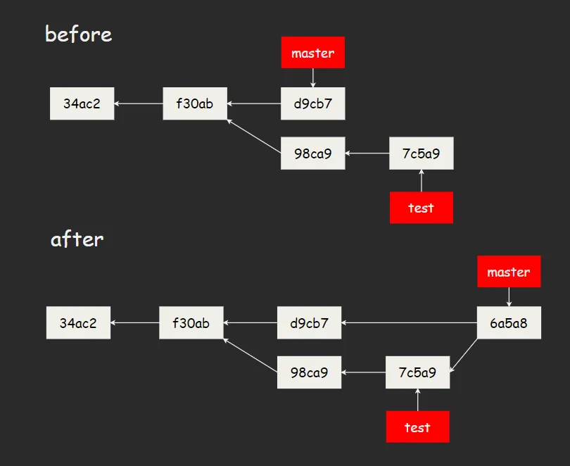

## 遇到冲突时的分支合并

如果在两个不同的分支中对同一个文件进行了不同的修改，在合并的时候就会产生冲突。此时 Git 做了合并，但是没有自动的创建一个新的合并提交，可以使用 `git status` 来查看那些因包含合并冲突而处于未合并状态（*unmerged*）的文件。

任何因包含合并冲突的文件，都会以未合并状态标识出来，Git 会在有冲突的文件中加入标准的冲突解决标记。可以自行合并这些内容或者选择其中的一个来解决冲突。

```
<<<<<<< HEAD:index.html
<div id="footer">contact : email.support@github.com</div>
=======
<div id="footer">
 please contact us at support@github.com
</div>
>>>>>>> iss53:index.html
```

在解决了冲突之后，对每个文件使用 `git add` 命令来将其标记为冲突已解决，然后可以输入 `git commit` 来完成合并提交。如果不想处理冲突这种情况，可以中断这次的合并：

```shell
git merge --abort
```

## 分支管理

```shell
# 显示当前所有本地分支
git branch
# 查看每个分支的最后一次提交
git branch -v
# 删除已经合并的分支
git branch -d <branch_name>
# 重命名分支
git branch -m <new_branch_name>
git branch -m <old_branch_name> <new_branch_name>
```

> [!NOTE]
>
> 删除为未合并的分支会失败，因为它包含了还未合并的工作。

## 远程分支

**远程跟踪分支**是**远程分支**状态的引用，它们是你不能移动的本地引用，当你做任何网络通信操作时，它们会自动移动。它们以 `remote/branch` 形式命名。

```shell
# 显示所有远程跟踪分支和本地分支
git branch -a
# 删除远程分支
git push <remote> -d <branch>
# 同样的效果，如果推送空分支，则会删除远程分支
git push origin :<branch>
# 删除远程跟踪分支
git branch -rd <remote>/<branch>
```

如果从一个服务器克隆，`git clone` 会自动将其命名为 `origin`，拉取它所有的数据，在本地创建一个名为 `origin/master` 的远程跟踪分支来表示服务器的 `master` 分支的位置，同时 Git 也会给一个与 `origin` 的 `master` 分支指向的同一个地方的本地分支 `master`，这样就有工作的基础。

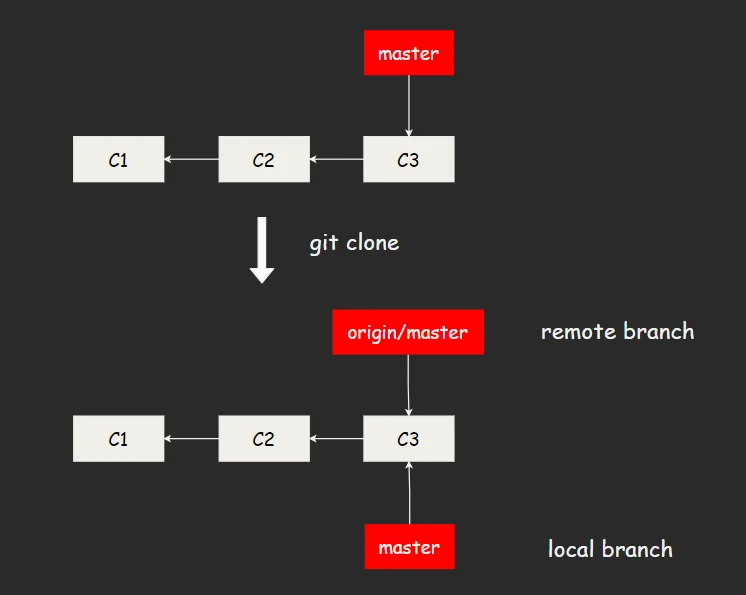

如果在本地的 `master` 分支上做了一些工作，同时其他人推送提交到远程服务器并更新它的 `master` 分支，那么你本地的提交历史将向不同的方向前进，只要你不与服务器连接，你的 `origin/master` 指针就不会移动。如果要同步你的工作，运行 `git fetch origin` 将从远程服务器抓取本地没有的数据更新本地数据库，并且移动 `origin/master` 指针向更新后的位置。在抓取数据之后，可以运行 `git merge origin/master` 将这些工作合并到当前所在的分支上。

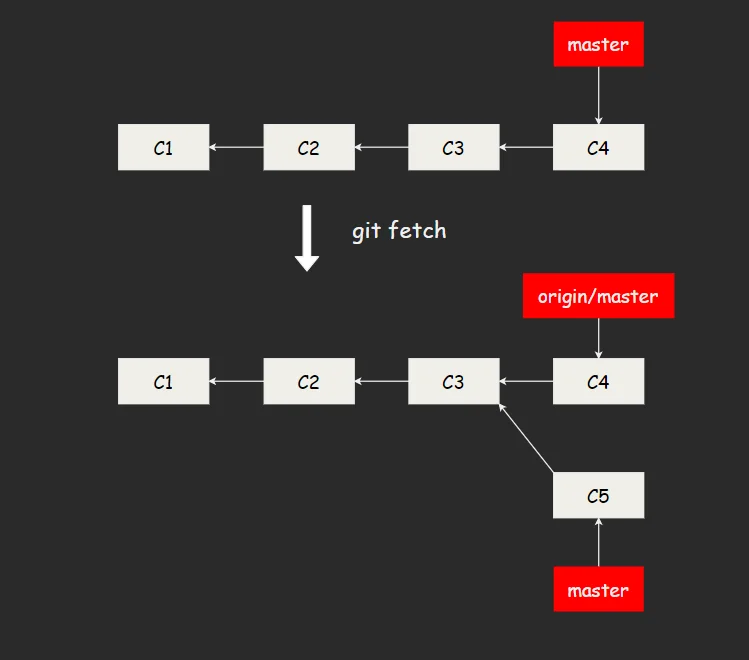

## 跟踪分支

从一个远程跟踪分支检出一个本地分支会自动创建**跟踪分支**，跟踪分支是与远程分支有直接关联的本地分支。如果在一个跟踪分支上输入 `git pull`，Git 就能自动识别去哪个服务器上抓取、合并到哪个分支。

```shell
# 在本地的远程跟踪分支上建立跟踪分支，并切换到创建的分支上
git checkout -b <branch_name> <remote_name>/<branch_name>
# 同样的效果，创建的跟踪分支会和远程跟踪分支同名
git checkout --track <remote_name>/<branch_name>
# 设置本地分支跟踪一个远程分支
git branch -u <remote_name>/<branch_name>
# 查看所有分支的跟踪信息
git branch -vv
```

> [!NOTE]
>
> `git branch -vv` 会显示出本地提交与服务器上差异，*ahead* 表示本地领先，*behind* 表示本地落后。这些差异的数字来自于从每个服务器上的最后一次抓取的数据，如果想了解最新的领先和落后数字，需要在运行前抓取所有的远程仓库。

## 变基

变基操作原理是先找到这两个分支的最近共同祖先，然后对比当前分支相对于该祖先的历次提交，提取相应的修改并存为临时文件，然后将当前分支指向目标基底，最后将之前存为临时文件的修改依序应用。

```shell
# 将当前分支变基到目标分支上
git rebase <branch_name>
# 将特性分支变基到目标分支上，这样可以省去切换分支
git rebase <base_branch> <topic_branch>
```

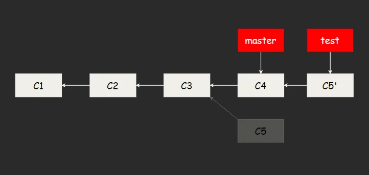

对两个分支进行变基时，不一定要在目标分支上应用，也可以指定另一个分支进行应用。

```shell
git rebase --onto <base_to> <base_from> <topic_branch>
```

这个命令的意思是，找出 `topic_branch` 分支和 `base_from` 分支的共同祖先之后的修改，然后把它们在 `base_to` 分支上重放。即截取特性分支上的另一个特性分支，然后变基到其他分支：

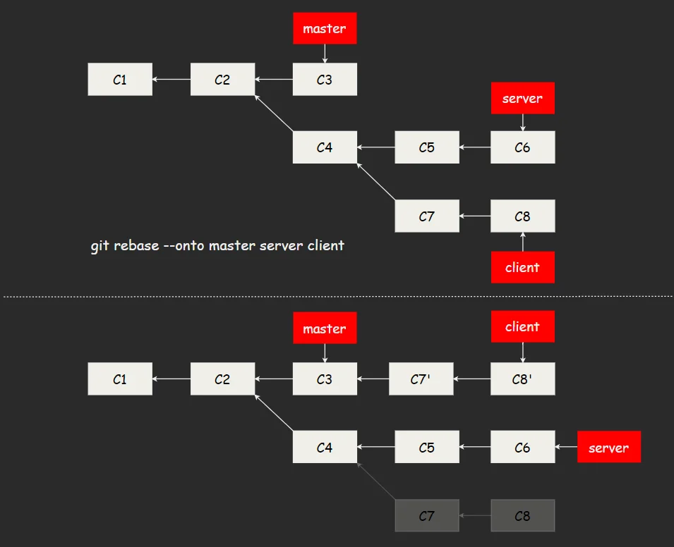

## 变基冲突

如果两个不同的分支对同一个文件进行修改，在变基时就会发生冲突。手动解决冲突后运行 `git add` 标记冲突已解决，然后继续变基操作。

```shell
git add <conflicted_file>
git rebase --continue
```

遇到冲突时还可以选择跳过，这将跳过当前的补丁：

```shell
git rebase --skip 
```

撤销变基操作：

```shell
git rebase --abort
```

## 变基的风险

> [!WARNING]
>
> 不要对在你的仓库外有副本的分支执行变基。变基操作的实质是丢弃一些现有的提交，然后相应的新建一些内容一样但实际不同的提交。

如果你已经将提交推送至某个仓库（还经过了一次合并），而其他人已经从仓库拉取并且进行了后续的工作，此时如果你用 `git rebase` 重新整理了提交并且再次推送，别人不得不再次将他们的工作和你的提交进行整合，如果接下来你还要拉取并整合别人的提交，提交历史就会变的特别混乱。

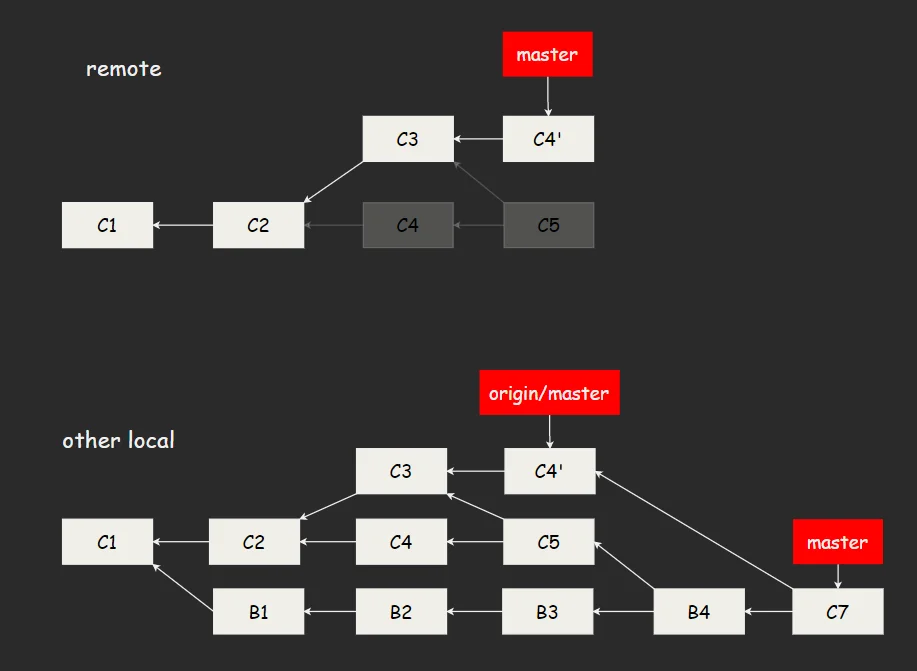

出现这样的情况，如果不执行合并，而是执行 `git rebase origin/master`，Git 将会：

- 检查哪些提交是特性分支上独有的提交：`C4`，`C5`，`B1`，`B2`，`B3`，`B4`。
- 检查其中哪些不是合并操作的结果：`C4`，`B1`，`B2`，`B3`。
- 检查哪些提交在对方覆盖更新并没有被纳入目标分支：`B1`，`B2`，`B3`（`C4 `就是 `C4'`）。
- 把这些查到的提交应用到 `origin/master` 上。


```shell
# 更简单的命令
git pull --rebase
# 同样的效果
git fetch origin
git rebase origin/master
```

# Git 工具

## 选择修订版本

Git 可以通过几种方法来指明特定的或者一定范围内的提交，可用通过 SHA-1 值来获取一次提交，提供的 SHA-1 字符数量不能少于4个。

```shell
git show <SHA-1>
```

1. 分支引用

    可以通过分支引用来获取一次提交。

    ```shell
    git show <branch>
    ```

2. 引用日志

    Git 会在后台保存一个引用日志，记录了几个月 HEAD 和分支引用指向的历史。每当 HEAD 所指向的位置发生了变化，Git 就会将这个信息存储到引用日志这个记录里。

    ```shell
    # 查看引用日志
    git reflog
    # 查看HEAD在n次前所指向的提交
    git show HEAD@{n}
    ```

3. 祖先引用

    如果在引用的结尾加上 `^`，Git 就会将其解析为该引用的上一个提交。`^ `后可以添加一个数字，这个语法只适用于合并的提交，因为合并提交会有多个父提交。**第一父提交**是你合并时所在的分支，**第二父提交**是你所合并到分支。

    ```shell
    # 获取第一父提交
    git show HEAD^
    # 获取第二父提交
    git show HEAD^2
    # 获取第一父提交的第一父提交
    git show HEAD^^
    ```

    另一种指明祖先提交的方法是`~`，`~`后面加可以加数字，根据指定的次数获取对应的第一父提交。

    ```shell
    # 第一父提交的第一父提交
    git show HEAD~2
    # 获取前第三次提交的第二父提交
    git show HEAD~3^2
    ```

4. 提交区间

    ```mermaid
    gitGraph
       commit id:"c1"
       commit id:"c2"
       branch test
       commit id:"c5"
       commit id:"c6"
       checkout main
       commit id:"c3"
       commit id:"c4"
    ```
    
    若要查看在某一个分支中而不在另一个分支中的提交，使用**双点**语法：
    
    ```shell
    # 显示C5、C6t提交
    git log main..test
    # 显示C3、C4提交
    git log test..main
    ```
    
    有时候需要两个以上的分支才能确定所需要的提交，Git 允许在任意引用前加上 `^` 或 `--not` 来指明你不希望提交被包含在其中的分支：
    
    ```shell
    # 这几个是等价的
    git log main..test
    git log ^main test
    git log test --not main
    # 查看被refA和refB包含但是不被refC包含的提交
    git log refA refB ^refC
    ```
    
    选择出被两个引用中的一个包含但又不被两者同时包含的提交，使用**三点**语法：
    
    ```shell
    # 显示C3、C4、C5、C6
    git log main...test
    ```

## 交互式暂存

使用 `git add -i` 会进入一个交互式终端模式：

```shell
$ git add -i
           staged     unstaged path
  1:    unchanged        +1/-1 demo.html
  2:    unchanged        +3/-1 demo.css

*** Commands ***
  1: status       2: update       3: revert       4: add untracked
  5: patch        6: diff         7: quit         8: help
What now>
```

## 储藏

当已经工作一段时间后，这时候想要切换到另一个分支，但是不想为做了一半的工作创建一个提交，可以使用 `git stash`。储藏会处理工作目录的状态，跟踪文件的修改与暂存的改动，然后将未完成的修改保存到一个栈上，你可以在任何时候重新应用这些改动。

```shell
# 储藏修改
git stash
# 默认情况下，只会储藏在索引中的文件，使用-u标记，也会储藏未跟踪文件
git stash -u
# 查看储藏的东西
git stash list
# 移除储藏
git stash drop stash@{n}
```

将存储的工作重新应用：

```shell
# 应用一个最近的储藏
git stash apply
# 应用后立即从栈上移除
git stash pop
# 指定一个储藏应用
git stash apply stash@{n}
```

如果储藏了一些工作，然后继续在储藏的分支上工作，再次重新应用储藏时可能会造成冲突，可以运行 `git stash branch` 在储藏工作时所在的提交创建一个新分支，重新应用储藏，应用成功会丢弃储藏。

```shell
git stash branch <branch>
```

## 清理

使用 `git clean` 命令，会从当前目录开始递归删除未跟踪的文件（不包括忽略的文件）来清理工作树，如果想要同时移除被忽略的文件，可以加上 `-x` 选项。默认 `git clean` 不会递归到未跟踪的目录中以免删除太多，指定 `-d` 以使其也递归到此类目录中。

```shell
# 清理工作树中所有未跟踪文件（只会递归到已跟踪的目录中）
git clean
# 同时递归到未跟踪的目录中（不包括忽略的目录）
git clean -d
# 同时也会清理被忽略的文件
git clean -x
# 显示将要删除的文件（这次不会删除，只是一次预演）
git clean -n
```

> [!TIP]
>
> 如果 Git 配置变量 `clean.requireForce`设置为 `true`，则 `git clean` 将拒绝删除文件或目录，除非使用 `-f` 选项。

## 签署

如果你从因特网上的其他人那里拿取工作，并且想要验证提交是不是真正地来自于可信来源，Git 提供了通过 GPG 来签署和验证工作的功能，生成 GPG 密钥步骤如下：

1. 生成 GPG 密钥

   ```shell
   # 完整功能的密钥对生成
   gpg --full-generate-key
   ```

2. 列出私钥

   ```shell
   # 列出私钥，私钥是用于签署提交和标签
   gpg --list-secret-keys --keyid-format=long
   ```

3. 创建 ASCII 字符的 GPG Key 输出（用于 Github）

   ```shell
   # 这个命令用于添加到Github上的GPG Key
   gpg --armor --export <GPG_KEY_ID>
   ```

4. 签署提交

   ```shell
   # 使用-S选项来签署一个提交
   git commit -S -m "YOUR_COMMIT_MESSAGE"
   ```

5. 签署标签

   ```shell
   # 签署标签，在使用GPG签名后Git需要添加标签信息，就算轻量标签也是如此
   git tag -s <tag>
   # 验证标签
   git tag -v <tag>
   ```

> [!NOTE]
>
> 若要避免每次需要手动签署，可以配置默认签署提交和标签：
>
> ```shell
> git config --global commit.gpgsign true
> git config --global tag.gpgsign true
> ```
>
> 如果有多个 GPG Key，需要告诉 Git 选择哪一个：
>
> ```shell
> git config --global user.signingkey <GPG_KEY>
> ```

## 交互式变基

可以给 `git rebase` 加上 `-i` 选项来进行交互式变基，必须要指定重写多远的历史。

```shell
# 表示在HEAD~3..HEAD范围内的每一个提交都会被重写
git rebase -i HEAD~3
```

交互式变基给你一个将会运行的脚本，它将指定范围的提交从旧到新开始依次重演，例如：

```
pick 7d46817 first
pick 2926fd9 second
pick f533e0c latest

# Rebase a4331a7..f533e0c onto a4331a7 (3 commands)
#
# Commands:
# p, pick <commit> = use commit
# r, reword <commit> = use commit, but edit the commit message
# e, edit <commit> = use commit, but stop for amending
# s, squash <commit> = use commit, but meld into previous commit
# f, fixup <commit> = like "squash", but discard this commit's log message
# x, exec <command> = run command (the rest of the line) using shell
# b, break = stop here (continue rebase later with 'git rebase --continue')
# d, drop <commit> = remove commit
# l, label <label> = label current HEAD with a name
# t, reset <label> = reset HEAD to a label
# m, merge [-C <commit> | -c <commit>] <label> [# <oneline>]
# .       create a merge commit using the original merge commit's
# .       message (or the oneline, if no original merge commit was
# .       specified). Use -c <commit> to reword the commit message.
#
# These lines can be re-ordered; they are executed from top to bottom.
#
# If you remove a line here THAT COMMIT WILL BE LOST.
#
# However, if you remove everything, the rebase will be aborted.
```

如果要拆分提交，将要拆分的提交的指令修改为“edit”：

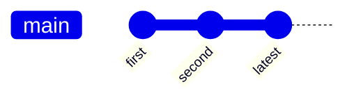

```
pick 7d46817 first
edit 2926fd9 second
pick f533e0c latest
```

当退出编辑器时，Git 应用第一个提交 `7d46817`，应用第二个提交 `2926fd9` 时会让你进入命令行，若要重置当前的内容创建新的提交：

```shell
git reset HEAD~
git add README
git commit -m 'update README'
git add main.c
git commit -m 'add main.c'
git rebase --continue
```

最后提交历史会像这样：

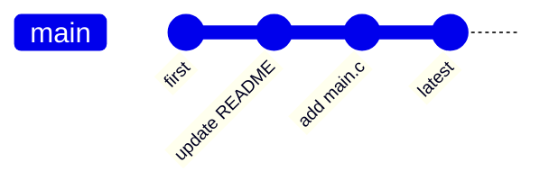

也可以使用“squash”将一连串的提交压缩为一个提交：

```
pick 7d46817 first
squash 2926fd9 second
squash f533e0c lastest
```

## 重置

1. 撤销本次提交，不改变当前工作目录的内容和暂存区的内容。

   ```shell
   # 即移动HEAD指向的分支，不是改变HEAD自身
   git reset --soft HEAD~
   ```

2. 撤销本次提交，并且将暂存区回到上一次提交后的状态，不改变当前工作目录的内容。

   ```shell
   # 即移动HEAD指向的分支，然后用HEAD指向的快照内容来更新索引
   git reset --mixed HEAD~
   ```

   > [!NOTE]
   >
   > `--mixed` 可以省略，这是 `git reset` 的默认行为

3. 撤销本次提交，并且将暂存区和工作目录的所有东西回到上一次提交后的状态。

   ```shell
   # 即移动HEAD指向的分支，然后用HEAD指向的快照内容来更新索引，最后让工作目录看起像索引
   git reset --hard HEAD~
   ```

可以给 `git reset` 指定路径，这将跳过移动 `HEAD` 指针，并且将重置的作用范围限定为指定的文件或文件集合。`HEAD`是一个指针，无法让它同时指向两个提交中各自的一部分，不过索引和工作目录可以部分更新，所以重置将跳过 `HEAD` 移动。

```shell
# 取消file.txt的暂存，本质上是将file.txt从HEAD复制到索引中
git reset HEAD file.txt
# 等价的命令
git reset file.txt
```

> [!NOTE]
>
> `git checkout` 与 `git reset --hard` 类似，都是操作索引、`HEAD` 和工作目录。不同于 `git reset --hard`，`git checkout` 对工作目录是安全的，会通过检查来确保不会将已更改的文件弄丢。另外 `git checkout` 只会移动 `HEAD` 自身来指向另外一个分支。

运行 `git checkout` 的另一种方式就是指定一个文件路径。带路径的 `git checkout` 不会移动 `HEAD`，但是会用该提交中的那个文件来更新索引，同样会覆盖工作目录中对应的文件。

```shell
git checkout [branch] -- <file>
```

## 还原提交

如果不小心进行了一次提交，可以使用 `git revert` 来生成一次新的提交，这个提交将会撤销一个已存在的提交的所有更改。

```shell
# 撤销HEAD提交，保留第一父提交，-m选项表示需要被保留下来的父节点，即选择主线1或2
git revert -m 1 HEAD
```

`m'` 和 `c6` 具有完全一样的内容，从这开始就像是合并从未发生过一样。

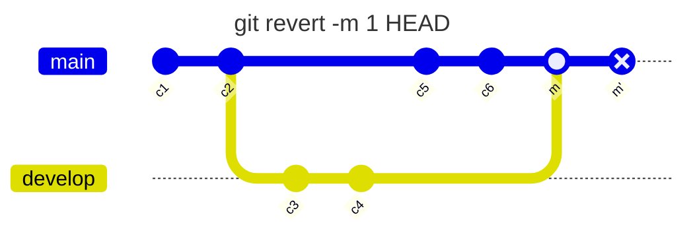

如果此时在 develop 分支中增加工作然后再次合并到 main 中，Git 只会包含被还原的合并之后的修改。`c8` 包含 `m'` 和 `c7`，但是不包含 `c4` 中的内容。三方合并时认为 `c4` 中的内容已经被删除，此时合并只会包含 `c7` 的内容。

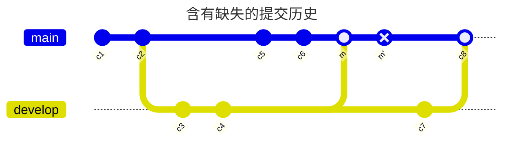

解决办法是撤销 `m'`，然后再去合并，`m''` 相当于 `m`。

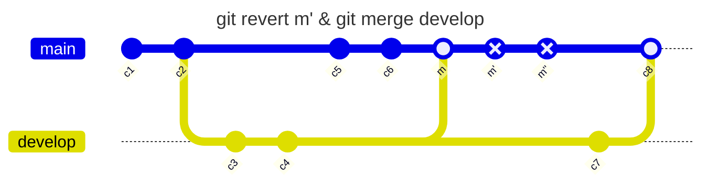

通常情况下 `git revert` 会自动创建一些提交，并带有提交日志消息，说明哪些提交被恢复，如果不想创建多个 revert 提交，可以使用 `-n` 选项，这将提交还原到工作目录和索引所需的更改，但不进行提交。

```shell
# 撤销前三次的提交，但是不会创建revert提交，此时只会改变暂存区和工作目录
git revert -n HEAD~2..HEAD
```

## 挑选工作流

可以使用 `git cherry-pick` 来对其他分支中提交进行挑选，Git 中的拣选类似于对特定的某次提交的变基，它会提取该提交的补丁，之后尝试将其重新应用到当前分支上。

```shell
git cherry-pick <commit-ish...>
```

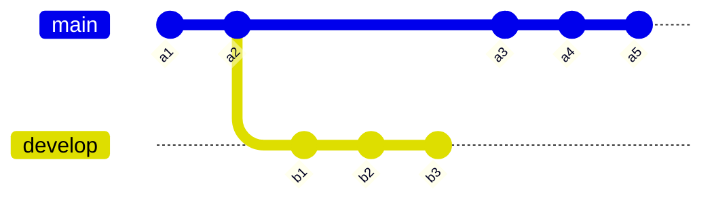

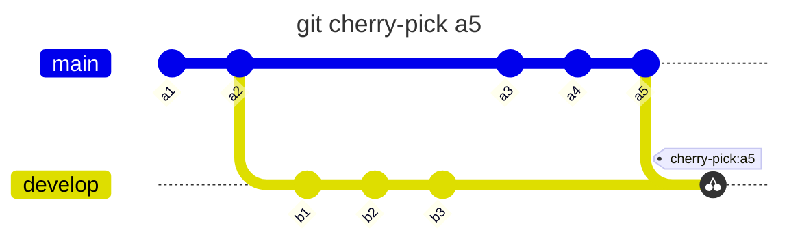

## 文件标注

查看每一行最后一次修改的提交：

```shell
# -L选项来限制输出范围
git blame -L <n,m> <file>
```

## 子模块

某个工作中的项目需要包含并使用另一个项目，你想要把他们当作两个独立的项目，同时又想在一个项目中使用另一个。Git 通过子模块来解决这个问题，子模块允许将一个 Git 仓库作为另一个 Git 仓库的子目录，能将另一个仓库克隆到自己的项目中，同时还保持提交的独立。

添加一个子模块，默认情况下会将子项目放到一个与仓库同名的目录中，如果想放到其他地方，可以在命令结尾添加一个不同的路径。

```shell
git submodule add <url> [dir]
```

同时会创建 `.gitmodules` 文件，该文件保存了项目的 URL 与已经拉取的本地目录之间的映射。

```
[submodule "xxx"]
  path = xxx
  url = https://github.com/user_name/xxx
```

克隆一个含有子模块的项目，默认会包含该子模块目录，但其中还没有任何文件，必须要运行两个命令：

```shell
# 初始化本地配置文件
git submodule init
# 抓取数据
git submodule update
```

> [!NOTE]
>
> 更简单的方法，给 `git clone` 传递 `--recursive` 选项，会自动初始化并更新仓库中的每一个子模块。

## 凭证存储

如果使用的 SSH 方式连接远端，并且设置了一个没有口令的密钥，这样就可以在不输入用户名和密码的情况下安全的传输数据。然而这对 HTTP 协议来说是不可能的，每一个连接都是需要用户名和密码的。Git 拥有一个凭证系统来处理这个事情，选项如下：

- 默认模式所有都不缓存，每一连接都会询问用户名和密码。
- `cache` 模式会将凭证存放在内存中一段时间，密码永远不会被存储在磁盘中，并且在15分钟后从内存中清除。
- `store` 模式会将凭证用明文的形式存放在磁盘中，并且永不过期。这种方式的缺点是密码是用明文的方式存放在 `~/.git-credentials` 中。可以使用 `--file <path>` 参数，可以自定义存放密码的文件路径。

设置 Git 来选择上述的一种方式：

```shell
git config --global credential.helper cache
```

## Git 钩子

Git 能在特定的重要动作发生时触发自定义脚本，有两组这样的钩子：客户端和服务端的。客户端钩子由诸如提交和合并这样的操作所调用，而服务器端钩子作用于诸如接收被推送的提交这样的联网操作。

钩子都被存储在 Git 目录下的 hooks 子目录中，即 `.git/hooks` 中，当使用 `git init` 初始化一个版本库时，Git 默认会在这个目录中放置一些示例脚本，这些脚本除了本身可以被调用外，它们还透露了被触发时所传入的参数。 所有的示例都是 shell 脚本，其中一些还混杂了 Perl 代码，不过，任何正确命名的可执行脚本都可以正常使用。把一个正确命名且可执行的文件放入 Git 目录下的 hooks 子目录中，即可激活该钩子脚本，这样一来，它就能被 Git 调用。

> [!NOTE]
>
> 这些示例的名字都是以 `.sample` 结尾，如果你想启用它们，得先移除这个后缀。
