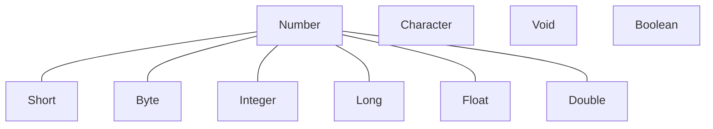
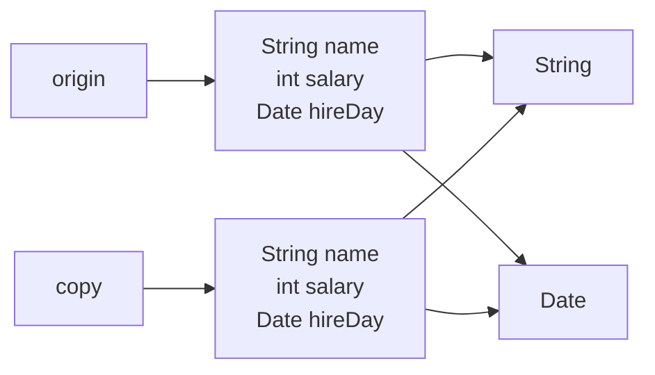
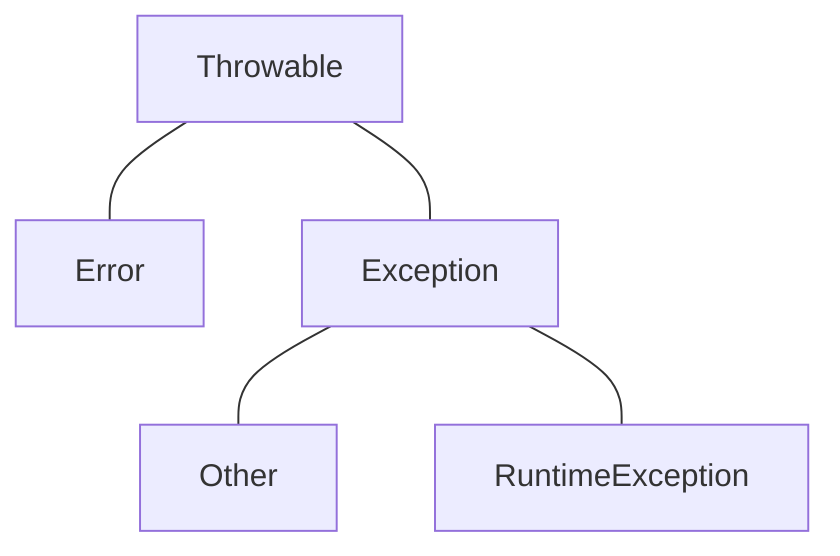
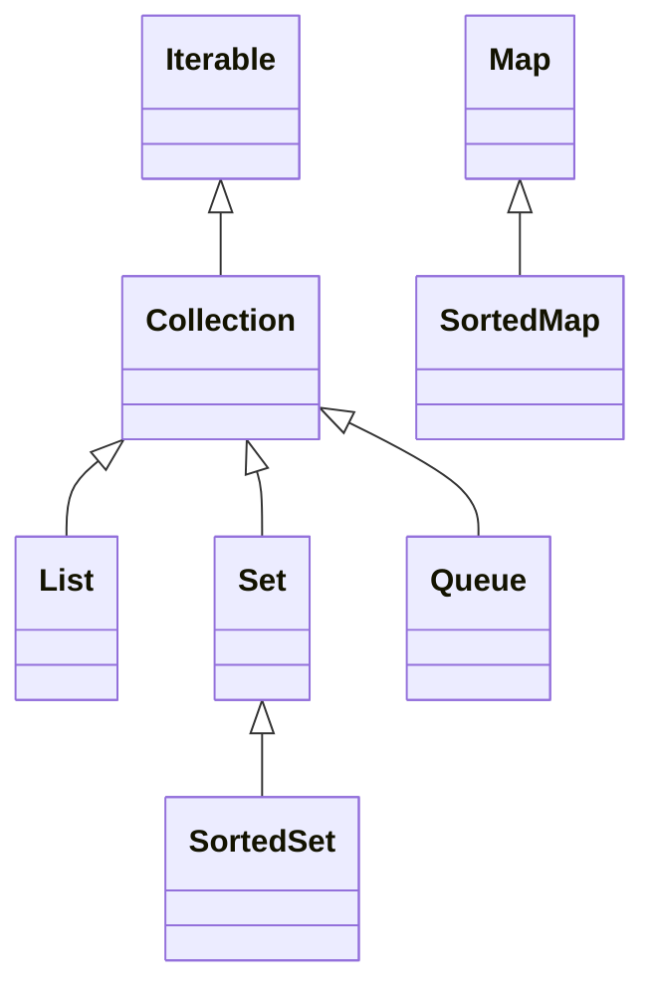
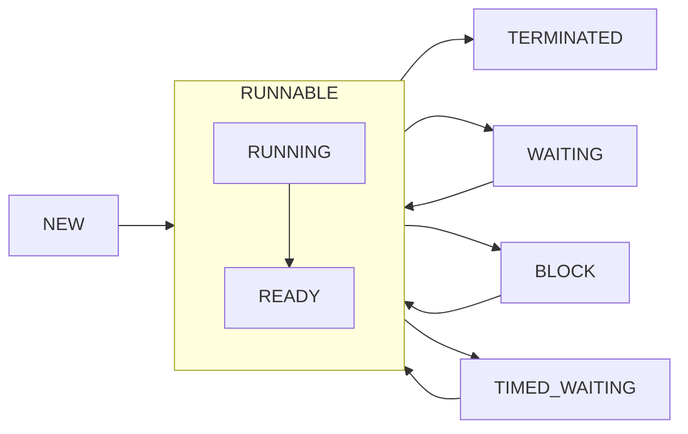

# 数据类型

Java 是一种强类型语言，在 Java 中 一共有8种基本类型，其中有4种整型，2种浮点类型，1种用于表示 Unicode 编码的字符单元的字符类型以及 `boolean` 类型。

## 整型

|  类型   | 存储需求 | 范围                          |
| :-----: | :------: | ----------------------------- |
| `byte`  |  1字节   | $-128 \sim 127$               |
| `short` |  2字节   | $-32768 \sim 32767$           |
|  `int`  |  4字节   | $-2147483648 \sim 2147483647$ |
| `long`  |  8字节   | $-2^{63}\sim 2^{63}-1$        |

在 Java 中，整型的范围与运行 Java 代码的机器无关，这解决了软件从一个平台移植到另一个平台等等问题。由于 Java 程序必须保证在所有机器上都能得到相同的运行结果，所有各种数据类型的取值范围必须固定。

从 Java 7 开始，可以为数字字面量加上下划线，如 `100_000`，让数字更易于阅读，Java 编译器会去除这些下划线。长整型数值有一个后缀 `l` 或 `L`。

```java
long n = 1000L;
```

整型2、8、16进制字面量表示：

```java
int a = 0b10; // 2进制，前缀0b或0B
int b = 010;  // 8进制，前缀0
int c = 0x10; // 16进制，前缀0x或0X
```

## 浮点类型

所有的浮点数遵循 IEEE754 规范。

|   类型   | 存储需求 | 取值范围                                            |
| :------: | :------: | --------------------------------------------------- |
| `float`  |  4字节   | 大约 $\pm3.40282347E+38F$（有效位数6~7位）          |
| `double` |  8字节   | 大约$\pm1.79769313486231570E+308$（有效位数为15位） |

`float` 类型的数值后面有一个后缀 `f` 或 `F`，如 `3.14F`。没有后缀的浮点数值默认为是 `double` 类型，同样也可以为数值后面添加后缀 `d` 或 `D`，如 `3.14D`。 

> [!NOTE]
> 可以用16进制来表示浮点数值，例如 $0.125 = 2^{-3}$，可以表示为 `0x1.0p-3`，尾数采用16进制，其中 `p` 用来表示指数，基数为2，而不是10。

用于表示溢出和出错情况的三个特殊的浮点数值：

- `Double.POSITIVE_INFINITY`（无穷大）
- `Double.NEGATIVE_INFINITY`（无穷小）
- `Double.NaN`（不是数字）


> [!CAUTION]
>
> 所有的非数值的值都认为是不相同的，不能这样判断一个特定值是否等于 `NaN`：
>
> ```java
> if(x == Double.NaN)	// 不能这样判断
> ```
>
> 正确的做法是使用 `Double.isNaN()` 方法。

浮点数不适用于无法接受舍入误差的金融计算中，如果在数值计算中不允许有任何舍入误差，应该使用 `BigDecimal` 类。

## char 类型

`char` 类型存储长度为2字节，`char` 类型的字面量值要用单引号括起来，可以使用 Unicode 转义序列，其范围从 `\u0000` 到 `\uffff`，`\u` 转义序列可以出现在加引号的字符常量或字符串之外，而其他所有转义序列不可以。

```java
/* 这种写法是合法的 */
public static void mian(String\u005B\u005D args)
```

Unicode 转义序列会在解析代码之前得到处理，例如：

```java
string str = "\u0022+\u0022"; // \u0022会在解析之前转换为"，所以会变成""+""，即一个空字符串
```

要注意注释中的`\u`，下面的注释会产生一个语法错误。`\u000D`会替换为一个换行符，而`\users`会产生一个语法错误，因为`\u`后面不是16进制数。

```java
// \u000D is a new line
// look inside c:\users
```

给 `char` 赋值可以使用数值，数值被当成 Unicode 码点处理。同样，将 `char` 转为 `int` 输出也是 Unicode 码点。

```java
char ch = 0x251; // 拉丁小写字母ɑ
```

## Unicode 和 char 类型

在 Unicode 标准中，**码点**（*code point*，是指一个编码表中的某个字符对应代码值）采用16进制书写，并加上前缀`U+`。Unicode 的码点可以分为17个代码级别，第一个代码级别称为**基本的多语言级别**，码点从 `U+0000` 到 `U+FFFF`，其余16个级别码点从 `U+10000` 到 `U+10FFFF`，其中包括一些辅助字符。

- UTF-16

  UTF-16 编码采用不同长度的编码表示所有的 Unicode 码点，在基本的多语言级别中，每个字符用16位表示，通常称为**代码单元**（*code unit*）。而辅助字符采用一对连续的代码单元进行编码，第一个代码单元 `110110xx xxxxxxxx` 为**高位代理**，第二个代码单元 `110111xx xxxxxxxx` 为**低位代理**，作用就是告诉计算机这是辅助字符。

  |  Code Point Segment   | Encoding                              |
  | :-------------------: | ------------------------------------- |
  |   `0x0000`~`0xFFFF`   | `xxxxxxxx xxxxxxxx`                   |
  | `0x010000`~`0x10FFFF` | `110110xx xxxxxxxx 110111xx xxxxxxxx` |

  Unicode 将**基本的多语言级别**的两段码点保留，不表示任何字符，即高位代理和低位代理片段。

  | Surrogate | Hex               | Bin                                     |
  | --------- | ----------------- | --------------------------------------- |
  | high      | `0xD800`~`0xDBFF` | `11011000 00000000`~`11011011 11111111` |
  | low       | `0xDC00`~`0xDFFF` | `11011100 00000000`~`11011111 11111111` |

  在 Java 中，`char` 类型描述了 UTF-16 编码中的一个代码单元。

- UTF-8

  类似于 UTF-16，UTF-8 编码方式如下，将码点转为2进制，依次填入，位数不够的左边填充0。

  |    Unicode Segment    | Encoding                              |
  | :-------------------: | ------------------------------------- |
  |     `0x00`~`0x7F`     | `0xxxxxxx`                            |
  |   `0x0080`~`0x07FF`   | `110xxxxx 10xxxxxx`                   |
  |   `0x0800`~`0xFFFF`   | `1110xxxx 10xxxxxx 10xxxxxx`          |
  | `0x010000`~`0x10FFFF` | `11110xxx 10xxxxxx 10xxxxxx 10xxxxxx` |


## boolean 类型

`boolean` 类型有两个值：`false` 和 `true`，用来判定逻辑条件整型值和布尔值之间不能进行相互转换。

# 基本概念

## 变量

在声明变量时，变量名必须是一个以字母开头并由字母或数字构成的序列，Java 中的字母包括 `a-Z`，`_`，`$` 或者在某种语言中表示字母的 Unicode 字符，不能使用 Java 保留字作为变量名。声明一个变量之后必须用赋值语句对变量进行显式初始化，千万不要使用未初始化的变量。

> [!TIP]
>
> 可以用 `Character` 类中 `isJavaIdentifierStart()` 和 `isJavaIdentifierPart()` 方法来检查哪些 Unicode 字符属于 Java 标识符。

在 Java 中，使用关键字 `final` 指示**常量**，关键字 `final` 表示这个变量只能被赋值一次，一旦赋值之后就不能够改变了，常量名通常使用全大写。

```java
final double VARIABLE_NAME;
```

## 类型转换

1. 数值类型之间的转换

   如果两个数值进行二元操作时，先要将两个操作数转换成同一个类型，然后再进行计算：

   - 如果两个操作数中有一个是 `double` 类型，另一个操作数就会转换为 `double` 类型。 
   - 否则，如果其中一个操作数是 `float` 类型，另一个操作数将会转换为 `float` 类型。 
   - 否则， 如果其中一个操作数是 `long` 类型， 另一个操作数将会转换为 `long` 类型。 
   - 否则， 两个操作数都将被转换为 `int` 类型。 

2. 强制类型转换

   由高类型转换为低类型需要**强制类型转换**。实箭头表示无信息丢失的转换，虚箭头表示可能有信息丢失：

   ```mermaid
   flowchart LR
       byte --> short --> int -.-> float --> double
       int --> long
       int --> double
       long -.-> float
       long -.-> double
       char --> int
   ```

## 位运算符

在 Java 中，`>>` 运算符会用符号位填充高位，而在 C/C++ 中不能保证 `>>` 是完成算术移位（扩展符号位）还是逻辑移位（填充0），C/C++ 中的 `>>` 运算符对于负数生成的结果依赖于具体的实现，而 Java 消除了这种不确定性。

>[!NOTE]
> Java 还有 `>>>` 运算符，会用0填充高位，不存在 `<<<` 运算符。

移位运算符的右操作数要完成模32运算（除非左操作数是 `long` 类型，这种情况下需要对右操作数模64），例如 `1 << 35` 等价于 `1 << 3`。

## switch 语句

`case` 标签可以是类型为：

- `char`、`byte`、`short` 或 `int` 的常量表达式。
- 枚举常量。
- 从Java SE 7 开始，`case` 标签还可以是字符串字面量。

当在 `switch` 语句中使用枚举常量时，不必在每个标签中指明枚举名，可以由 `switch` 的表达式值确定，例如：

```java
Size sz = ...;
switch(sz){
	case SMALL:	//不需要使用 Size.SMALL
		...
		break;
	...
}
```

## 中断控制流程语句

Java将 `goto` 作为保留字，但并没有在语言中使用它，偶尔使用 `goto` 跳出循环还是有益处的，Java中 `break` 语句可以带标签，用来支持这种程序设计风格。

 标签必须放在希望跳出的最外层循环之前，并且必须紧跟一个冒号：

```java
label:
while(...){
	for(...){
        ...
		break label;
	}
}
```

标签可以应用到任何语句中，甚至可以应用到 `if` 语句或者块语句中：

```java
label:
{
	...
	if(condition){
		break label;
	}
	...
}
```

## for each 循环

Java有一种功能很强的循环结构，可以用来依次处理数组中的每个元素（其他类型的元素集合亦可）而不必为指定下标而分心：

```java
for(variable : collection){
	...
}
```

定义一个变量来暂存集合中的每一个元素，`collection` 这一集合表达式必须是一个数组或者是一个实现了 `Iterable` 接口类对象（例如 `ArrayList`）。

## 大数值

如果基本的整数和浮点数精度不能满足要求，可以使用 `java.math` 包中的两个有用的类：`BigInteger` 和 `BigDecimal`，这两个类可以包含任意长度数字序列的数值，`BigInteger` 实现了任意精度的整数运算，`BigDecimal` 实现了任意精度的浮点数运算。

使用静态的 `valueOf` 方法将普通的数值转换为大数值：

```java
BigInteger a = BigInteger.valueOf(100);
BigInteger b = BigInteger.valueOf(100);
```

大数值的算术运算：

```java
BigInteger c = a.add(b);	// c = a + b
BigInteger d = c.multiply(b.add(BigInteger.valueof(2))	// d = c * (b + 2)
```

对于 `BigDecimal`，通常建议优先使用字符串构造方法：

```java
BigDecimal a = new BigDecimal(0.1); // [!code error] 不准确
BigDecimal b = new BigDecimal("0.1");
```

如果必须要使用 `double` 作为 `BigDecimal` 的源时，使用 `valueOf()` 方法进行转换：

```java
// 下面的方法是等价的
BigDecimal a = BigDecimal.valueOf(0.1);
BigDecimal b = new BigDecimal(Double.toString(0.1));
```

如果需要比较两个 `BigDecimal`，通常使用 `compareTo()` 方法，与 `equals()` 方法不同的是，如果两个 `BigDecimal` 值相同但是精度不同，`compareTo()` 方法会认为是相等的：

```java
BigDecimal a = new BigDecimal("1.0");
BigDecimal a = new BigDecimal("1.00");
System.out.println(a.equals(b)); 	// false
System.out.println(a.compareTo(b)); // 0
```


# 数组

## 初始化

声明数组的方式如下：

```java
/* 两种方式都可 */
int[] a;
int a[];
```

声明数组并没有真正初始化数组，应该使用 `new` 运算符创建数组。创建一个数字数组时，所有元素都初始化为0，`boolean` 数组的元素会初始化为 `false`，对象数组的元素则初始化为 `null`。

```java
int[] a = new int[10];
```

在Java中，允许数组长度为0，在编写一个结果为数组的方法时，如果结果为空，则这种语法形式就非常有用：

```java
new int[0]
```

在Java中，提供了另一种创建数组对象并同时赋予初始化值的简化书写形式：

```java
int[] a = {1, 2, 3};
```

可以初始化一个**匿名数组**，这种语法形式可以在不创建新变量的情况下重新初始化一个数组：

```java
int[] n = new int[] {1, 2, 3};
```

想要获取数组中的元素个数，可以使用 `length` 属性，例如：

```java
int[] a = new int[]{1, 2, 3};
for (int i = 0; i < a.length; i++) {
    System.out.println(a[i]);
}
```

## 数组拷贝

在Java中，允许将一个数组变量拷贝给另一个数组变量，这时两个变量将引用用一个数组。

```java
/* a和b将引用同一个数组 */
int[] a = {1, 2, 3};
int[] b = a;
```

如果希望将一个数组的所有值拷贝到一个新的数组中去，就要使用 `Arrays` 类 `copyOf` 方法，该方法的第二个参数表示新数组的长度，这个方法通常用来增加数组的大小。

```java
int[] newArray = Arrays.copyOf(oldArray, 5);
```

## 命令行参数

每个 Java 应用程序都有一个带 `String[] args` 参数的 `main` 方法，这个参数表明 `main` 方法将接收一个字符串数组，也就是命令行参数。

```shell
# args[0]是-h，args[1]是world
java demo -h world
```

## 数组排序

要对数组进行排序，可以使用 `Arrays` 类中的 `sort` 方法，这个方法使用了优化的快速排序算法：

```java
int[] a = {1, 3, 1, 5, 4};
Arrays.sort(a);
```

> [!NOTE]
> `sort` 方法可以对对象数组进行排序，但要求对象所属的类必须实现了 `Comparalbe` 接口。

`Arrays` 类常用方法如下：

```java
/* 返回包含a中数据元素的字符串 */
static String toString(type[] a)
/* 采用二分查找搜索算法查找值v（数组必须排序过），如果查找成功，则返回相应的下标值，否则返回一个负数值 */
static int binarySearch(type[] a, type v)
/* 将数组所有数据元素值设置为v */
static void fill(type[] a, type v)
/* 如果两个数组大小相同，并且下标相同的元素都对应相同，返回true */
static boolean equals(type[] a, type[] b)
```

## 多维数组

在Java中声明一个二维数组：

```java
int[][] a;
```

初始化二维数组：

```java
int[][] a = new int[2][3];
int[][] b = {{1, 2, 3}, {4, 5, 6}};
```

`for each` 循环语句不能自动处理二维数组的每一个元素，它是按照行处理的，要想访问二维数组中的所有元素，需要用两个嵌套的循环：

```java
for (int[] row : array) {
    for (int value : row) {
        System.out.println(value);
    }
}
```

如果想要快速的打印一个二维数组的数据元素列表，可以调用 `Arrays` 类中的 `deepToString()` 方法。

```java
System.out.println(Arrays.deepToString(a));
```

## 不规则数组

Java 实际上没有多维数组，只有一维数组，多维数组被解释为数组的数组，例如 `int a[3][3]` 如下：


还可以构造一个不规则数组，即数组的每一行有不同的长度：

```java
int[][] n = new int[3][];
n[0] = new int[] {1, 2, 3};
n[1] = new int[] {4, 5, 6, 7};
n[2] = new int[] {8, 9, 10};
```

在 C++ 中，Java 声明 `int[][] n = new int[10][6]` 不同于 `double n[10][6];`，也不同于 `int (*n)[6] = new int[10][6];`，而是分配了一个包含10个指针的数组，然后指针数组的每个元素都被填充了一个包含6个数字的数组：

```c++
int** n = new int*[10];
for(int i = 0 ; i < 10 ; i++){
    n[i] = new int[6];
}
```

# 字符串

Java 字符串就是 Unicode 字符序列，Java 没有内置的的字符串类型，而是在标准 Java 类库中提供了一个 `String` 类，`String` 没有提供用于修改字符串的方法，`String` 类对象称为**不可变字符串**，不可变字符串有一个优点，就是编译器可以让字符串共享。

## 码点与代码单元

Java 字符串由 `char` 值序列组成，`char` 类型是一个采用 UTF-16 编码表示 Unicode 码点的代码单元。`length()` 方法返回采用 UTF-16 编码表示的给定字符串所需要的代码单元数量。

```java
String str = "hello";
int n = str.length();	// n值为5
```

如果想得到实际的长度，即**码点数量**，可以使用 `codePointCount()` 方法：

```java
String str = "𝕆"; // 如果使用length()方法来判断字符串长度，则结果为2
int n = str.codePointCount(0, str.length());	// n值为1
```

>[!NOTE]
> 使用 UTF-16 编码表示字符𝕆（`U+1D546`），需要两个代码单元，因此使用`length()`方法返回的结果为2。

调用 `str.charAt(n)` 方法将返回位置 `n` 的代码单元。

```java
String str = "abc";
char first = str.charAt(0);	// fisrt值为'a'
```

如果字符是由两个代码单元组成，例如𝕆：

```java
String str = "𝕆";
char ch = str.charAt(0);	// ch值为字符𝕆的第一个代码单元
```

如果要遍历一个字符串，并依次查看每一个码点，可以用 `codePoints()` 方法，这个方法会生成一个 `int` 值的流，每个 `int` 值对应一个码点，可以将它转换为一个数组再完成遍历：

```java
int[] codePoints = str.codePoints().toArray();
```

要把一个码点数组转换为一个字符串，可以使用构造函数 `String(int[] codePoints, int offset, int count)`。

```java
String str = new String(codePoints, 0, codePoints.length);
```

## String API

`String` 类的 `substring()` 方法可以从一个较大的字符串提取一个子串：

```java
String str = "hello";
String s = str.substring(1,4);	// 创建了一个由字符 "ell" 组成的字符串
```

使用 `equals()` 方法或 `equalsIgnoreCase()` 方法检测两个字符串是否相等：

```java
"hello".equals(str) // 检测"hello"是否与str相等
"hello".equalsIgnoreCase(str) // 不区分大小写
```

>[!CAUTION]
> 不能使用 `==` 判断两个字符串是否相等，这个运算符只能确定两个字符串是否放在同一个位置。

多个字符串放在一起，可以使用静态 `join` 方法，`join` 方法第一个参数是定界符：

```java
String all = String.join("-", "h", "e", "l", "l", "o");	// 输出 h-e-l-l-o
```

Java中的 `String` 类包含了多个方法，如下：

```java
/* 返回给定位置的代码单元 */
char charAt(int index)
/* 返回给定位置开始的码点 */
int codePointAt(int index)
/* 返回一个新字符串，将原始字符串中的大/小写字母改为小/大写字母 */
String toLowerCase()
String toUpperCase()
/* 返回一个新字符串，这个字符串删除原始字符串头部和尾部的空格 */
String trim()
/* 按照字典顺序，如果字符串位于other之前，返回一个负数，位于other之后，返回一个正数，如果两个相等，返回0 */
int compareTo(String other)
/* 将字符串的码点作为一个流返回 */
IntStream codePoints()
```

## 构建字符串

Java 允许使用 `+` 来连接两个字符串：

```java
String a = "hel";
String b = a + "lo";	// b为"hello"
```

有时候需要由较短的字符串构建字符串，采用字符串连接的方式效率比较低，每次连接字符串时都会构建一个新的 `String` 对象，既耗时，又浪费空间，使用 `StringBuilder` 类可以避免这个问题发生。

```java
StringBuilder builder = new StringBulider();	// 构建一个空字符串构建器
builder.append('h');							// 添加一个字符
bulider.append("ello");							// 添加一个字符串
Stirng completedString = builder.toString();	// 得到一个String对象
```

> [!TIP]
> 在 JDK 5.0 中引入 `StringBuilder` 类，这个类的前身是 `StringBuffer` 类，其效率稍有些低，但允许采用多线程的方式添加或删除字符串的操作，如果所有的字符串在一个单线程中编辑，则应该使用 `StringBuilder` 类替代它，这两个类的 API 是相同的。

`StringBuilder` 类中的主要方法：

```java
/* 构造一个空的字符串构建器 */
StringBuilder()
/* 返回StringBuilder或StringBuffer中的代码单元数量 */
int length()
/* 添加一个代码单元或字符串并返回this */
StringBuilder append(char c)
StringBuilder append(String str)
/* 追加一个码点，并将其转换为一个或两个代码单元并返回this */
StringBuilder appendCodePoint(int cp)
```

## 正则表达式

要使用正则表达式，首先需要用表示正则表达式的字符串来构建一个 `Pattern` 对象，然后从这个模式中获得一个 `Matcher`，并调用它的 `matches()` 方法：

```java
Pattern pattern = Pattern.compile(patternString);
Matcher matcher = pattern.matcher(input); // matcher()方法可以接受任何实现了CharSequence接口的类的对象
if(matcher.matches()) ...
```

如果需要找出输入中一个或多个匹配的子字符串，通常可以使用 `Matcher` 类的 `find()` 方法来查找匹配内容，如果 `find()` 返回 `true`，再使用 `group()` 来获取子串内容。

```java
while (matcher.find()) {
    String s = matcher.group();
    System.out.printf("%s %d %d\n", s, matcher.start(), matcher.end());
}
```

使用 `Matcher` 类的 `replaceAll()` 方法可以将正则表达式出现的所有地方都用指定的字符串来替换：

```java
Pattern pattern = Pattern.compile("[0-9]");
Matcher matcher = pattern.matcher("123456");
String s = matcher.replaceAll("\\$");
```

`Pattern`类的`split()`方法可以用正则表达式来匹配边界，从而将输入分割成字符串数组：

```java
Pattern pattern = Pattern.compile(",");
String[] s = pattern.split("hello,world");
System.out.println(Arrays.toString(s)); // [hello, world]
```

# 对象和类

**类**是构造**对象**的模板，由类构造对象的过程称为创建类的**实例**（*instance*）。对象中的数据称为**实例域**（*instance field*），操纵数据的过程称为**方法**（*method*）。

在 Java 中，使用**构造器**（*constructor*）构造新实例，构造器是一种特殊的方法，用来构造并初始化对象，构造器应该与类名相同，要创建一个对象，需要在构造器前加上`new`操作符。

```java
/* 构造一个Date对象 */
Date date = new Date();
/* 将一个方法应用于刚刚创建的对象 */
String s = new Date().toString();
```

## 显式参数和隐式参数

**隐式参数**是出现在方法名前的对象，而**显式参数**是明显的列在方法声明中。在每一个方法中，关键字`this`表示隐式参数，可以使用`this`将实例域和局部变量区分开来。`this`表示对调用方法的那个对象的引用。

```java
/* byPercent是显示参数，this是隐式参数 */
public void raiseSalary(double byPercent){
	double raise = this.salary * byPercent;
	this.salary += raise;
}
```

## 封装

在有些时候，需要获得或者设置实例域的值，应该提供下面三项内容：

- 一个私有的数据域
- 一个公有的域访问器方法
- 一个公有的域更改器方法

这要做要比提供一个简单的公有数据域复杂，但是却有明显的好处：

1. 可以改变内部的实现，除了该类的方法之外，不会影响其他代码。例如，如果将实例域改名，可以修改域访问器方法，而不影响程序的其他部分

2. 更改器方法可以执行错误检查，而直接对域进行赋值不会进行这些处理

---

不要编写返回引用可变对象的访问器方法，例如：

```java
class Employee{
	private Date hireDay;
    ...
	public Date getHireDay(){
		return hireDay;	// 这样破坏了封装性
	}
    ...
}
```

`Date`对象是可变的，这一点就破坏了封装性：

```java
Employee harry = new Employee();
/* 这样date和harry.hireDay引用同一个对象，对date调用更改器方法就可以改变这个雇员的私有状态 */
Date date = harry.getHireDay();
```

如果需要返回一个可变对象的引用，应该首先对它进行[克隆](##对象克隆)。

```java
public Date getHireDay(){
	return (Date)hireDay.clone();
}
```

## final 实例域

可以将实例域定义为`final`，构造对象时必须初始化这样的域，这个域的值被设置之后，不能再对它进行修改。也就是说， 必须确保在每一个构造器执行之后，这个域的值被设置， 并且在后面的操作中， 不能够再对它进行修改。

```java
class Employee{
	private final String name;
    ...
}
```

## 静态域

如果将域定义为`static`，这个类的所有实例将共享一个静态域，静态域属于类而不属于对象，而每一个对象对于所有的实例域却都有自己的一份拷贝。

```java
class Employee{
	private static int nextId = 1;	
	private int id;
	...
}
```

## 静态常量

```java
public class Math{
	public static final PI = 3.14;
    ...
}
```

可以使用`Math.PI`来获得这个静态常量。

## 静态方法

静态方法不使用对象，即没有隐式参数，静态方法不能访问自身类中的实例域，但是可以访问自身类中的静态域。在下面两种情况下使用静态方法：

- 一个方法不需要访问对象状态，其所需参数都是通过显式参数提供。
- 一个方法只需要访问类的静态域。

---

静态方法还有一种常见的用途，类似`LocalDate`类使用**静态工厂方法**来构造对象，例如`LocalDate.now()`和`LocalDate.of()`。不使用构造器完成这些操作的原因：

- 无法命名构造器，构造器的名字必须与类名相同，如果希望采用不一样的名字，则使用静态工厂方法。
- 当使用构造器时，无法改变构造的对象类型，而使用工厂方法可以返回子类对象。

## 重载

有些类有多个构造器，如果多个方法有相同的名字，不同的参数，便产生了**重载**（*overloading*），编译器必须挑选出具体执行哪个方法，它通过用各个方法给出的参数类型与特定方法调用所使用的值类型进行匹配来挑选出相应的方法，如果编译器找不到匹配的参数，就会产生编译时的错误，这个过程称为**重载解析**。

Java 允许重载任何方法，因此，要描述一个完整的方法，需要指出方法名以及参数类型，这叫做**方法签名**。返回值不是方法签名的一部分，也就是说不能存在两个名字相同、参数类型相同而返回值类型不同的方法。

## 构造器

如果在编写一个类时没有编写构造器，那么系统就会提供一个无参构造器。如果类中提供至少一个构造器，但是没有提供无参构造器，如果在构造对象时没有提供参数则会被认为不合法。

> 仅当类没有提供构造器时系统才会提供一个默认的构造器。

关键字`this`还可以调用同一个类的另一个构造器：

```java
class Employee{
    /* 无参构造方法 */
	public Employee(){
		this("jack")	// 调用有参构造方法
	}
    /* 有参构造方法 */
	public Employee(String name){
		...
	}
    ...
}
```

## 域初始化

1. 默认域初始化

   如果在构造器中没有显式的赋给域初值，那么就会被自动赋值，数值为0、布尔值为`false`、对象引用为`null`。

2. 显式域初始化

   可以在类定义中直接将一个值赋值给任何域，在执行构造器主体之前，先执行赋值操作。

   ```java
   class Employee{
   	private String name = "";
       ...
   }
   ```

3. 初始化块

   Java 还可以使用初始化块来对域进行初始化，在一个类的声明中，可以包含多个代码块，只要构造类的对象，这些块就会被执行。首先执行初始化块，再执行构造器方法。
   
   ```java
   class Employee{
   	private int id;
   	private String name;
       /* 初始化块 */
   	{
   		id = 1;
   		name = "jack";
       }
       ...
   }
   ```

---

类的初始化有多种途径，下面是调用构造器的具体处理步骤：

1. 所有数据被初始化为默认值（默认域初始化）
2. 按照在类声明中出现的次序，依次执行所有域初始化语句和初始化块
3. 如果构造器第一行调用了第二个构造器，则执行第二个构造器主体
4. 执行这个构造器主体

---

对于类的静态域，在类第一次加载时，将会进行静态域初始化，与实例域一样，除非显式设置成其他值，否则为默认值。也可以使用**静态初始化块**进行静态域的初始化：

```java
private static String name;
/* 使用静态初始化块 */
static {
	name = "jack";	
}
```

所有的静态初始化语句以及静态初始化块都按照类定义的顺序执行，静态初始化只执行一次。

## 包

Java 允许使用包将类组织起来，使用包的主要原因是确保类名的唯一性，如果有两个相同名字的类，只要将这些类放置在不同包中，就不会产生冲突。为了确保唯一性，建议将公司的域名以逆序的形式作为包名。

1. 类的导入

   一个类可以使用所属包中的所有类，以及其他包中的公有类，可以使用两种方式访问另一个包中类：

   ```java
   /* 第一种是在类名前添加完整的包名 */
   java.time.LocalDate today = java.time.LocalDate.now();
   /* 第二种是使用import语句 */
   import java.util.*;
   ```

   当发生命名冲突时，需要指定完整的包名。

2. 静态导入

   `import`语句还增加了导入静态方法和静态域的功能：

   ```java
   /* 这样就可以使用System类的静态方法和静态域，而不必加类名前缀 */
   import static java.lang.System.*;
   ```

3. 将类放入包中

   要想要将类放入一个包中，要将包名放在源文件的开头：

   ```java
   package com.test;
   ```

   如果没有在源文件中放置`package`语句，这个源文件中的 类就被放在一个默认包中，默认包就是没有名字的包。

## 类路径

类路径列出的目录和归档文件是搜索类的起始点，虚拟机要查找一个类文件，首先会查看存储在`jre/lib`和`jre/lib/ext`目录下的归档文件中所存放的系统类文件，如果找不到，再查看类路径。

编译器定位文件要比虚拟机复杂的多，如果引用了一个类而没有指出这个类所在的包，那么编译器将首先查找包含这个这个类的包，并且查询所有的`import`命令，例如源文件包含指令：

```java
import java.util.*;
import com.test.*;
```

如果源代码中引用了`Employee`类，编译器将查找`java.lang.Employee`、`java.util.Employee`、`com.test.Employee`和当前包中的`Employee`类。编译器还要查看源文件是否比类文件新，如果比类文件新，那么源文件就会被自动地重新编译。

## 文档注释

JDK有一个工具叫做`javadoc`，可以由源文件生成一个HTML文档，可以使用命令来提取注释：

```shell
javadoc -d docDirectory nameOfPackage
```

注释以`/**`开始，以`*/`结束，注释中可以使用HTML标签，例如`<em>...</em>`，但是不能使用`<h1>`或`<hr>`，因为这会和文档的格式产生冲突。如果要键入代码，使用`{@code ... }`，而不是`<code>`，这样就不用对代码中的`<`字符进行转义。

1. 类注释

   必须放在`import`语句之后，类定义之前，例如：

   ```java
   import ...
   /**
    * The {@code System} class contains several useful class fields
    * and methods. It cannot be instantiated.
    */
   public class System{
       ...
   }
   ```

2. 方法注释

   必须在所描述方法之前，可以使用以下标记：`@param`、`@return`、`@throws`。

   ```java
   /**
    * @param  变量描述
    * @return 返回值描述
    * @throws 异常描述
    */
   public void mothedName(int variableName){
       ...
   }
   ```

3. 通用注释

   ```java
   /**
    * @author 作者描述，可以使用多个@author，每个 @author标记对应一个作者
    * @version 版本描述
    * @since 对引入特性的版本描述
    * @deprecated 标记将对类、方法或变量添加一个不再使用的注释
    * @see 引用描述，标记将增加一个超链接，可以链接到一个方法，例如：
    * @see com.test.Employee#raiseSalary(double)
    */
   ```

4. 包与概括注释

   如果想要产生包注释，需要在包目录中添加一个单独的文件，可以有如下选择：

   - 提供一个以`package.html`命名的 HTML 文件。在标记`<body></body>`之间的所有文本都会被抽取出来。
   - 提供一个以`package-info.java`命名的 Java 文件，这个文件必须包含一个初始的以`/**`和`*/`界定的 Javadoc 注释，跟随在一个包语句之后，不应该包含更多的代码或注释。

## 引用

- 强引用

  强引用（*Hard References*）是默认的引用类型，如果对象可通过任何强引用访问，则不能对其进行垃圾回收：

  ```java
  Object obj = new Object();
  ```

- 软引用

  软引用（*Soft References*）告诉垃圾回收器，可以由回收器自行决定回收被引用的对象，对象可以在内存中停留一段时间，直到收集器决定需要回收它。

  ```java
  SoftReference<Object> softReference = new SoftReference<>(new Object());
  ```

  如果想使用对象，可以使用`get()`方法。因为对象可能已经被清除，所以我们需要在使用前检查它：

  ```java
  Object obj = softReference.get();
  if (obj == null) {
      // object was already cleared
  }
  ```

- 弱引用

  当一个对象是弱可达的时，垃圾收集器会将其清除，弱可达性意味着一个对象既没有强引用也没有软引用指向它，只有通过弱引用（*Weak References*）才能到达该对象。如果和引用队列存在关联，可以从引用队列中获取这个`WeakReference`实例。

  ```java
  ReferenceQueue<Object> queue = new ReferenceQueue<>();
  WeakReference<Object> w = new WeakReference<>(new Object(), queue);
  ```

- 虚引用

  虚引用（*Phantom References*）的主要用途是在对象被垃圾收集器回收之前，获取一个通知，以便执行一些必要的清理工作或者记录一些信息，垃圾收集器会在适当的时候回收该对象。虚引用本身并不能控制一个对象的生命周期，也不能通过虚引用去获取对象。

  ```java
  ReferenceQueue<Object> queue = new ReferenceQueue<>();
  PhantomReference<Object> phantomReference = new PhantomReference<>(new Object(), queue);
  System.gc();
  Reference<?> ref = queue.poll();
  if (ref != null) {
      // TODO
  }
  ```

# 继承

## 定义子类

关键字`extends`表示继承：

```java
public class Manager extends Employee{
	...
}
```

## 子类构造器

在子类中可以使用`super`来调用父类构造器，使用`super`调用构造器的语句必须是子类构造器的第一条语句。如果子类构造器没有显式地调用父类构造器，则自动实现对父类无参构造器的调用，如果父类没有无参构造器，而子类中又没有显式地调用父类的其他构造器，则编译器会报错。

```java
public Manager(String name, double salary){
	super(name, salary);
	...
}
```

## final 类和方法

如果不允许扩展一个类，可以使用`final`修饰符表明这个类是`final`类，被`final`修饰的类其中的方法自动地成为`final`方法（不包括域）。

一个类中的特定方法也可以被声明为`final`，这样子类就不可以覆盖这个方法。

```java
public final String getName(){
	...
}
```

> 将方法或类声明为`final`主要目的是确保它们不会在子类中改变语义。

## 访问控制权限

| 访问控制修饰符 | 同一类中 | 同一包中 | 子类 | 任意位置 |
| :------------- | :------: | :------: | :--: | :------: |
| `public`       |    ✔     |    ✔     |  ✔   |    ✔     |
| `protected`    |    ✔     |    ✔     |  ✔   |    ✘     |
| 包访问权限     |    ✔     |    ✔     |  ✘   |    ✘     |
| `private`      |    ✔     |    ✘     |  ✘   |    ✘     |

> 对于类的访问权限修饰符，只能使用`public`和包访问权限。

---

- `public`：对所有类可见。

- `protected`：父类的`protected`成员是包内可见的，并且对子类可见。若子类与父类不在同一包中，那么在子类中，子类实例可以访问其从父类继承而来的`protected`方法，而不能访问父类实例的`protected`方法。

   ```java
   package com.test;
   public class Father{
   	protected void f(){
   		...
   	}
   }
   
   package com.test1;
   public class Son extends Father{
   	public static void main(String[] args){
   		Father father = new Father();
   		father.f();	// 编译错误
   	}
   }
   ```

   不可以在不同包中的子类中使用父类实例访问父类的`protected`方法，子类对象无权限访问父类对象的方法表中的保护区域，只能通过自己的对象去访问自己方法表中的保护区域来调用已继承的`protected`方法。

- 包访问权限（没有关键词）：对本包可见。

- `private`：对本类可见。

## 覆盖和隐藏

具有相同方法签名的子类中的实例方法可以**覆盖**（重写，*override*）父类中的方法。

- 返回类型不是签名的一部分，在覆盖方法时，一定要保证返回类型的兼容性。允许子类将覆盖方法的返回类型定义为原返回类型的子类型。
- 在覆盖一个方法时，子类方法不能低于父类方法的可见性。

```java
public class Father{
	public void f(){
		...
	}
}

public class Son extends Father{
    // 子类方法重写父类方法
	public void f(){
		...
	}
}
```

如果需要在子类中调用父类中被重写的方法，可以使用`super`关键字调用：

```java
super.f();
```

子类定义与父类具有相同签名的方法时发生的情况：

|              | 父类实例方法 | 父类静态方法 |
| ------------ | ------------ | ------------ |
| 子类实例方法 | 重写         | 编译错误     |
| 子类静态方法 | 编译错误     | 隐藏         |

如果子类中定义了具有与父类中的静态方法具有相同签名的静态方法，则子类中的方法将**隐藏**父类中的静态方法。

域只能被隐藏，不能被覆盖。可以用静态域隐藏实例域，也可以用实例域隐藏静态域。当发生隐藏时，声明类型是什么类，就调用对应类的域或方法，不会发生动态绑定。

## 多态

在Java中，对象变量是多态的，一个`Employee`变量可以引用一个`Employee`类对象，也可以引用`Employee`类的任何一个子类对象。可以将一个子类对象赋给父类变量，一个对象变量可以指示多种实际类型的现象被称为**多态**，不能将一个父类对象赋值给子类变量。

```java
// 子类对象赋值给父类变量
Employee employee = new Manager();
```

子类数组的引用也可以转换成父类数组的引用：

```java
Manager[] managers = new Manager[10];
Employee[] employees = managers;
/* 不能存储类型不兼容的引用，这会导致AarryStoreException异常 */
employees[0] = new Employee();
```

## 动态绑定和静态绑定

将方法调用和一个方法主体关联起来叫做**绑定**，若在程序执行前期进行绑定叫做**前期绑定**，也就是**静态绑定**，例如 C 语言只有一种方法调用，就是前期绑定。**后期绑定**是在运行时根据对象的类型进行绑定，也叫**动态绑定**。如果一种语言想要实现后期绑定，必须具有某种机制能在运行时判断对象的类型。

- `static`方法、`final`方法和`private`方法或者构造器采用静态绑定。

- 当程序运行时，并且采用动态绑定调用方法时，虚拟机一定调用变量所引用对象的实际类型最合适的那个类的方法。例如：

  ```java
  Employee obj = new Manager();
  obj.f();	// 调用Manager中的f()方法
  ```

- 域都是采用静态绑定。

## 类型转换

将一个值存入变量时，编译器将检查是否允许该操作。将一个子类引用赋值给一个父类变量编译器是允许的，但是将一个父类引用赋值给一个子类变量必须进行类型转换。

```java
Employee employee = new Manager();
/* 由高到低要强制转换 */
Manager manager = (Manager) employee;
```

如果在继承链上进行向下的类型转换，运行时将会报错，父类对象不能转换为子类：

```java
Employee employee = new Employee();
/* 这样运行会出错 */
Manager manager = (Manager) employee;
```

在进行类型转换之前，可以先查看是否能转换成功，`instanceof`操作符用来判断左边的对象是否是右边类的实例：

```java
Employee employee = new Manager();
Manager manager;
/* 使用instanceof操作符判断 */
if (employee instanceof Manager){
	manager = (Manager) employee;
}
```

## Object

`Object`类是 Java 中所有类的父类，Java 中每个类都是由它扩展来的，`Object`类型的引用变量可以引用任何类型的对象。在 Java 中只有基本类型不是对象，所有的数组类型，不管是对象数组还是基本类型数组都扩展了`Object`类。

> Java 中，基本类型数组是`Object`的子类，不是`Object[]`的子类。

1. `equals()`方法

   `equals()`方法用于检测一个对象是否等于另一个对象。在`Object`类中，这个方法将判断两个对象是否具有相同的引用。如果两个对象具有相同的引用，它们一定是相等的。对多数类来说，这种判断没有什么意义，通常需要检测两个对象状态的相等性：

   ```java
   public class Employee {
       String name;
       int salary;
   
       public boolean equals(Object obj) {
           if (this == obj)
               return true;
           if (obj == null || getClass() != obj.getClass())
               return false;
           Employee employee = (Employee) obj;
           // 当name为null时会出现异常
           return name.equals(employee.name) && salary == employee.salary;
       }
       ...
   }
   ```

   当`name`属性为`null`时，调用`equals()`则会出现异常，为了防止`name`可能为`null`的情况，需要使用`Objects.equals()`方法，上面的最后一条语句改写为：

   ```java
   return Objects.equals(name, employee.name) && salary == employee.salary;
   ```

   对于`Objects.equals()`方法，如果两个参数都为`null`，则会返回`true`，如果其中一个参数为`null`，则返回`false`。如果两个参数都不为`null`，则调用`a.equals(b)`方法。

   ```java
   /* Objects类中的equals方法 */
   public static boolean equals(Object a, Object b) {
       return (a == b) || (a != null && a.equals(b));
   }
   ```

   如果要判断两个数组是否相等，可以使用`Arrays`类中的`equals()`方法，数组元素的类型可以是`Object`，和基本类型。

   ```java
   int[] a = {1, 2, 3};
   int[] b = {1, 2, 3};
   if(Arrays.equals(a, b)){
       ...
   }
   ```

2. `hashCode()`方法

   散列码（*hash code*）是由对象导出的一个整型值，散列码没有规律，如果`x`和`y`是两个不同的对象，那么`x.hashCode()`和`y.hashCode()`基本不会相同。对于字符串，`String`类采用下列算法计算散列码：

   ```java
   int hash = 0;
   for(int i = 0; i < length(); i++){
   	hash = 31 * hash + charAt(i);
   }
   ```
   
   对于`StringBuider`类，其中没有定义`hashCode`方法，它的散列码是由`Object`类的默认`hashCode`方法导出的对象存储地址。更加通用的方法是`Objects`类中的`hashCode()`方法，如果参数为`null`，则会返回0，否则返回对象调用`hashCode`的结果。
   
   ```java
   public static int hashCode(Object obj) {
       return obj != null ? obj.hashCode() : 0;
   }
   ```
   
   当需要组合多个散列值时，可以调用`Objects`类中的`hash()`方法，这个方法对各个参数调用各自的`hashCode()`方法并组合这些散列值。
   
   ```java
   public static int hash(Object... values) {
       return Arrays.hashCode(values);
   }
   ```
   
    如果要计算数组的散列码，可以使用`Arrays`类中的`hashCode()`方法，数组元素类型可以是`Object`和基本类型：
   
   ```java
   /* type可以是Object和基本类型 */
   static int hashCode(type[] a)
   ```
   
3. `toString`方法

   `Object`中还有一个重要的方法，就是`toString()`方法，用于打印输出对象所属类名和散列码：

   ```java
   Object object = new Object();
   /* 输出格式：类名@16进制散列码 */
   System.out.println(object);		// java.lang.Object@15db9742
   ```

   绝大多数的`toString()`方法都遵循这样的格式：

   ```
   className[field1=value, field2=value]
   ```

   自定义类中的`toString()`方法的实现：

   ```java
   public String toString(){
   	return getClass().getName() + "[field1=" + field1 + ",field2=" + field2 + "]";
   }
   ```

   只要对象与一个字符串通过操作符`+`连接起来，就会自动地调用`toString()`方法：

   ```java
   /* 这会调用employee.toString方法 */
   System.out.println("this is" + employee);
   ```

   对于数组来说，数组继承了`Object`类中的`toString()`方法，所以对数组调用`toString()`方法会按照旧的格式打印。正确的处理是调用`Arrays`类中的`toString()`方法。
   
   ```java
   String str = Arrays.toString(arr);
   ```

## 对象包装器与自动装箱

有时候需要将基本类型转换为对象，所有的基本类型都有一个与之对应的类，通常这些类称为**包装器**（*wrapper*）。



数字类型的包装类继承于公共的父类 `Number`，对象包装器类是不可变的，一旦构造了包装器，就不允许改变包装在其中的值，包装器类还是 `final`，因此不能定义它们的子类。

这种变换被称为**自动装箱**（*autoboxing*），如果要将一个 `Integer` 对象赋值给一个 `int` 值时，将会**自动拆箱**：

```java
ArrayList<Integer> list = new ArrayList<>();
list.add(3); // 自动变为list.add(Integer.valueOf(3))
int n = list.get(0); // list.get(0).intVaule()
```

在算术表达式中也能够自动装箱和自动拆箱：

```java
/* 编译器会插入一条自动拆箱的指令，然后自增计算，最后将结果装箱 */
Integer n = 3;
n++;
/* Integer值会自动拆箱提升为double，然后再装箱为Double */
Integer a = 3;
Double b = 2.0;
System.out.println(true ? a : b); // 结果为3.0
```

> [!NOTE]
>
> 装箱和拆箱都是编译器认可的，而不是虚拟机，编译器在生成类的字节码时，插入必要的方法调用，虚拟机只是执行这些字节码。

对于对象包装器，通常用 `==` 是判断两个引用变量是否是指向同一个对象，通常这种比较是不会成立的，但是根据自动装箱的规则，`Byte`、`Short`、`Integer`、`Long` 这4种包装类默认创建了数值 $-128 \sim 127$ 的相应类型的缓存数据，`Character` 创建了数值在  $0 \sim 127$ 范围的缓存数据，`Boolean` 直接返回 `true` 或 `false`。

```java
Integer a = 127;
Integer b = 127;
Integer c = 128;
Integer d = 128;
System.out.println(a == b);	// true
System.out.println(c == d);	// false
```

## 可变参数的方法

可以定义可变参数的方法，将参数指定为任意类型，甚至是基本类型：

```java
public int max(int... values){
	...
}
```

对于方法实现者来说，`int...`参数类型和`int[]`完全一样：

```java
/* 编译器将 new int[] { 1, 2, 3 } 传递给max */
int m = max(1, 2, 3);
```

甚至可以这样定义`main`方法：

```java
public static void main(String... args)
```

## 枚举类

这个声明定义的类型是一个类，比较两个枚举值时，直接使用`==`就可以，不需要调用`equals`。

```java
/* 定义一个枚举类型 */
public enum Size{
    SMALL, MEDIUM, LARGE, EXTRA_LARGE;
}
```

也可以在枚举类型中添加一些构造器、方法和域，构造器在构造枚举常量时被调用。

```java
public enum Size {
    // 在构造枚举常量时将调用构造器将参数传递给abbreviation
    SMALL("S"), MEDIUM("M"), LARGE("L"), EXTRA_LARGE("XL");

    private String abbreviation;

    private Size(String abbreviation) {
        this.abbreviation = abbreviation;
    }

    public String getAbbreviation() {
        return abbreviation;
    }
}
```

所有的枚举类型都是`Enum`类的子类，它们继承了这个类的许多方法：

```java
/* 返回给定名字、给定类的枚举常量 */
static Enum valueOf(Class enumClass, String name)
/* 返回枚举常量名 */
String toString()
/* 返回枚举常量在声明中的位置，从0开始计数 */
int ordinal()
/* 如果枚举常量在other之前出现，则返回一个负值，如果this == other，返回0，否则返回正值 */
int compareTo(E other)
```

> 鉴于简化的考虑，`Enum`类省略了一个**类型参数**，例如，实际上应该将枚举类型`Size`扩展为`Enum<Size>`。
>

## 抽象类

可以将通用的方法放置在位于继承关系较高层次的通用类中。将方法声明为`abstract`，这种方法是不完整的，仅有声明没有方法体：

```java
public abstract String getDescription();
```

包含抽象方法的类叫做**抽象类**，如果一个类中包含一个或多个抽象方法，该类必须声明为抽象类。

```java
public abstract class Person{
	public abstract String getDescription();
}
```

- 抽象类不能被实例化。
- 如果从一个抽象类继承，并且想创建该类的对象，则必须实现抽象类中的所有抽象方法。

## 反射

反射库（*reflection library*）提供了一个非常丰富且精心设计的工具集，以便编写能够动态操纵 Java 代码的程序。能够分析类能力的程序称为反射，反射机制可以用来在运行时分析类的能力、在运行时查看对象、实现通用的数组操作代码等等。

### Class 类

在程序运行期间，Java 运行时系统始终为所有的对象维护一个被称为运行时的类型标识。这个信息跟踪着每个对象所属的类，虚拟机利用运行时类型信息选择相应的方法执行。保存这些信息的类被称为`Class`，可以使用`Object`类中的`getClass()`方法创建一个`Class`类型的实例：

```java
Employee employee = new Employee();
Class c = employee.getClass();
```

可以使用静态方法`forName()`获得类名对应的`Class`对象，这个方法只有在`className`是类名或接口名时才能够执行，否则将会抛出一个 *checked exception*，无论何时使用这个方法，都应该提供一个异常处理器。

```java
String className = "com.test.Employee";
Class c = Class.forName(className);
```

还可以使用`T.class`来获取`Class`类对象，如果`T`是任意的 Java 类型（或`void`关键字），则`T.class`将代表匹配的`Class`类对象。一个`Class`对象实际上表示的是一个类型，这个类型未必一定是一种类。例如`int`不是类，但`int.class`是一个`Class`对象。`Class`类实际上是一个泛型类，例如`Employee.class`的类型是`Class<Employee>`。

```java
Class c1 = Employee.class;
Class c2 = int.class;
Class c3 = Double[].class;
```

`Class`类常用的方法是`getName()`，将返回这个类的名字，如果类在一个包中，包的名字也作为类名的一部分：

```java
System.out.println(c.getName());
```

鉴于历史原因，`getName()`方法在应用于数组类型时会返回一个奇怪的名字：

```java
System.out.println(int[].class.getName());	// [I
System.out.println(Double[].class.getName());	// [Ljava.lang.Double;
```

虚拟机为每个类型管理一个`Class`对象，因此可以用`==`运算符实现两个类对象比较操作：

```java
if(e1.getClass() == e2.getClass()){
	...
}
```

可以用`newInstance()`方法来动态创建一个类的实例，`newInstance()`方法调用无参构造器初始化新创建的对象，如果这个类没有无参构造器，就会抛出一个异常。

```java
/* 创建一个与e具有相同类型的实例 */
e.getClass().newInstance()
```

### 利用反射分析类

在`java.lang.reflect`包中有三个类`Field`、`Method`和`Constructor`分别用于描述类的域、方法和构造器。`Class`类中的常用方法：

```java
/* 返回包含Field对象的数组，这些对象记录了这个类或其超类的public域 */
Field[] getFields()
/* 返回包含Field对象的数组，这些对象记录了这个类的全部域，如果类中没有域，或者Class对象描述的是基本类型或数组类型，这些方法将返回一个长度为0的数组 */
Field[] getDeclareFields()
/* 返回指定名称的public域 */
Field getField(String name)
/* 返回指定名称的域 */
Field getDeclareField(String name)
/* 返回这个类和从父类继承的所有public方法 */
Method[] getMethods()
/* 返回指定名称的方法 */
Method getDeclareMethod(String name, Class... parameterTypes)
/* 返回这个类或接口的全部方法，不包括从父类继承的方法 */
Method[] getDeclareMethods()
/* 返回这个类的public构造器 */
Constructor[] getConstructors()
/* 返回这个类的所有构造器 */
Constructor[] getDeclaredConstructors()
```

### 在运行时使用反射分析对象

利用反射机制，可以查看在编译时还不清楚的对象域。

```java
Employee employee = new Employee("jack", 12);
Class cl = employee.getClass();
Field field = cl.getDeclareField("name");
Object value = field.get(employee);
```

这段代码中，如果`name`是一个私有域，那么`get`方法将抛出一个`IllegalAccessException`。除非拥有访问权限，否则 Java 安全机制只允许查看任意对象有哪些域，而不允许读取它们的值。

反射机制的默认行为受限于Java 的访问控制，如果一个 Java 程序没有受到安全管理器的控制，就可以覆盖访问控制，为了达到这个目的，需要调用`Filed`、`Method`或`Constructor`类中的`setAccessible()`方法。

```java
field.setAccessible(true);
```

> `setAccessible()`方法是`AccessibleObject`类中的一个方法，这个类是`Field`、`Method`和`Constructor`类的公共父类。

`Field`类中的常用方法：

```java
/* 返回obj对象中用Filed对象表示的值 */
Object get(Object obj)
/* 用一个新值设置obj对象中的Field对象表示的域 */
void set(Object obj, Object newValue)
```

### 使用反射编写泛型数组代码

为了创建和原数组类型相同的新数组，需要`java.lang.reflect`包中的`Array`类中的一些方法，其中`Array`类中的静态方法`newInstance()`能构造新数组，需要提供两个参数，一个是数组的元素类型，一个是数组的长度。

```java
Object newArray = Array.newInstance(componentType, newLength);
```

获取数组元素类型需要调用`Class`类中的`getComponentType()`方法，获取数组的长度可以调用`Array`类中的`getLength()`方法。

```java
public static Object newCopyOf(Object a, int newLength) {
    Class cl = a.getClass();
    if (!cl.isArray())
        return null;
    Class componentType = cl.getComponentType();
    int length = Array.getLength(a);
    Object newArray = Array.newInstance(componentType, newLength);
    System.arraycopy(a, 0, newArray, 0, Math.min(length, newLength));
    return newArray;
}
```

这个方法可以用来扩展任意类型的数组，而不只是对象数组。

```java
int[] a = {1, 2, 3};
a = (int[]) newCopyOf(a, 10);
```

`Array`类中常用方法：

```java
/* 返回数组的长度 */
static int getLength(Object array)
/* 返回给定类型、给定维度的新数组 */
static Object newInstance(Class componentType, int length)
static Object newInstance(Class componentTpye, int[] lengths)
```

### 调用任意方法

`Method`类中有一个`invoke()`方法，允许调用包装在当前`Method`对象中的方法。

```java
Object invoke(Object obj, Object... args)
```

对于静态方法，第一个参数可以忽略，即可以设置为`null`。如果被调用的方法返回值是基本类型，`invoke()`方法会返回其包装器类型，例如：

```java
/* 调用Employee中的方法getSalary，返回值为int */
Method method = Employee.class.getDeclareMethod("getSalary");
Employee employee = new Employee();
int s = (Integer) method.invoke(employee);	// 自动拆箱将Integer转换为int
```

> 如果`getSalary()`是私有方法，需要添加`method.setAccessible(true)`让程序不受限于Java的访问控制。
>

# 接口

接口不是类，而是对类的一组需求描述，这些类要遵循接口描述的统一格式进行定义。要定义一个接口，使用关键字`interface`。

```java
public interface Comparable<T>{
	int compareTo(T other);
}
```

要实现某个接口，使用关键字`implements`。

```java
class Employee implements Comparable<Employee>{
	...
}
```

> 使用抽象类表示通用属性存在一个问题，每个类只能扩展于一个类，如果已经扩展了一个类，就不能扩展第二个类了，但是每个类却能实现多个接口。有些语言有多重继承，但是Java不支持多继承，因为这样会让语言本身变得复杂，接口可以提供多继承的大多数好处，同时也避免了多继承的复杂性。

接口的特性如下：

- 因为接口不是类，所有没有实例，不能使用`new`关键字实例化一个接口。

- 接口中的所有方法自动地属于`public`，在接口中声明方法时，不需要显式提供关键字`public`。

- 接口中的域都自动被设为`public static final`，所以也不需要显式提供关键字。

- 可以使用`instanceof`检查一个对象是否实现了某个接口。

  ```java 
  /* 判断employee对象是否实现了Comparable接口 */
  if(employee instanceof Commparable)
  ```

- 接口也可以被扩展。

  ```java
  /* Powered接口继承了Moveable接口 */
  public interface Powered extends Moveable{
  	...
  }
  ```

## 静态方法

在 Java SE 8 中，允许在接口中增加静态方法，通常的做法都是将静态方法放在伴随类中，例如标准库中，成对出现的接口和实用工具类，如 Collection/Collections 等等。当实现自己的接口，不需要为实用工具方法提供一个伴随类。

```java
public interface Person{
	static void get(){
        ...
    }
}
```

## 默认方法

可以为接口方法提供一个默认实现，必须用`default`修饰符标记这个方法。

```java
public interface Person{
	default void eat(){
		...	// 方法的实现
	}
}
```

> 为什么要有默认方法：在一个典型的基于抽象的设计中，一个接口有一个或多个实现类。接口要新增方法，所有的实现都要新增这个方法的实现，否则就不满足接口的约束，默认接口方法是处理此问题的解决方案，在接口添加默认方法不需要修改实现类，接口新增的默认方法在实现类中直接可用。

## 默认方法冲突

如果在一个接口中定义了一个默认方法，然后又在父类中定义了一个同样的方法，Java 有相应的规则针对这种二义性。

1. 父类优先

   如果父类提供了一个具体方法，同名且有相同参数类型的默认方法会被忽略。例如，如果一个默认方法重新定义了`Object`类中的某个方法，例如`toString()`或`equals()`等等，由于类优先的规则，这样的默认方法无法超越`Object`类中的`toString()`或`equals()`方法。

2. 接口冲突

   如果两个接口都提供了方法签名相同的方法，必须覆盖这个方法来解决冲突，或者在两个冲突的方法中选择一个：

   ```java
   /* Person和Named接口中都有getName默认方法 */
   class Student implements Person, Named{
   	public String getName(){
           /* 可以选择两个冲突的方法中的一个 */
   		return Person.super.getName();
           //return Named.super.getName();
   	}
   }
   ```

## Comparator 接口

对一个对象数组进行排序，使用`Arrays.sort()`方法，需要这些对象实现了`Comparable`接口。例如可以对字符串数组进行排序，因为`String`类实现了`Comparable<String>`接口，而`compareTo()`方法可以按字典顺序比较字符串。

```java
public interface Comparable<T> {
	int compareTo(T o);
}
```

如果希望按照长度递增的顺序对字符串数组进行排序，对于这种情况，可以调用`Arrays`类中的`sort()`重载方法，有一个数组和比较器作为参数，比较器需要实现`Comparator`接口。

```java
public interface Comparator<T> {
	int compare(T o1, T o2);
    ...
}
```

按字符串长度递增比较，比较器实现如下：

```java
public class LengthComparator implements Comparator<String> {
    @Override
    public int compare(String o1, String o2) {
        return o1.length() - o2.length();
    }
}
```

对数组进行排序：

```java
Comparator<String> comparator = new LengthComparator();
Arrays.sort(arr, comparator)
```

## 对象克隆

`clone()` 方法是 `Object` 类的一个 protected 方法。默认的克隆操作是**浅拷贝**，并没有克隆对象中引用的其他对象，如果原对象和浅克隆对象共享的子对象是不可变的，那么这种共享就是安全的，例如子对象是 `String` 类。



通常子对象都是可变的，必须重写 `clone()` 方法来建立一个**深拷贝**，同时克隆所有的子对象。重写 `clone()` 方法必须实现 `Cloneable` 接口，同时指定 `public` 作为 `clone()` 方法访问修饰符。

```java
public class Employee implements Cloneable{
    @Override
    public Employee clone() throws CloneNotSupportedException {
        Employee cloned = (Employee) super.clone();
        cloned.hireDay = (Date) hireDay.clone();
        return cloned;
    }
}
```

> [!CAUTION]
>
> `Cloneable` 接口是 Java 提供了一组标记接口之一，标记接口不包含任何方法，它唯一的作用就是允许在类型查询中使用 `instanceof`。`Object` 类的 `clone()` 方法会抛出 `CloneNotSupportedException` 异常，如果在一个对象中调用 `clone()`，但是这个对象没有实现 `Cloneable` 接口，JVM 会在调用时检查是否实现了这个接口，没有则会抛出这个异常。

## Lambda 表达式

lambda 表达式是一个可以传递的代码块，可以在以后执行一次或者多次。Java 中的一种 lambda 表达形式：参数、箭头、以及一个表达式。如果代码要完成的计算无法放在一个表达式中，可以将代码放在`{}`中并显式包含`return`语句。无需指定 lambda 表达式的返回类型，返回值类型总是会由上下文推导出。

```java
(parameters) -> expression
(parameters) -> {statements}
```

即使 lambda 表达式没有参数，也要提供空括号，就像无参方法一样：

```java
() -> {
    for (int i = 0; i <10; i++) {
        System.out.println(i);
    }
}
```

如果可以推导出一个 lambda 表达式的类型，则可以省略其类型。

```java
// 编译器可以推导出o1和o2必然是String
Comparator<String> comp = (o1, o2) -> o1.length() - o2.length();
```

如果方法只有一个参数，而且这个参数的类型可以推导出，那么可以省略小括号。

```java
ActionListener listener = event -> {
    System.out.println("...");
};
```

> 如果 lambda 表达式只在某些分支返回一个值，而在另外一些分支不返回值，这是不合法的，例如`(int x) -> { if(x > 0) return 1; }`就是不合法的。

### 函数式接口

Java 中有许多封装代码块的接口，例如`Comparator`，lambda 表达式与这些接口是兼容的。对于只有一个抽象方法的接口，需要这种接口的对象时，就可以提供一个 lambda 表达式，这种接口称为**函数式接口**。Java API 在`java.util.function`包中定义了许多非常通用的函数式接口。

```java
// 在底层，sort()方法会接收实现了Comparator<String>接口的类的对象，在这个对象上调用compare()方法会执行这个lambda表达式的方法体
Arrays.sort(str, (o1, o2) -> o1.length() - o2.length());
```

> 如果设计自己的接口，其中只有一个抽象方法，可以使用`@FunctionalInterface`注解来标记这个接口，这样做的好处是如果无意中增加了另一个抽象方法，编译器会产生一个错误消息。

### 方法引用

有时， 可能已经有现成的方法可以完成你想要传递到其他代码的某个动作，可以使用**方法引用**，方法引用使用`::`操作符分隔方法名与对象或类名，方法引用主要有三种情况：

- `object::instanceMethod`
- `Class::staticMethod`
- `Class:instanceMethod`

前两种情况中，方法引用等价于提供方法参数的 lambda 表达式，例如`System.out::println`等价于`x -> System.out.println(x)`，`Math::paw`等价于`(x, y) -> Math.pow(x, y)`。

第三种情况，第一个参数会成为方法的目标，例如`String::compareToIgnoreCase`等价于`(x, y) -> x.compareToIgnoreCase(y)`。

> 如果有多个同名的方法重载，编译器会尝试从上下文中找出你指的那个方法，例如`Math.max`有两个版本，选择哪一个版本取决于`Math:max`转换为哪个函数式接口的方法参数。方法引用不能独立存在，总是会转换为函数式接口的实例。

在方法引用中可以使用`this`参数，例如`this::equals`等价于`x->this.equals(x)`。使用`super`也是合法的。

### 构造器引用

构造器引用与方法引用类似，只不过方法名为`new`，例如：`Person::new`是`Person`构造器的一个引用，具体是哪一个构造器取决于上下文。

可以用数组类型建立构造器引用，例如`int[]::new`是一个构造器引用，有一个参数，即数组的长度，等价于`x->new int[x]`。

### 变量作用域

lambda 表达式有3个部分：代码块、参数和自由变量的值（这里是指非参数而且不在代码块中定义的变量）。表示 lambda 表达式的数据结构必须存储自由变量的值，自由变量被 lambda 表达式**捕获**（具体实现细节：例如，可以把一个 lambda 表达式转换为包含一个方法的对象，这样自由变量的值就会复制到这个对象的实例域中）。

有时希望在 lambda 表达式中访问外围方法或类中的变量，lambda 表达式捕获的变量在运行时是以值的形式被传递的，而不是引用：

```java
// lambda表达式的代码可能会在repeatMessage调用返回很久之后才运行，这时候参数text可能已经不存在了
public static void repeatMessage(String text, int delay) {
    ActionListener listener = event -> {
        System.out.println(text);
        Toolkit.getDefaultToolkit().beep();
    };
    new Timer(delay, listener).start();
}
```

在 lambda 表达式中，只能引用值不会改变的变量，下面的做法是不合法的，之所以有这个限制，是因为在 lambda 表达式中改变变量，并发执行多个动作时就会不安全。如果允许在 lambda 表达式内部修改外部变量的值，那么就可能导致一些意料之外的结果，因为在 lambda 表达式执行时外部变量的值可能已经被改变了。

```java
public static void countDown(int start, int delay) {
    ActionListener listener = event -> {
        start--; // 不能改变局部变量的值
        System.out.println(start);
    };
    new Timer(delay, listener).start();
}
```

另外如果在 lambda 表达式中引用变量，而这个变量可能在外部改变，这也是不合法的。lambda 表达式中捕获的变量必须实际上是最终变量（*effectively final*），最终变量是指这个变量初始化之后就不会再为它新赋值。

lambda 表达式的体与嵌套块有相同的作用域，在 lambda 表达式中声明与一个局部变量同名的参数或局部变量是不合法的。

```java
Path first = Path.get("/usr/bin");
Comparator<String> comparator = (first, seconed) -> first.length() - seconed.length(); // Error
```

在一个 lambda 表达式中使用`this`关键字时，是指创建这个 lambda 表达式的方法的`this`。

```java
public class Application {
    public void init() {
        ActionListener actionListener = event -> {
            // 这会调用Application对象的toString方法，而不是ActionListener实例的方法
            System.out.println(this.toString());
        };
    }
}
```

## 内部类

内部类（*inner class*）是定义在一个类中的类，内部类有以下作用：

- 内部类的方法可以访问该类定义所在的作用域，包括私有数据。
- 内部类可以对同一个包中的其他类隐藏。
- 当想要定义一个回调函数且不想编写大量代码时，使用匿名内部类比较便捷。

> 内部类可以声明为私有的，这样只有外部类的方法才可以访问构造器。只有内部类才可以是私有类。

```java
public class TalkingClock {
    private int interval;
    private boolean beep;
    
    public void start() {
        // 创建TimePrinter对象后，编译器会将this引用传递给当前的构造器，new TimerPrinter(this)
        ActionListener listener = new TimePrinter();
        Timer timer = new Timer(interval, listener);
        timer.start();
    }
    
    // inner class
    public class TimePrinter implements ActionListener {
        @Override
        public void actionPerformed(ActionEvent e) {
            // 内部类既可以访问自身的数据域，也可以访问创建它的外围类对象的数据域
            if (beep) {
                Toolkit.getDefaultToolkit().beep();
            }
        }
    }
}
```

内部类是一种编译现象，与虚拟机无关，编译器会把内部类翻译为类似`OuterClass$InnerClass.class`的常规类文件。内部类总有一个隐式引用，指向了创建它的外部类对象，这个引用在内部类的定义中是不可见的。外部类的引用在构造器中设置，编译器修改了所有内部类的构造器，添加了一个外部类引用的参数，例如：

```java
public TimePrinter(TalkingClock clock){
	outer = clock; // outer只是说明内部类的机制，不是Java关键字
}
```

在内部类中，使用外围类引用语法如下：

```java
OuterClass.this
```

1. 局部内部类

    可以在一个方法中定义一个内部类，**局部内部类**不能使用`private`或`public`来声明，它的作用域被限定在这个局部类的块中。

    ```java
    public void start() {
        class TimePrinter implements ActionListener {
            @Override
            public void actionPerformed(ActionEvent e) {
                if (beep) {
                    Toolkit.getDefaultToolkit().beep();
                }
            }
        }
        ActionListener listener = new TimePrinter();
        Timer timer = new Timer(interval, listener);
        timer.start();
    }
    ```

2. 匿名内部类

    假如只创建这个类的一个对象，就不需要命名了，这种类被称为**匿名内部类**。由于构造器的名字必须和类名相同，但是匿名内部类没有类名，所以匿名类不能有构造器，取而代之是将构造器参数传递给父类构造器。

    ```java
    public void start() {
        ActionListener listener = new ActionListener() {
            @Override
            public void actionPerformed(ActionEvent e) {
                if (beep) {
                    Toolkit.getDefaultToolkit().beep();
                }
            }
        };
        Timer timer = new Timer(interval, listener);
        timer.start();
    }
    ```

3. 静态内部类

    有时候使用内部类只是为了把一个类隐藏在另一个类的内部，并不需要内部类引用外围类对象，因此可以将内部类声明为`static`，以便取消产生的引用。

## 代理

利用代理可以在运行时创建一个实现了一组给定接口的类，这种功能只有在编译时无法确定需要实现哪个接口时才有必要使用。假如有一个表示接口的`Class`对象，它的实际类型在编译时无法知道。要想构造一个实现这些接口的类，需要使用`newInstance`方法或反射找出这个类的构造器，但是不能实例化一个接口，需要在程序处于运行状态时定义一个新类。为了解决这个问题，有些程序会生成代码，将这些代码放置一个文件中，调用编译器然后再加载结果类文件，这样做的速度会比较慢，并且需要将编译器与程序放在一起。而代理机制则是一种更好的解决方案，代理类可以在运行时创建全新的类，这样的代理类能够实现指定的接口，它具有以下方法：

- 指定接口所需要的全部方法。
- `Object`中的全部方法。

然而不能在运行时定义这些方法的新代码，而是要提供一个**调用处理器**（*invocation handler*），调用处理器是是实现了`InvocationHandler`接口的类对象，这个接口只有一个`invoke()`方法，无论何时调用代理对象的方法，调用处理器的`invoke()`方法都会被调用，并向其传递`Method`对象和原始的调用参数，调用处理器必须给出处理调用的方式。

```java
Object invoke(Object proxy, Method method, Object[] args)
```

- 代理类是在运行过程中创建的，一旦被创建，就变成了常规类。
- 所有的代理类都扩展于`Proxy`类，一个代理类只有一个实例域，即调用处理器。
- 所有的代理类都覆盖了`Object`类中的`toString()`、`equals()`和`hashCode()`方法，这些方法仅仅调用了调用处理器的`invoke()`方法，`Object`类中的其他方法没有被重新定义。
- 代理类一定是`public`和`final`。
- 可以使用`Proxy.isProxyClass()`方法来检测一个`Class`对象是否代表一个代理类。

要创建一个代理对象，需要使用`Proxy`类的`newProxyInstance()`方法，这个方法有三个参数：

- 一个类加载器（用`null`表示使用默认的类加载器）。
- 一个`Class`对象数组，每个元素都是需要实现的接口。
- 一个调用处理器。

定义一个调用处理器，需要实现`InvocationHandler`接口：

```java
public class IntegerHandler implements InvocationHandler {
    private Object target;

    public IntegerHandler(Object target) {
        this.target = target;
    }

    @Override
    public Object invoke(Object proxy, Method method, Object[] args) throws Throwable {
        System.out.println("before invoke method");
        Object object = method.invoke(target, args);
        System.out.println("after invoke method");
        return object;
    }
}
```

创建代理对象：

```java
// 实例化调用处理器
InvocationHandler handler = new IntegerHandler(1);
// 创建实现Comparable接口的代理对象
Comparable comparable = (Comparable) Proxy.newProxyInstance(null, new Class[]{Comparable.class}, handler);
// 当调用Comparable接口中的方法，则会直接执行调用处理器中的方法
int result = comparable.compareTo(2);
```

# 异常

在 Java 中，异常对象都是派生于 `Throwalbe` 类的一个实例，即所有的异常的父类是 `Throwable`。Java 将继承于 `Error` 类或 `RuntimeException` 的所有异常称为**非受查异常**，其他所有的异常称为**受查异常**，编译器将检查是否为所有的受查异常提供了异常处理器。



- `Error`

   `Error`描述了 Java 运行时系统的内部错误和资源耗尽错误，应用程序不应该抛出这种类型的对象，如果出现这样的错误，除了通知给用户，并尽力使程序安全地终止外，再也无能为力了，这种情况很少出现。

- `Exception`

    `Exception` 层次结构分为两个分支：`RuntimeException` 和其他异常。继承于 `RuntimeException` 的异常通常包括以下情况：

    - 错误的类型转换。
    - 数组访问越界。
    - 访问空指针。
    
    不是继承于 `RuntimeException` 的异常通常包括：

    - 试图在文件尾部后面读取数据。
    - 试图打开一个不存在的文件。
    - 试图根据给定的字符串查找 `Class` 对象，而这个字符串表示的类并不存在。

## 声明受查异常

对于那些可能被他人使用的 Java 代码，应该根据异常规范，在方法其首部声明所有可能抛出的异常，反映出这个方法可能抛出哪些受查异常。如果方法没有声明所有可能发生的受查异常，编译器就会发生一个错误消息。

```java
public FileInputStream(String name) throws FileNotFoundException, EOFException{
    ...
}
```

上面的代码声明这个构造器可能会抛出一个异常 ，如果发生这种情况，构造器将不会初始化一个`FileInputStream`对象，而是抛出一个`FileNotFoundException`类对象，系统会开始搜索异常处理器，以便知道如何处理`FileNotFoundException`对象，如果没有异常处理器捕获这个异常，当前执行的线程就会结束。一旦方法抛出了异常，这个方法就不可能返回到调用者。

如果出现以下的情况，则必须告诉这个方法的调用者有可能抛出异常：

- 调用一个抛出受查异常的方法。

- 程序运行过程中发现错误，并利用`throw`语句抛出一个受查异常。

    ```java
    throw new EOFException();
    ```

如果在子类覆盖了一个父类的方法，子类方法中声明的受查异常不能比父类方法中声明的异常更通用（子类方法可以抛出更特定的异常，或者根本不抛出任何异常）。如果父类方法没有抛出任何受查异常，子类也不能抛出任何受查异常。

> 不需要声明从`Error`继承的异常，任何程序代码都有可能抛出那些异常的潜能，我们对其没有任何控制能力。也不用声明从`RuntimeException`继承的那些非受查异常，这些错误完全在控制之下，应该将更多的时间花费在修正程序中的错误上，而不是在说明这些错误发生的可能性上。
>

## 创建异常类

在程序中，可能会遇到任何标准异常类都没有能够充分地描述清楚的问题，这种情况下，可以创建自己的异常类。定义一个派生于`Exception`的类或者派生于`Exception`子类的类。

```java
/* 创建自定义异常类FileFormatException */
class FileFormatException extends IOException{
	public FileFormatException(){
	}	
	public FileFormatException(String message){
		super(message);
	}
}
```

## 捕获异常

如果某个异常发生的时候没有任何地方进行捕获，那程序就会终止执行。

```java
try{
	...
}catch(ExceptionType1 e){
	...
}catch(ExceptionType2 e){
    ...
}
```

如果在`try`语句中的代码没有抛出任何异常，那么程序将跳过`catch`子句。如果方法中的任何代码抛出了一个在`catch`子句中没有声明过的异常类型，那么这个方法就会立刻退出。

同一个`catch`子句可以捕获多个异常类型，捕获多个异常时，异常变量隐含为`final`变量，不能在子句体中为`e`赋不同的值。

```java
try{
    ...
}catch(FileNotException | UnknowHostException e){
	...
}
```

## 再次抛出异常

可以在`catch`子句中抛出一个异常，这样做的目的是改变异常的类型。

```java
try{
	...
}catch(Exception e){
    /* 抛出新的异常，用带有异常信息文本的构造器来构造 */
	throw new ServletException(e.getMessage);
}
```

有一种更好的处理办法，并且将原始异常设置为新异常的原因。

```java
try{
	...
}catch(SQLException e){
	Throwable se = new ServletException("database error");
	se.initCause(e);
	throw se;
}
```

当捕获到异常时，可以使用下面这条语句重新得到原始异常。这种包装技术可以让用户抛出子系统中的高级异常，而不会丢失原始异常的细节。

```java
Throwable e = se.getCause();
```

## finally 子句

当代码抛出一个异常时，就会终止方法中剩余代码的处理，并退出这个方法的执行，如果方法获得了一些本地资源，并且只有这个方法自己知道，如果这些资源在退出方法之前必须被回收，那么就会产生资源回收问题。

一种解决方案就是`finally`子句，不管是否有异常被捕获，`finally`子句中的代码都被执行。

```java
InputStream in = new FileInputStream(...);
try{
	...
}catch(IOException e){
	...
}finally{
	in.close();
}
```

当`finally`子句包含`return`语句时，将会出现意想不到的结果，在方法返回之前，`finally`子句中的内容将被执行，如果`finally`子句中也有一个`return`语句，这个返回值将覆盖原始的返回值。

```java
/* 调用f(2)最终返回0而不是4 */
public static int f(int n) {
    try {
        int r = n * n;
        return r;
    } finally {
        if (n == 2) return 0;
    }
}
```

有时候`finally`也会带来麻烦，例如清理资源的方法可能会抛出异常，这时原本的异常将会被丢失，而抛出`close()`的异常。

```java
InputStream in = ...;
try{
	...
}finally{
    in.close();
}
```

## try-with-resource

假设资源属于一个实现了`AutoCloseable`接口的类，`AutoCloseable`接口有一个方法：

```java
void close() throws Exception
```

当使用带资源的`try`语句，`try`块退出时，会自动调用`res.close()`方法：

```java
try(Resource res = ...){
	// work with res
}
```

如果`try`块抛出一个异常，且`close()`方法也抛出一个异常，原来的异常会重新被抛出，而`close()`方法抛出的异常会被抑制，这些异常将被自动捕获，并由`addSuppressed()`方法增加到原来的异常，如果需要获取这个异常，可以调用`getSuppressed()`方法，它会得到从`close()`方法抛出并被抑制的异常列表。

## 断言

断言机制可以在测试阶段向代码中插入一些检查语句，当代码发布时，这些插入的检测语句会被自动移走。可以使用关键字`assert`：

```
assert <condition>;
assert <condition> : <expression>;
```

这两种形式都会对条件进行检测，如果结果为`false`，则会抛出一个`AssertionError`。第二种形式中，表达式将被传入`AssertionError`构造器，并转换成一个消息字符串。

默认情况下，断言被禁用，可以在运行时用`--enableassertions`或`-ea`选项启用。在启用或警用时不必重新编译程序，启用和禁用是类加载器的功能，当断言被禁用时，类加载器将跳过断言代码。

# 泛型

一个泛型类就是具有一个或多个类型变量的类：

```java
public class Pair<T>{ ... }

public class Pair<T, U>{ ... }
```

> 在 Java 库中，使用 E 表示集合的元素类型，K 和 V 表示键与值，T、U 或 S 表示任意类型。

## 泛型方法

定义一个泛型方法：

```java
class ArrayAlg{
    public static <T> T getMiddle(T... t){
        return t[t.length / 2];
    }
}
```

泛型方法可以定义在普通类中，也可以定义在泛型类中，当调用一个泛型方法时，在方法名前的尖括号中放入具体的类型：

```java
String middle = ArrayAlg.<String>getMiddle("a", "b", "c");
```

> 大多数情况下，编译器可以推断出类型，所以省略类型参数。

## 类型变量的限定

有时候需要对类或方法的类型变量加以约束，例如要计算数组中的最小元素，需要这个类实现了`Comparable`接口：

```java
public static <T extends Comparable> T min(T[] t){
	// code
}
```

一个类型变量或者通配符可以有多个限定，使用`&`分隔：

```
T extends Comparable & Serializable
```

## 类型擦除

无论何时定义一个泛型类型，都会自动提供一个相应的原始类型（*raw type*），原始类型的名字就是删去类型参数后的的泛型类型名，擦除类型变量，并替换为第一个限定类型（无限定类型则为`Object`）。

```java
public class Pair<T> {
    private T first;
    private T second;
    
    public void setFirst(T first) {...}
   	public void getFirst(T second) {...}
    ...
}

// 擦除后
public class Pair {
    private Object first;
    private Object second;
    
    public void setFirst(Object first) {...}
   	public void getFirst(Object second) {...}
    ...
}
```

```java
public class Interval<T extends Comparable & Serializable>{
	private T lower;
	private T upper;
    ...
}

// 擦除后
public class Interval{
	private Comparable lower;
	private Comparable upper;
    ...
}
```

当程序调用泛型方法时，如果擦除返回类型，编译器插入强制类型转换：

```java
Pair<Employee> buddies = ...;
// 泛型擦除后getFrist()方法将返回Object类型，编译器自动插入Employee的强制类型转换
Employee buddy = buddies.getFrist();
```

> 编译器把这个方法调用翻译为两条虚拟机指令，即对原始方法`getFrist()`的调用，以及将返回的`Object`类型强制转换为`Employee`类型。

类型擦除也会出现在泛型方法中，方法的擦除带来了一些复杂问题：

```java
public class DateInterval extends Pair<LocalDate> {
    @Override
    public void setSecond(LocalDate second) {...}
}

// 子类继承Pair<LocalDate>擦除后
public class DateInterval extends Pair {
    @Override
    public void setSecond(LocalDate second) {...}
}

Pair<LocalDate> pair = new DateInterval();
pair.setSecond(second); // 需要对setSecond()的调用具有多态性
```

存在另一个从`Pair`类继承的`setSecond()`方法，即`public void setSecond(Object second)`，由于类型擦除和多态发生了冲突，要解决这个问题，需要编译器在`DateInterval`类中生成一个桥方法（*bridge method*），这个方法将调用`DateInterval.setSecond(Object)`方法：

```java
// 桥方法
public void setSecond(Object second) {
    setSceond((LocalDate) second);
}
```

## 约束与局限性

- 不能用基本类型实例化类型参数

- 运行时类型查询只适用于原始类型

    ```java
    if(a instanceof Pair<String>) // Error
    ```

- 不能创建参数化类型的数组

    ``` java
    Pair<String>[] table = new Pair<String>[10]; // Error
    ```

    擦除后`table`的类型`Pair[]`，可以把它转换为`Object[]`，而数组会记住它的元素类型，如果试图存储其他类型的元素，就会抛出一个`ArrayStoreException`异常，不过对于泛型类型，擦除会使这种机制无效，出于这种原因，不允许创建参数化类型的数组。

    ```java
    Pair<String>[] table = new Pair<String>[10]; // 假设可以这样
    Object[] arr = table;
    arr[0] = new Pair<Emloyee>(); // 能够通过数组存储检查
    ```

- Varargs 警告

    对于下面这个方法，Java 虚拟机必须创建一个泛型数组，对于这种情况，只会得到一个警告而不是错误。可以使用`@SafeVarargs`注解来抑制这个警告。

    ```java
    @SafeVarargs
    public static <T> void show(T... t){...}
    ```

- 不能实例化类型变量

    不能使用`new T(...)`、`new T[...]`或者`T.class`这样的表达式中的类型变量。

- 泛型类的静态上下文中类型变量无效

    如果这个程序可以正常运行，那么就可以声明`Pair<String>`或者`Pair<Integer>`，但是只包含一个静态域。

    ```java
    public class Pair<T>{
    	private static T t; // Error
    }
    ```

- 不能抛出或捕获泛型类的实例

    `catch`子句不能使用类型变量：
    
    ```java
    public static <T extends Throwable> void doWork(Class<T> t){
        try{
            ...
        }catch(T e){  // Error
            ...
        }
    }
    ```
    
    泛型类不能扩展`Throwable`：
    
    ```java
    public class Problem<T> extends Exception {...} // 编译错误
    ```
    
    在异常规范中使用泛型是可以的：
    
    ```java
    public static <T extends Throwable> void doWork(T t) throws T{
    	try{
    		...
    	}catch(Throwable throwable){
    		t.initCause(throwable);
    		throw t;
    	}
    }
    ```
    
- 可以消除对受查异常的检查

    必须为所有的受查异常提供一个处理器，不过可以利用泛型消除这个限制：

    ```java
    class Block{
        @SupperWarrings("unchecked")
        public static <T extends Throwable> void throwAs(Throwable e) throws T{
           throw (T) e; 
        }
    }
    ```

    如果调用这个方法，编译器会认为`t`是一个非受查异常：

    ```java
    try{
    	// do work
    }catch(Throwable t){
    	Block.<RuntimeException>throwAs(t);
    }
    ```

## 通配符

通配符类型中，允许类型参数变化：

```java
Pair<? extends Employee> pair = new Pair<Employee>();
pair = new Pair<Manager>();
```

通配符还可以指定一个父类型限定：

```java
// 指定为Manager的所有父类型
Pair<? super Manager> pair;
```

# 集合

## 迭代器

`Collection`接口中的`iterator()`方法会返回一个实现了`Iterator`接口的对象，可以使用这个迭代器对象来依次访问集合中的元素。`Iterator`接口中包括四个方法：

```java
public interface Iterator<E>
{
    E next ();
    boolean hasNext();
    void remove();
    default void forEachRemaining(Consumer<? super E> action);
}
```

通过反复调用`next()`方法可以逐个访问集合中的每个元素，但是如果到达了集合的末尾`next()`方法则会抛出一个`NoSuchElementException`异常，因此需要在调用`next()`方法之前调用`hasNext()`方法来判断是否还有下一个元素。可以调用`forEachRemaining`并提供一个 lambda 表达式来遍历每一个元素：

```java
iterator.forEachRemaining(e -> {
    // do something
});
```

> for-each 循环可以和任何实现了`Iterable`接口的对象一起工作，`Collection`接口扩展了`Iterable`接口，因此标准库中的任何集合都可以使用 for-each 循环。

`remove()`方法将会删除上次调用`next()`方法时返回的元素，如果调用`remove()`前没有调用`next()`将是不合法的，会抛出一个`IllegalStateException`异常。

## 集合框架中的接口



集合有两个基本接口：`Collection`和`Map`。`List`是一个有序集合，元素会增加到容器特定的位置，可以采用迭代器或者索引来访问，后一种方式被称为随机访问，因为这样可以按任意顺序访问元素。`Set`接口不允许添加重复的元素。`Queue`按特定的排队规则来确定先后顺序，存储的元素是有序的、可重复的。

> `RandomAccess`是一个标记接口，不包括任何方法，用来测试一个特定的集合是否支持高效的随机访问。

## 具体的集合

### 链表

链表是一个**有序集合**，每个对象的位置十分重要，`LinkedList`可以在任何位置进行高效地插入和删除操作的有序序列，基于双向链表来实现，`LinkedList`实现了`Deque`接口，具有双端队列的特性，支持从两端插入和删除元素。

```java
List<String> list = new LinkedList<>();
```

由于迭代器是描述集合中位置的，所以这种依赖于位置的`add()`方法将由迭代器负责，只有对自然有序的集合使用迭代器添加元素才有实际意义。例如`Set`，其中的元素完全无序，因此`Iterator`接口中就没有`add()`方法，集合类库提供了子接口`ListIterator`，其中包含`add()`方法。另外，`ListIterator`接口还包含了`previous()`和`hasPrevious()`两个方法，可以用来反向遍历链表。

### 数组列表

`ArrayList`可以使用`set()`和`get()`随机访问每个元素，封装了一个动态可再分配的对象数组，底层是`Object[]`。

```java
List<String> list = new ArrayList<>();
```

### 散列集

散列表为每个对象计算一个整数，称为散列码（*Hash Code*），散列码是由对象的实例域产生的一个整数，具有不同数据域的对象将产生不同的散列码。在 Java 中，散列表用链表数组实现，每个列表被称为桶（*Bucket*），要想査找表中对象的位置，就要先计算它的散列码，然后与桶的总数取余，所得到的结果就是保存这个元素的桶的索引。有时候会遇到桶被占满的情况，这种现象被称为散列冲突，这时需要用新对象和桶中的所有对象进行比较，查看这个对象是否已经存在。

`HashSet`实现了基于散列表的集，可以使用`add()`方法添加元素，


### 树集

`TreeSet`是一个有序集合，基于`TreeMap`实现，可以以任意顺序将元素插入到集合中，在对集合进行遍历时，每个值将自动地按照排序后的顺序呈现。要使用`TreeSet`必须能够比较元素，这些元素必须实现`Comparable`接口，或者构造集时必须提供一个`Comparator`。


### 队列与双端队列

### 优先队列

### 线程安全的集合

## 映射

Java 类库为映射提供了两个通用的实现：`HashMap`和`TreeMap`。这两个类都实现了`Map`接口，`HashMap`对键进行散列，`TreeMap`用键的整体顺序对元素进行排序，并将其组织成搜索树。

`Map`接口中`keySet()`方法返回一个键集：

```java
Set<String> keys = map.keySet();
for (String key : keys) {
	// do something
}
```

`values()`方法返回值集：

```java
Collection<Object> values = map.values();
```

如果想同时查看键和值，可以使用`entrySet()`方法，或者使用`forEach()`方法：

```java
Set<Map.Entry<String, Object>> entries = map.entrySet();
for (Map.Entry<String, Object> entry : entries) {
	String key = entry.getKey();
	Object value = entry.getValue();
	// do something
}
```

### 弱散列映射

`WeakHashMap`使用弱引用保存键，当某个对象只能由`WeakReference`引用，垃圾回收器将会回收它，然后将这个对象的弱引用对象放入队列中，`WeakHashMap`将会周期性的检查队列，以便查找出新添加的弱引用，然后删除对应的条目。

```java
Map<String, Object> map = new WeakHashMap<>();
```

### 链接散列集和映射

`LinkedHashSet`和`LinkedHashMap`类用来记住插入元素项的顺序，这样就可以避免在散列表中的项从表面上看是随机的，当条目插入到表中时就会并入双向链表。

```java
Map<String, Employee> staff = new LinkedHashMap<>();
```


## 视图和包装器

`Map`接口的`keySet()`方法返回一个实现`Set`接口的类对象，这个类的方法对原映射进行操作，这种集合称为**视图**。`Arrays`类的静态方法`asList()`返回一个包装了普通 Java 数组的`List`包装器，返回的对象不是`java.util.ArrayList`，而是一个视图对象，带有访问数组底层的`get()`和`set()`方法，改变数组大小的所有方法都会抛出异常。

```java
Integer[] nums = new Integer[10];
List<Integer> list = Arrays.asList(nums);
```

如果由多个线程访问集合，就必须确保集不会被意外地破坏。例如如果一个线程试图将元素添加到散列表中，同时另一个线程正在对散列表进行再散列，其结果将是灾难性的。类库的设计者使用视图机制来确保常规集合的线程安全，而不是实现线程安全的集合类，例如：

```java
Map<String, Employee> maps = Collections.synchronizedCollection(new HashMap<String, Employee>());
```

将错误类型的元素混入泛型集合中的问题极有可能发生，这个错误的`add()`在运行时检测不到，只有在稍后另一部分代码调用`get()`方法时将结果转换为`String`时才会抛出异常。**受査视图**可以探测到这类问题，如果不属于给定的类，就立即抛出一个`ClassCastException`。

```java
List<String> list = new ArrayList<>();
List rawList = list;
rawList.add(new Date());
```

```java
List<String> list = new ArrayList<>();
List<String> safelist = Collections.checkedList(list, String.class);
List rawList = safelist;
rawList.add(new Date()); // ClassCastException
```

# 部署 Java 应用程序

## 创建 JAR 文件

在将应用程序进行打包时，使用者一定希望仅提供给其一个单独的文件，而不是一个含有大量类文件的目录，Java 归档文件（JAR）就是为此目的而设计的。一个 JAR 文件既可以包含类文件，也可以包含诸如图像和声音这些其他类型的文件。此外，JAR 文件是压缩的，使用了熟悉的 ZIP 压缩格式。

可以使用 jar 工具制作 JAR 文件：

```shell
jar cvf JARFileName File1 File2 ...
```

## 清单文件

除了类文件、图像和其他资源外，每个 JAR 文件还包含一个用于描述归档特征的清单文件（manifest），清单文件被命名为`MANIFEST.MF`，它位于 JAR 文件的一个特殊 META-INF 子目录中。最小的符合标准的清单文件如下：

```
Manifest-Version: 1.0
```

创建一个包含清单文件的 JAR 文件：

```shell
jar cvfm JARFileName ManifestFileName ...
```

如果要更新一个已有的 JAR 文件清单，需要将增加的部分放置到一个文本文件中：

```shell
jar uvfm JARFileName ManifestFileName
```

## 可执行 JAR 文件

可以在清单文件中指定应用程序的主类，然后可以通过命令启动应用程序`java -jar MyProgram.jar`。

```
Main-Class: com.mypkg.MainAppClass
```

## 资源

类加载器可以记住如何定位类，然后在同一位置查找关联的资源：

```java
// 在找到ResourceTest类的地方查找demo.txt文件，如果没有找到则返回null
URL url = ResourceTest.class.getResource("about.txt");
// 或者使用getResourceAsStream()方法来获取
InputStream stream = ResourceTest.class.getResourceAsStream("about.txt");
```

除了可以将资源文件与类文件放在同一个目录中外，还可以将它放在子目录中。可以使用层级资源名：`data/text/about.txt`，这是一个相对资源名，会被解释为相对于加载这个资源的类所在的包。一个已`/`开头的资源名被称为绝对资源名，例如`/about.txt`。

> 注意：必须使用`/`作为分隔符，不需要考虑文件系统实际使用哪种目录分隔符，例如在 Windows 文件系统中，资源加载器会自动将`/`转换为`\`。

## 属性映射

属性映射（*property map*）是一种存储键/值对的数据结构，属性映射通常用来存储配置信息，它有3个特性：

- 键和值是字符串
- 映射可以很容易地存入文件以及从文件加载。
- 有一个二级表保存默认值。

实现属性映射的类为`Properties`，可以使用`store()`方法将属性映射列表保存到一个文件中：

```java
Properties settings = new Properties();
settings.setProperty("title", "hello, world");
OutputStream out = new FileOutputStream("settings.properties");
// 第二个参数是包含在这个文件中的注释
settings.store(out, "program.properties");
```

要从文件中加载属性：

```java
Properties settings = new Properties();
InputStream in = new FileInputStream("settings.properties");
settings.load(in);
```

可以使用`System.getProperties()`来获取一个`Properties`对象，来描述系统信息。例如获取用户主目录：

```java
String userDir = System.getProperty("user.home");
```

`Properties`类有两种提供默认值的机制。第一种方法是，查找一个字符串的值时可以指定个默认值，这样当键不存在时就会自动使用这个默认值：

```java
settings.getProperty("width", "400");
```

另一种是可以把所有默认值都放在一个二级属性映射中，并在属性映射的构造器中提供这个二级映射：

```java
Properties defaultSettings = new Properties();
defaultSettings.setProperty("width", "300");
defaultSettings.setProperty("height", "300");
Properties settings = new Properties(defaultSettings);
```

## 首选项 API

利用`Properties`类可以很容易地加载和保存配置信息，但是还是有以下缺点：

- 有些操作系统没有主目录的概念，所以很难找到一个统一的配置文件位置。
- 关于配置文件的命名没有标准约定，用户安装多个 Java 应用时，就更容易发生命名冲突。

`Preferences`类以一种与平台无关的方式提供了一个中心存储库，在 Windows 中`Preferences`类使用注册表来存储信息，在 Linux 中信息则存储在本地文件系统中。`Preferences`存储库有一个树状结构，节点路径名类似于包名，例如`/com/mycompany/myapp`。存储库的各个节点分别有一个单独的键值对表，可以用来存储数值、字符串或字节数组，但不能存储可串行化的对象，API 设计者认为对于长期存储来说，串行化格式过于脆弱并不合适，当然，如果不同意这种看法，也可以用字节数组保存串行化对象。为了增加灵活性，可以有多个并行的树。每个程序用户分别有一棵树，另外还有一棵系统树，可以用于存放所有用户的公共信息。

```java
// 若要访问树中的一个节点，需要从用户或者系统根开始
Preferences userRoot = Preferences.userRoot();
Preferences systemRoot = Preferences.systemRoot();
```

提供节点路径名来访问节点，如果节点的路径名等于类的包名，可以使用这个类的`Class`对象来访问。

```java
// 使用路径访问
Preferences node = userRoot.node("/com/res");
// 同样的效果
Preferences node = Preferences.userNodeForPackage(obj.getClass());
```

得到节点后可以设置、获取键值：

```java
// 设置值
node.put("name", "hello, world");
// 读取信息时必须设置一个默认值
String value = node.get("name", "hello, world");
```

可以使用`keys()`方法获取一个节点中的所有键：

```java
String[] keys = node.keys();
```

可以使用`exportNode()`方法或者`exportSubtree()`方法导出一个节点或者子树，数据用 XML 格式保存。

```java
OutputStream out = new FileOutputStream("config.xml");
node.exportNode(out);
```

同样可以使用`Preferences`类中的`importPreferences()`方法将数据导入到另一个存储库中。

## 服务加载器

通常，提供一个插件时，程序希望插件设计者能有一些自由来确定如何实现插件的特性。另外还可以有多个实现以供选择。利用`ServiceLoader`类可以很容易地加载符合一个公共接口的插件。

定义一个接口，其中包含服务的各个实例应当提供的方法。

```java
package com.encrypt;
public interface Cipher {
    byte[] encrypt(byte[] source, byte[] key);
    byte[] decrypt(byte[] source, byte[] key);
    int strength();
}
```

服务提供者可以提供一个或者多个实现这个服务的类，实现类可以放在任意包中，而不一定是服务接口所在的包。把这些类的类名增加到`META-INF/services`目录下的一个 UTF-8 编码的文本文件中，文件名必须与接口类的完全限定名一样。

```
├── com.encrypt.EncryptImpl
└─┬ META-INF
  └─┬ services
  	└─- com.encrypt.Cipher
```

然后可以在主程序中初始化一个服务加载器：

```java
// 服务加载器的iterator方法会对服务提供的所有实现返回一个迭代器
public static ServiceLoader<Cipher> cipherServiceLoader = ServiceLoader.load(Cipher.class);

public static Cipher getCipher(int strength) {
    for (Cipher cipher : cipherServiceLoader) {
        if (cipher.strength() == 1) {
            return cipher;
        }
    }
    return null;
}
```

# 模块

在 Java 9 中，JDK 有了新的结构，原本的包移动到了新的模块系统中，Java 9 在包上引入了一个新的抽象级别，称为 JPMS（*Java Platform Module System*），模块是一组密切相关的包和资源，以及一个新的模块描述符文件。模块中的包与之前的 Java 包相同，除了组织的代码外，包还用于确定哪些代码可以在模块之外公开访问。在不使用模块时，通常会将所有的资源放到项目顶层目录中，并手动管理哪些资源属于应用的不同部分。使用模块，可以将所需的资源与需要模块组织在一块，使项目更容易管理。

> 参考文章：https://dev.java/learn/modules/

## 模块系统的优点

1. 强封装

   在没有使用模块系统之前，所有公开的类都可以被其他类访问，甚至非公开的类也可以通过反射来访问。而模块系统可以控制哪些类型构成公共 API，它不再是对所有类可见，现在被导出的公共类才可以被其他外部的类访问，这最终允许我们锁定包含不应该在子项目之外使用的公共类型的功能。这对于 JDK 自身的 API 至关重要，避免意外使用内部 API，以使项目更加强大和可维护，例如 JDK 内部的 API（ `sum.*`、`com.sun.*`）。

2. 可靠的配置

   在模块解析阶段，模块系统会检查所有的直接依赖和传递依赖，并在缺少某些依赖时报错。模块之间不能有循环依赖，在运行时可以相互访问，但是不能有编译时的依赖，这种强制单向依赖的设计有利于提高代码的可维护性。包应该有一个唯一的来源，不同的模块不能包含相同的包。如果这样做，这被称为**拆分包**，模块系统将拒绝编译或启动此类配置。这些验证减少了运行时因为依赖缺失而导致的启动失败的错误。

3. 可扩展的平台

   可以手工制作一个运行时映像，该映像只包含需要的 JDK 功能，并与应用程序一起发布。如果代码库是完全模块化的，可以更进一步，将模块包含在该映像中，使其成为自包含的应用程序映像，具有所需的一切。

## 模块描述符

要设置一个模块，需要在包的根目录下命名一个 `module-info.java` 文件，这个文件被称为模块描述符。当创建一个模块时，必须要包含一个模块描述符文件用来定义以下内容：

- 模块名称：与包的命名规则一致。
- 依赖：列出当前模块依赖的其他模块。
- 公共包：列出允许外部模块访问的包。默认情况下所有的包都是模块私有的，甚至是 `public` 声明的。
- 服务提供者：提供一个服务实现能够被其他模块消费。
- 服务消费者：允许当前的模块成为一个服务的消费者。
- 反射权限：明确允许其他类使用反射来访问软件包的私有成员。默认情况下不能使用反射来访问从其他模块中导入的类。

```java
module my.module {
    // all directives are optional
    requires module.name;
    requires static module.name;
    requires transitive module.name;
    
    exports package.name;
    export package.name to module.name;
    
    opens com.example.app.entities;
}
```

- `requires`

  这个指令声明模块所需的依赖，同时可以访问这个依赖中所有导出的包。对于基础模块 `java.base`，不需要使用 `requires` 来声明即可使用。

- `requires static`

  当一个模块需要通过其他模块的类型编译，但是又不想在运行时依赖它，可以使用这个指令。默认情况下，依赖是需要在编译时和运行时都要存在的，但是对于**可选依赖**，可能在运行时不存在，这个指令通过要求在编译时存在，但容忍在运行时不存在来解决这个问题。

- `requires transitive`

  模块系统对于访问其他模块的代码有着严格的限制，其中之一就是模块必须能够读取被访问的模块。大多时候建立可读性是使用 `requires`，不过有时候可以使用 `requires transitive` 来建立隐式的可读性。这个指令定义了模块的传递性，例如如果 `com.mysql.driver` 依赖了 `java.sql`，若没有指定模块的传递性，那么在使用 `com.mysql.driver` 的模块中同时也需要显式指定依赖 `java.sql`。

- `exports`

  默认情况下，所有的类都是仅在模块内部可见的，若要在模块外部的代码中使用，需要被导出或者开放。使用这个指令来暴露出指定包中所有的 `public` 类。

- `export ... to ...`

  通常导出会使所有的外部模块都可以访问导出的类，如果需要限制指定的模块才能访问这个导出的包，可以使用这个指令。

- `opens`

  模块系统的封装也适用于反射，默认情况下不同模块之间不可以通过反射来访问。这个指令允许开放某个包，使它们在编译时无法访问，但允许在运行时进行反射。

- `opens ... to ...`

  指定具体某个模块才可以使用反射来访问这个包。

- `open`

  这个指令允许开放整个模块通过反射来访问，在 `module` 关键字之前声明。

在 Java 中，通常将 API 建模为接口，然后选择最佳实现。理想情况下，API 的消费者与实现之间没有直接的依赖关系。Java 的 Service Loader API 将消费者与实现分离，在模块系统将其作为一个概念与使用集成，并在模块声明中提供指令。

::: code-group

```java [module-info.java(api)]
module com.example.api {
    exports com.example.api;
}
```

```java [module-info.java(impl)]
module com.example.impl {
    requires com.example.api;

    provides com.example.api.Service
        with com.example.impl.Implementation;
}
```

```java [module-info.java(comsuer)]
module com.example.app {
    requires com.example.api;

    uses com.example.api.Service;
}
```

:::

- `uses`：指定了要使用的服务。
- `provides ... with ...`：指定服务的接口与实现。

## 匿名模块

匿名模块（*Unnamed Modules*）包含了所有的非模块化类，包括了在编译期没有模块描述符的类，以及在编译期或运行期通过类路径加载的类。匿名模块可以读取模块路径中的所有模块。匿名模块导出了所有的包（但是这是单向的，因为命名模块不能通过 `require` 来声明匿名模块）并且开放整个模块以供反射来访问。

匿名模块的主要目标是获取来自类路径的内容确保它们可以在 JPMS 中工作，由于在类路径的 JAR 包没有任何界限，所以整个类路径中只有一个匿名模块，所有公共类都可以相互访问，并且包可以跨 JAR 分割。当出现同一包在模块路径和类路径都存在时，类路径上的包会被忽略。

可以通过在编译和运行时使用 `--add-exports` 选项来指定模块对匿名模块的可见性：

```shell
javac --add-exports java.base/sun.util=ALL-UNNAMED Internal.java
java --add-exports java.base/sun.util=ALL-UNNAMED
     --class-path com.example.internal.jar
     com.example.internal.Internal
```

在运行时使用 `--add-opens` 选项来指定匿名模块可以使用反射来访问指定的模块：

```shell
java --add-opens java.base/sun.util=ALL-UNNAMED
     --class-path com.example.internal.jar
     com.example.internal.Internal
```

## 自动模块

模块系统允许普通 JAR 变成自动模块（*Automatic Modules*）运行在模块路径上。自动模块的名称可以在 JAR 的 MANIFEST.MF 中使用 `Automatic-Module-Name` 来定义，如果没有这个，模块系统将使用 JAR 的名称来生成一个模块名称。自动模块可以读取模块路径上的所有其他模块，并且可以读取匿名模块，同时导出了所有的包并且开放了反射来访问。

## 发布模块

模块可以通过两种方式被发布：

1. 作为 JAR 文件。

2. 作为 JMOD 文件。

   JMOD 文件格式允许聚合 .class 文件、元数据和资源以外的文件。此格式是可传输的，但不可执行的，这意味着您可以在编译时或链接时使用它，但不能在运行时使用。可以使用 `jlink` 命令来制作一个包含最小化 Java 运行时的可执行文件。

> [!WARNING]
>
> 每个 JAR 只能有一个模块，在构建后必须要确保将项目中的每个模块打包成一个单独的 JAR。

> [!NOTE]
>
> JMOD 参考文章：https://dev.java/learn/jvm/tools/core/jmod/。
>
> JLINK 参考文章：https://dev.java/learn/jvm/tools/core/jlink/。

# 并发

## 创建线程

可以通过继承`Thread`类来重写`run()`方法，或者通过构造函数传入一个`Runnable`类的实例来创建线程。

```java
Thread thread = new Thread(()->{
	// TODO
});
thread.start();
```

## 中断线程

当对一个线程调用`interrupt()`方法时，线程的中断状态将被置位，这是每一个线程都具有的`boolean`标志，每个线程都应该不时地检査这个标志，以判断线程是否被中断。没有任何语言方面的需求要求一个被中断的线程应该终止，中断一个线程不过是引起它的注意，被中断的线程可以决定如何响应中断。

```java
Thread thread = new Thread(() -> {
    while (!Thread.currentThread().isInterrupted()) {
        // TODO
    }
});
```

如果线程被阻塞就无法检测中断状态，当在一个被阻塞的线程上调用`interrupt()`方法时，阻塞调用将会被`InterruptedException`异常中断。

> 静态方法`Thread.interrupted()`也可以检测线程是否被中断，但是调用该方法会清除该线程的中断状态。

## 线程状态



线程可以有6种状态：

- `NEW`

    当使用`new Thread()`来创建一个线程时，该线程还没有开始运行，这时的状态是`NEW`。

- `RUNNABLE`

    当调用线程的`start()`方法，线程处于可运行状态，一个可运行的线程也可能没有运行，这取决于操作系统给线程提供运行的时间。线程调度的细节依赖于操作系统提供的服务，抢占式调度系统给每一个可运行线程一个时间片来执行任务，当时间片用完时，操作系统会剥夺该线程的运行权，并给另一个线程运行机会。

- `BLOCKED`

    当一个线程试图获取一个内部的对象锁，而该锁被其他线程持有，则该线程进入阻塞状态。当其他线程释放该锁，并且线程调度器允许本线程持有它的时候，该线程将变成非阻寒状态。例如`wait()`被`notify()`后重新获取锁失败、`synchronized`块/方法未获取到锁。

- `WAITING`

    当线程等待另一个线程通知调度器一个条件时，它自己进入等待状态。在调用`Object.wait()`方法或`Thread.join()`方法，或者是等待`Lock`或`Condition`时，就会出现这种情况。

- `TIMED_WAITING`

    有几个方法有一个超时参数，调用它们导致线程进入计时等待状态。这一状态将一直保持到超时期满或者接收到适当的通知。带有超时参数的方法有`Thread.sleep()`和`Object.wait()`、`Thread.join()`、`lock.tryLock()`以及`Condition.await()`的计时版。

- `TERMINATED`

    线程因为`run()`方法正常退出而终止或者因为一个没有捕获的异常终止`run()`方法而终止。

要确定一个线程的状态，可以使用`getState()`实例方法：

```java
State state = thread.getState();
```

在当前线程的工作不重要时，需要将 CPU 资源让位给其他线程，可以使用`yield()`方法，`yield()`方法表示给调度器的提示，表明当前线程愿意放弃当前对处理器的使用，调度器可以自由地忽略此提示。让掉当前线程 CPU 的时间片，使正在运行中的线程重新变成就绪状态，并重新竞争 CPU 的调度权。

```java
Thread.yield();
```

当需要一个线程等待另一个线程执行完成后再继续进行，可以使用`join()`方法来实现线程的加入。

```java
thread.join();
```

## 线程优先级

每一个线程有一个优先级，默认情况下，线程继承它的父线程的优先级，可以用`setPriority()`方法提高或降低任何一个线程的优先级，可以将优先级设置为在`Thread.MIN_PRIORITY`与`Thread.MAX_PRIORITY`之间的任何值（即0~10），`Thread.NORM_PRIORITY`被定义为5。

```java
thread.setPriority(Thread.MAX_PRIORITY);
```

每当线程调度器有机会选择新线程时，它首先选择具有较高优先级的线程，但是线程优先级是高度依赖于系统的，当虚拟机依赖于宿主机平台的线程实现机制时，Java 线程的优先级被映射到宿主机平台的优先级上，优先级个数也许更多，也许更少，在某些操作系统中，优先级会被忽略，不要将程序功能的正确性依赖于优先级。

## 守护线程

守护线程的唯一用途是为其他线程提供服务，当只剩下守护线程时， 虚拟机就退出了， 由于如果只剩下守护线程， 就没必要继续运行程序了。

```java
thread.setDaemon(true);
```

## 未捕获异常处理器

线程的`run()`方法不能抛出任何受查异常，但是非受査异常会导致线程终止，在这种情况下线程就死亡了。不需要任何`catch`子句来处理可以被传播的异常，在线程死亡之前，异常会被传递到一个用于未捕获异常的处理器。这个处理器必须实现`Thread.UncaughtExceptionHandler`接口，这个接口只有一个方法：

```java
void uncaughtException(Thread t, Throwable e);
```

可以用`setUncaughtExceptionHandler()`方法为任何线程安装一个处理器，也可以用`Thread`类中的静态方法`setDefaultUncaughtExceptionHandler()`为所有线程安装一个默认的处理器：

```java
thread.setUncaughtExceptionHandler(((t, e) -> {
    // TODO
}));
```

如果不为独立的线程安装处理器，此时的处理器就是该线程的`ThreadGroup`对象，`ThreadGroup`类实现了`Thread.UncaughtExceptionHandler`接口。

## 锁对象

`ReentrantLock`实现了`Lock`接口，是一个可重入且独占式的锁，用`ReentrantLock`保护代码块的基本结构如下：

```java
Lock lock = new ReentrantLock();
try{
	lock.lock();
    // TODO
}finally{
	lock.unlock();
}
```

这一结构确保任何时刻只有一个线程进入临界区，一旦一个线程封锁了锁对象，其他任何线程都无法通过`lock.lock()`语句，当其他线程调用`lock()`时，它们将被阻塞，直到第一个线程释放锁对象。把解锁操作括在`finally`子句之内是至关重要的，如果在临界区的代码抛出异常，锁必须被释放，否则，其他线程将永远阻塞。

`ReentrantLock`是**可重入**的，因为线程可以重复地获得已经持有的锁，锁保持一个持有计数来跟踪对`lock()`方法的嵌套调用，线程在每一次调用`lock()`都要调用`unlock()`来释放锁，由于这一特性，被一个锁保护的代码可以调用另一个使用相同的锁的方法。

`ReentrantLock`默认使用非公平锁，也可以通过构造器来显式的指定使用公平锁。

```java
Lock lock = new ReetrantLock(true);
```

- 公平锁：多个线程按照申请锁的顺序去获得锁，线程会直接进入队列去排队，永远都是队列的第一位才能得到锁。
- 非公平锁：多个线程去获取锁的时候，会直接去尝试获取，获取不到，再去进入等待队列，如果能获取到，就直接获取到锁。

公平锁偏爱等待时间最长的线程，但是这一公平的保证将大大降低性能，所以在默认情况下，锁没有被强制为公平的。听起来公平锁更合理一些，但是使用公平锁比使用常规锁要慢很多，只有当你确实了解自己要做什么并且对于你要解决的问题有一个特定的理由必须使用公平锁的时候，才可以使用公平锁。即使使用了公平锁，也无法确保线程调度器是公平的，如果线程调度器选择忽略一个线程，而该线程为了这个锁已经等待了很长时间，那么就没有机会公平地处理这个锁了。

线程在调用`lock()`方法时可能会发生阻塞，可以使用`tryLock()`方法来申请一个锁，在成功后返回`true`，否则立刻返回`false`，线程可以立刻离开去做其他事情。`locklnterruptibly()`方法和`tryLock()`类似，但是等待过程中会响应中断。

```Java
if(lock.trylock()){
	try{
		...
	}finally{
		lock.unlock();
	}
}else{
	// TODO
}
```

`ReentrantReadWriteLock`类维护了一个读锁一个写锁。读锁是共享锁，写锁是独占锁。读锁可以同时被多个线程持有，而写锁最多只能同时被一个线程持有。

```

```


## 条件对象

一个锁对象可以有一个或多个相关的`Condition`对象，可以用`newCondition()`方法获得一个`Condition`对象，

```java
Condition sufficientFunds = lock.newCondition();
```

> 习惯上给每一个条件对象命名为可以反映它所表达的条件的名字。

通常线程进入临界区后发现必须满足某一条件后才能执行，需要使用一个条件对象来管理那些已经获得锁但是不能做有用工作的线程。例如银行转账，需要有转出的余额，如果余额不足，则调用`await()`方法，现在线程进入等待状态并放弃了锁。

```java
while (accounts[from] < amount) {
	sufficientFunds.await();
}
```

一旦一个线程调用`await()`方法，它进入该条件的等待集，当锁可用时，该线程不能马上解除等待，直到另一个线程调用同一条件上的`signalAll()`方法时为止。

```java
sufficientFunds.signalAll();
```

这一调用重新激活因为这一条件而等待的所有线程，当这些线程从等待集当中移出时，它们再次成为可运行的，调度器将再次激活它们。同时它们将试图重新进入该对象，一旦锁成为可用的，它们中的某个将从`await()`调用返回， 获得该锁并从等待的地方继续执行。调用`signalAll()`不会立即激活一个等待线程，它仅仅解除等待线程的等待，以便这些线程可以在当前线程退出同步方法之后， 通过竞争实现对对象的访问。另一个方法`signal()`则是随机解除等待集中某个线程的等待状态，这比解除所有线程的等待更加有效，但也存在危险，如果随机选择的线程发现自己仍然不能运行，那么它再次进入等待。如果没有其他线程再次调用`signal()`，那么系统就死锁了。

## synchronized

Java 中的每一个对象都有一个内部锁，如果一个方法用`synchronized`关键字声明，那么对象的锁将保护整个方法，要调用该方法，线程必须获得内部的对象锁。也可以将静态方法声明为`synchronized`，该方法获得相关的类对象的内部锁。

```java
public synchronized void method{
    // method body
}
```

内部对象锁只有一个相关条件，可以使用从`Object`类继承的`wait()`方法添加一个线程到等待集中，`notifyAll()`和`notify()`方法解除等待线程的阻塞状态。

## volatile

`volatile`关键字为实例域的同步访问提供了一种免锁机制，在 Java 中，`volatile`关键字可以保证变量的**可见性**，如果将变量声明为`volatile`，就表示这个变量是共享且不稳定的，每次使用它都到主存中进行读取。多处理器的计算机能够暂时在寄存器或本地内存缓冲区中保存内存中的值，这个结果就会造成运行在不同处理器上的线程可能在同一个内存位置取到不同的值。

`volatile`还有一个作用就是防止 JVM 指令重排，如果将变量声明为`volatile`，在对这个变量进行读写操作的时候，会通过插入特定的内存屏障的方式来禁止指令重排序。编译器可以改变指令执行的顺序以使吞吐量最大化，这种顺序上的变化不会改变代码语义，但是编译器假定内存的值仅仅在代码中有显式的修改指令时才会改变，然而内存的值可以被另一个线程改变。

```java
// 双重检查锁定模式实现的单例模式
public class Singleton {
    private volatile static Singleton uniqueInstance;

    public static Singleton getUniqueInstance() {
        if (uniqueInstance == null) {
            synchronized (Singleton.class) {
                if (uniqueInstance == null) {
                    uniqueInstance = new Singleton();
                }
            }
        }
        return uniqueInstance;
    }
}
```

## 原子类


LongAdder

## ThreadLocal

`SimpleDateFormat`类不是线程安全的，如果有一个静态变量：

```java
public static final SimpleDate Format dateFormat = new SimpleDateForniat("yyyy-MM-dd");
```

如果有两个线程都执行以下操作，结果可能会很混乱：

```java
String dateStamp = dateFormat.format(new Date());
```

有时可能要避免共享变量，可以使用`ThreadLocal`类为各个线程提供各自的实例：

```java
public static final ThreadLocal<SimpleDateFormat> dateFormat = ThreadLocal.withInitial(() -> new SimpleDateFormat("yyyy-MM-dd"));
```

```java
String date = dateFormat.get().format(new Date());
```

`Random`类是线程安全的，但是如果多个线程需要等待一个共享的随机数生成器会效率很低，可以使用`ThreadLocalRandom.current()`来返回一个特定于当前线程的`Random`类实例。

```java
int num = ThreadLocalRandom.current().nextInt(100);
```

## 阻塞队列


## Callable与Future

`Callable`接口只有一个方法`call()`，与`Runnable`类似，但是是有返回值的。`Future`保存异步计算的结果，可以启动一个计算，将`Future`对象交给某个个线程， `Future`对象的所有者在结果计算好之后就可以获得它。

调用`Future`接口中的`get()`方法将会被阻塞直到计算完成，如果调用带计时的`get()`方法，如果超时则会返回一个`TimeoutException`异常，如果运行该计算的线程被中断，两个方法都将拋出`IntermptedException`。

`FutureTask`类可将`Callable`转换为`Future`和`Runnable`，这个类同时实现了这两个接口：

```java
Callable<Integer> callable = () -> {
	Thread.sleep(2000);
	return 42;
};
FutureTask<Integer> task = new FutureTask<>(callable);
new Thread(task).start();
Integer result = task.get();
```

## Executor

构建一个新的线程是有代价的，因为涉及与操作系统的交互，如果程序中创建了大量的生命期很短的线程，应该使用线程池，一个线程池中包含许多准备运行的空闲线程。将`Runnable`对象交给线程池，就会有一个线程调用`run()`方法，当`run()`方法退出时， 线程不会死亡，而是在池中准备为下一个请求提供服务。创建大量线程会大大降低性能甚至使虚拟机崩溃，如果有一个会创建许多线程的算法，应该使用一个线程数固定的线程池以限制并发线程的总数。

`Executors`类有许多静态工厂方法用来构建线程池，例如`newCachedThreadPool()`方法构建了一个线程池，对于每个任务，如果有空闲线程则让它立即执行任务，如果没有可用的空闲线程，则创建一个新线程，空闲的线程将会被保留60秒：

```java
ExecutorService service = Executors.newCachedThreadPool();
```

`newFixedThreadPool()`方法构建了一个具有固定大小的线程池，如果提交的任务数量多于空闲的线程数，那么就会把的任务放置到队列中，当其他任务完成以后再运行它们。

```java
ExecutorService service = Executors.newFixedThreadPool(10);
```

`newSingleThreadExecutor()`方法是一个线程数量为1的线程池：

```java
ExecutorService service = Executors.newSingleThreadExecutor();
```

这些方法返回了实现了`ExecutorService`接口的`ThreadPoolExecutor`类的对象，可以使用`ExecutorService`接口中的`submit()`方法的多个重载将`Runnable`对象或者`Callable`对象提交给`ExecutorService`，`submit()`方法会返回一个`Future`对象，用来获取结果。

```java
Future<?> future = service.submit(() -> {
    // TODO
});
Object result = future.get();
```

`newScheduledThreadPool()`方法和`newSingleThreadScheduledExecutor()`方法会返回实现了`ScheduledExecutorService`接口的对象，`ScheduledExecutorService`接口具有为预定执行或重复执行任务而设计的方法，可以预定`Runnable`或`Callable`在初始的延迟之后只运行一次，也可以预定一个`Runnable`对象周期性地运行。

```java
ScheduledExecutorService service = Executors.newScheduledThreadPool(10);
ScheduledFuture<Integer> scheduledFuture = service.schedule(() -> 1, 1, TimeUnit.SECONDS);
```

执行器可以控制一组相关的任务，`ExecutorService`接口中的`shutdownNow()`方法可以取消所有的任务：

```java
List<Runnable> list = service.shutdownNow();
```

`invokeAny()`方法提交所有对象到一个`Callable`对象的集合中，并返回某个已经完成了的任务的结果，无法知道返回的究竟是哪个任务的结果，也许是最先完成的那个任务的结果。

```java
List<Callable<Integer>> tasks = new ArrayList<>() {{
    add(() -> 1);
    add(() -> 2);
    add(() -> 3);
}};
Integer result = service.invokeAny(tasks);
```

`invokeAll()`方法将执行所有给定的任务，当这些任务全部都完成时返回一个`Future`对象列表：

```java
List<Future<Integer>> result = service.invokeAll(tasks);
for (Future<Integer> future : result) {
    System.out.println(future.get());
}
```

`invokeAll()`方法的缺点是如果第一个任务恰巧花去了很多时间，则必须等待，将结果按可获得的顺序保存起来更有实际意义，可以用`ExecutorCompletionService`来进行排列：

```java
ExecutorCompletionService<Integer> ecs = new ExecutorCompletionService<>(service);
tasks.forEach(ecs::submit);
for (int i = 0; i < tasks.size(); i++) {
    // take()方法将获取一个已完成的任务，如果没有任何完成的结果则会阻塞
    Integer result = ecs.take().get();
}
```

## Fork-Join

Java SE 7 中引入了 Fork-Join 框架，能够把一个大任务分割成若干个小任务，最终汇总每个小任务结果后得到大任务的计算结果。ForkJoin 框架使用了一种有效的智能方法来平衡可用线程的工作负责，成为工作密取（*work stealing*），每个工作线程都有一个双端队列来完成任务，一个工作线程将子任务压人其双端队列的队头（只有一个线程可以访问队头，所以不需要加锁），一个工作线程空闲时，它会从另一个双端队列的队尾密取一个任务。

创建`ForkJoinPool`实例：

```
// 创建一个公共的ForkJoin实例
ForkJoinPool pool = ForkJoinPool.commonPool();
// 直接通过构造函数
ForkJoinPool pool = new ForkPool();
```

`ForkJoinTask`类封装了`fork()`方法和`join()`方法，分别实现了任务的拆分和合并，`fork()`方法不执行任务，而是将任务放入工作队列中，`join()`方法并不简单的阻塞线程，当一个工作线程调用`join()`，它将处理其他任务，直到子任务已经完成。

`ForkJoinTask`类的子类如下：

- `RecursiveTask`

  `RecursiveTask`是一个递归的带有结果的`ForkJoinTask`。例如，统计数组中大于的50的数有多少：

  ```java
  public class CounterTask extends RecursiveTask<Integer> {
      private static final int THRESHOLD = 100;
      private final int[] values;
      private final int from;
      private final int to;
      private final IntPredicate predicate;
  
      public CounterTask(int[] values, int from, int to, IntPredicate predicate) {
          this.values = values;
          this.from = from;
          this.to = to;
          this.predicate = predicate;
      }
  
      @Override
      protected Integer compute() {
          if (to - from + 1 <= THRESHOLD) {
              int sum = 0;
              for (int i = from; i <= to; i++) {
                  if (predicate.test(values[i])) sum++;
              }
              return sum;
          } else {
              int mid = (from + to) / 2;
              CounterTask left = new CounterTask(values, from, mid, predicate);
              CounterTask right = new CounterTask(values, mid + 1, to, predicate);
              invokeAll(left, right);
              return left.join() + right.join();
          }
      }
  }
  ```

  ```java
  final int MAX_LENGTH = 10;
  final int BOUND = 50;
  int[] values = new int[MAX_LENGTH];
  Random random = new Random(1);
  for (int i = 0; i < values.length; i++) {
      values[i] = random.nextInt(BOUND);
  }
  IntPredicate predicate = v -> v > BOUND;
  ForkJoinPool pool = new ForkJoinPool(4);
  int result = pool.invoke(new CounterTask(values, 0, values.length - 1, predicate));
  ```

- `RecursiveAction`

  `RecursiveAction`是一个递归的无结果的`ForkJoinTask`实现。

- `CountedCompleter`

  在任务完成执行后会触发执行一个自定义的钩子函数。

## CompletableFuture

`Future`在实际使用过程中存在一些局限性比如不支持异步任务的编排组合、获取计算结果的`get()`方法为阻塞调用，Java SE 8 引入了`CompletableFuture`类可以解决`Future`的这些缺陷，`CompletableFuture`除了提供了更为好用和强大的`Future`特性之外，还提供了函数式编程、异步任务编排组合等能力。


## 同步器


## AQS


# Stream API

# I/O

在 Java API 中，可以从其中读入一个字节序列的对象称做**输入流**，可以向其中写入一个字节序列的对象称做**输出流**，这些字节序列的来源地和目的地可以是文件，而且通常都是文件，但是也可以是网络连接，甚至是内存块。抽象类`Inputstream`和`Outputstream`构成了输入/输出类层次结构的基础。

因为面向字节的流不便于处理以 Unicode 形式存储的信息，所以从抽象类`Reader`和`writer`中继承出来了一个专门用于处理 Unicode 字符的单独的类层次结构，这些类拥有的读入和写出操作都是基于两字节的`Char`(即 Unicode 码元)，而不是基于`Byte`。


## 读取输入

打印到标准输出流是一件容易的事情，只要调用`System.out.println()`即可。如果要读取标准输入流，首先要构造一个`Scanner`对象，并与标准输入流`System.in`关联。`Scanner`类定义在`java.util`包中。

```java
import java.util.*;
Scanner in = new Scanner(System.in);
/* 使用nextLine()方法输入一行 */
String name = in.nextLine();
/* 使用next()方法读取一个单词，以空白符作为分隔符 */
String word = in.next(); 
/* 使用nextInt()方法输入一个整数 */
int age = in.nextInt();
/* 使用nextDouble()方法读取一个浮点数 */
Double num = in.nextDouble();
```

`Scanner`类的其他方法：

```java
/* 检测输入中是否还有其他单词 */
boolean hasNext()
/* 检测输入中是否还有表示整数或浮点数的下一个字符序列 */
boolean hasNextInt()
boolean hasNextDouble()
/* 构造一个从给定文件读取数据的Scanner */
Scanner(File f)
/* 构造一个从给定字符串读取数据的Scanner */
Scanner(String data)
```

因为输入是可见的，所以`Scanner`类不适合用于从控制台读取密码，Java SE 6 引入了`Console`类实现这个目的，想要读取一个密码：

```java
Console cons = System.console();
String userName = cons.readLine("user_name:");
char [] password = cons.readPassword("password:");
```

##  格式化输出

Java SE 5.0 沿用了 C 语言库函数中的`printf()`方法，用于格式化输出，用于`printf()`的转换符：

| 转换符        | 类型         |
| ------------- | ------------ |
| `o`或`d`或`x` | 8/10/16进制  |
| `f`           | 浮点数       |
| `e`           | 指数浮点数   |
| `a`           | 16进制浮点数 |
| `b`           | 布尔         |
| `h`           | 散列码       |
| `s`           | 字符串       |
| `c`           | 字符         |
| `%`           | 百分号       |

还可以给出控制格式化输出的各种标志，可以使用多个标志：

| 标志                    | 含义                   |
| ----------------------- | ---------------------- |
| `+`                     | 打印正数和负数的符号   |
| 空格                    | 在正数之前添加空格     |
| 0                       | 在数字前面补0          |
| `-`                     | 左对齐                 |
| `(`                     | 将负数括在括号内       |
| `,`                     | 添加分组分隔符         |
| `#`（对于`f`格式）      | 包含小数点             |
| `#`（对于`o`或`x`格式） | 添加前缀`0`或`0x`      |
| `$`                     | 给定被格式化的参数索引 |
| `<`                     | 格式化前面说明的数值   |

```java
/* 以10进制和16进制分别输出第1、第2个参数 */
System.out.printf("%1$d %2$x", 10, 12);
/* 以16进制输出前面的参数 */
System.out.printf("%d %<x", 10);
```

> 可以使用`s`转换符格式化任意的对象，对于实现了`Formattable`接口的对象都将调用`formatTo`方法，否则将调用`toString()`方法。

可以使用静态的`String.format()`方法创建一个格式化的字符串而不打印输出：

```java
String str = String.format("Hello,%s", name);
```

---

对于日期格式化，以`t`开始，例如：

```java
System.out.printf("%tc", new Date());
```

| 转换符       | 类型                    |
| ------------ | ----------------------- |
| `c`          | 完整的日期和时间        |
| `F`          | ISO 8601日期，1998-11-1 |
| `T`          | 24小时时间              |
| `R`          | 24小时时间没有秒        |
| `Y`          | 四位数字的年            |
| `B`、`b`/`h` | 月份完整拼写、缩写      |
| `a`、`A`     | 星期的完整拼写、缩写    |

格式说明符的语法图如下：


## 文件输入输出

要对文件进行读取，想要用`File`对象构造一个`Scanner`对象：

```java
Scanner in = new Scanner(Paths.get("myfile.txt"), "UTF-8");
```

要对文件写入，需要构造一个`PrintWriter`对象，如果文件不存在，则会创建该文件：

```java
PrintWriter out = new PrintWriter("myfile.txt", "UTF-8");
out.print("...");
out.close();
```

当指定一个相对文件名时，文件位于 Java 虚拟机启动路径的相对位置。如果在命令行方式下用`java MyProgram`启动程序，启动路径就是命令解释器的当前路径。如果使用集成开发环境，那么启动路径由 IDE 控制，可以使用这样的方式找到路径：

```java
String dir = System.getProperty("user.dir");
```

当采用命令行方式启动一个程序时，可以利用 shell 的重定向将文件关联到`System.in`和`System.out`。

```shell
java demo < myfile.txt > output.txt
```


# 网络


# JDBC

编程人员可以通过 JDBC 这个 API 连接到数据库，JDBC 和 ODBC 都基于同一个思想：根据 API 编写的程序都可以与驱动管理器进行通信，而驱动管理器则通过驱动程序与实际的数据库进行通信。

## 连接数据库

1. 配置数据库 URL

    在连接数据库时，需要使用各种与数据库类型相关的参数，例如主机名、端口号和数据库名。JDBC 使用了一种与普通 URL 类似的语法来描述数据源，例如连接 MySQL 数据库：

    ```
    jdbc:mysql://localhost:3306//example
    ```

2. 驱动程序 JAR 文件

    需要获取所使用的数据库的驱动程序的 JAR 文件。

3. 注册驱动类

    许多驱动程序的 JAR 文件会自动注册驱动器类，这种情况下可以省略手动注册的步骤，包含`META-INF\services\java.sql.Driver`文件的 JAR 就可以自动注册驱动器类。如果驱动程序 JAR 文件不支持自动注册，那就需要找出数据库提供商使用的 JDBC 驱动器类的名字，通过使用`DriverManager`来注册驱动器，例如：

    ```java
    Class.forName("com.mysql.jdbc.Driver");
    ```
    
4. 连接数据库

    驱动管理器遍历所有注册过的驱动程序，以便找到一个更够使用数据库 URL 种指定的子协议的驱动程序。

    ```java
    Connection connection = DriverManager.getConnection("jdbc:mysql://localhost:3306/test", "root", "root");
    ```

## 使用 JDBC 语句

要执行 SQL 语句，需要创建一个`Statement`对象：

```java
Statement statement = connection.createStatement();
```

然后调用`Statement`接口中的`executeUpdate()`方法或者`executeQuery()`方法：

```java
String sql = "...";
int result = statement.executeUpdate(sql); // executeUpdate()方法用于执行DML或者DDL，返回受影响的行数或者0
```

```java
String sql = "...";
String column = "...";
ResultSet result = statement.executeQuery(sql); // executeQuery()方法用于执行DQL，返回一个ResultSet对象用于遍历查询的结果
while(result.next()){
    String name = result.getString(column);
}
```

> `ResultSet`接口的迭代协议与`Iterator`接口有所不同，`ResultSet`接口的迭代器初始化时被设定在第一行之前，必须调用`next()`方法将它移动到第一行，另外它没有`hasNext()`方法，需要不断调用`next()`方法直到返回`false`。

# 日期和时间

## 时间线

在 Java 中，`Instant`表示时间线上的某个点，被称为“新纪元”的时间线原点被设置为穿过伦敦格林威治皇家天文台的本初子午线所处时区的1970年1月1日的午夜，这与 UNIX/POSIX 时间中使用的惯例相同。从该原点开始，时间按照每天86400秒向前或向回度量，精确到纳秒。调用`Instant.now()`方法可以给出当前的时间，`Duration`是两个时刻之间的时间量。`Duration`对象的内部存储所需的空间超过了一个`long`值，因此秒数存在`long`中，而纳秒存在一个额外的`int`中。

```java
Instant start = Instant.now();
something();
Instant end = Instant.now();
Duration timeElapsed = Duration.between(start, end);
long second = timeElapsed.getSeconds();
```

检查某个算法是否比另一个算法快10倍：

```java
Druation timeElapsed1 = ...;
Druation timeElapsed2 = ...;
boolean result = timeElapsed1.multipliedBy(10).minus(timeElapsed2).isNegative();
```

## 本地时间和时区时间

在 Java API 中有两种时间：

- 本地日期/时间：包含日期和当天的时间，但是与时区没有关系。
- 时区时间：表示的是时间线上一个精确的时刻。

> 有许多计算不需要时区，有时候时区甚至是一种阻碍，API 的设计者推荐不要使用时区时间。
>

`LocalDate`表示日期，`LocalTime`表示时刻，`LocalDateTime`表示日期时间。

```java
/* 使用静态工厂方法 */
LocalDate now = LocalDate.now();
LocalTime time = LocalTime.now();
LocalDateTime dateTime = LocalDateTime.now();
/* 可以提供年月日来构造一个特定日期的对象 */
LocalDate date = LocalDate.of(1970, 1, 1);
```

`Period`表示本地日期的间隔，类似于`Instant`：

```java
Period period = Period.between(start, end);
```

`util()`会产生两个本地时间之长：

```java
Period period = start.until(end); // 这似乎不是很有用，因为每个月天数不同
long days = start.util(end, ChronoUnit.DAYS); // 产生具体的天数
```

`TemporalAdjusts`类提供了大量用于调整时间的静态方法，可以将调整方法的结果传递给`with()`方法，这将返回一个新的`LocalDate`。

```java
LocalDate firstDay = LocalDate.now().with(TemporalAdjusters.firstDayOfYear()); // 今年的第一天
```

还可以通过实现`TemporalAdjust`接口来创建自己的时间调整器：

```java
// 计算下一个工作日
TemporalAdjuster temporalAdjuster = e -> {
    LocalDate current = LocalDate.from(e);
    do {
        current = current.plusDays(1);
    } while (current.getDayOfWeek().getValue() > 5);
    return current;
};
LocalDate date = LocalDate.now().with(temporalAdjuster);
```

## 格式化和解析

# 注解

# JNDI

任何计算系统中的一个基本功能是**命名服务**，将名称与对象相关联并根据名称找到对象的方法。例如，当使用电子邮件系统时，必须提供收件人的姓名。要访问计算机中的文件，必须提供其名称。命名服务允许查找给定名称的对象，命名服务的主要功能是将对人们友好的名称映射到对象。例如 DNS，将机器名称映射到 IP 地址；文件系统将文件名映射到文件引用，程序可以使用该文件引用访问文件的内容。

JNDI（*Java Naming and Directory Interface*）是一个 API，为 Java 应用程序提供命名和目录功能，独立于任何特定的目录服务实现。JNDI 体系结构由 API 和 SPI（*service provider interface*）组成。Java 应用程序使用 JNDI API 来访问各种命名和目录服务，SPI 允许透明地插入各种命名和目录服务，从而允许使用 JNDI API 的 Java 应用程序访问它们的服务。


## JNDI 包

JNDI 分为五个包：

- `javax.naming`

    包含用于访问命名服务的类和接口。这个包定义了`Context`接口，它是用于查找、绑定、解除绑定、重命名对象以及创建和销毁子上下文的核心接口。在 JNDI 中，所有命名和目录操作都是相对于上下文执行的，没有绝对的根。因此 JNDI 定义了一个`InitialContext`，它为命名和目录操作提供了一个起点，一旦有了初始上下文，就可以用它来查找其他上下文和对象。

- `javax.naming.directory`

    这个包扩展了`javax.naming`包，并提供了除命名服务之外的访问目录服务的功能。`DirContext`接口代表一个目录上下文，扩展了`Context`接口来充当命名上下文，这意味着任何目录对象都可以提供命名上下文，它定义了检查和更新与目录条目关联的属性的方法。

- `javax.naming.ldap`

    

- `javax.naming.event`

- `javax.naming.spi`

    JDK 包含了几种服务提供者，其他服务提供者可以从其他供应商处获得。

## 服务提供者

JNDI API 是用于访问任何命名或目录服务的通用 API，对命名或目录服务的实际访问是通过在 JNDI 下插入一个**服务提供者**（*service providers*）来实现的，服务提供者是将 JNDI API 映射到命名或目录服务器的实际调用的软件。


# Java Agent

# Java关键字

|   关键字   |              |                |              |
| :--------: | :----------: | :------------: | :----------: |
| `abstract` |   `assert`   |   `boolean`    |   `break`    |
|   `byte`   |    `case`    |    `catch`     |    `char`    |
|  `class`   |   `const`    |   `continue`   |  `default`   |
|    `do`    |   `double`   |     `else`     |    `enum`    |
| `extends`  |   `final`    |   `finally`    |   `float`    |
|   `for`    |    `goto`    |      `if`      | `implements` |
|  `import`  | `instanceof` |     `int`      | `interface`  |
|   `long`   |   `native`   |     `new`      |    `null`    |
| `package`  |  `private`   |  `protected`   |   `public`   |
|  `return`  |   `short`    |    `static`    |  `strictfp`  |
|  `super`   |   `switch`   | `synchronized` |    `this`    |
|  `throw`   |   `throws`   |  `transient`   |    `try`     |
|   `void`   |  `volatile`  |    `while`     |              |

# 运算符优先级

| 运算符                                                       | 优先级   |
| ------------------------------------------------------------ | -------- |
| `[]`  `.`  `()`                                              | 从左向右 |
| `!` `~` `++` `--` `+ 一元运算符` `- 一元运算符` `() 强制类型转换` `new` | 从右向左 |
| `*` `/` `%`                                                  | 从左向右 |
| `+` `-`                                                      | 从左向右 |
| `<<` `>>` `>>>`                                              | 从左向右 |
| `<` `<=`  `>` `>=` `instanceof`                              | 从左向右 |
| `==` `!=`                                                    | 从左向右 |
| `&`                                                          | 从左向右 |
| `^`                                                          | 从左向右 |
| `|`                                                          | 从左向右 |
| `&&`                                                         | 从左向右 |
| `||`                                                         | 从左向右 |
| `? :`                                                        | 从右向左 |
| `=` `+=` `-=` `*=` `/=` `%=` `&=` `|=` `^=` `<<=` `>>=` `>>>=` | 从右向左 |

