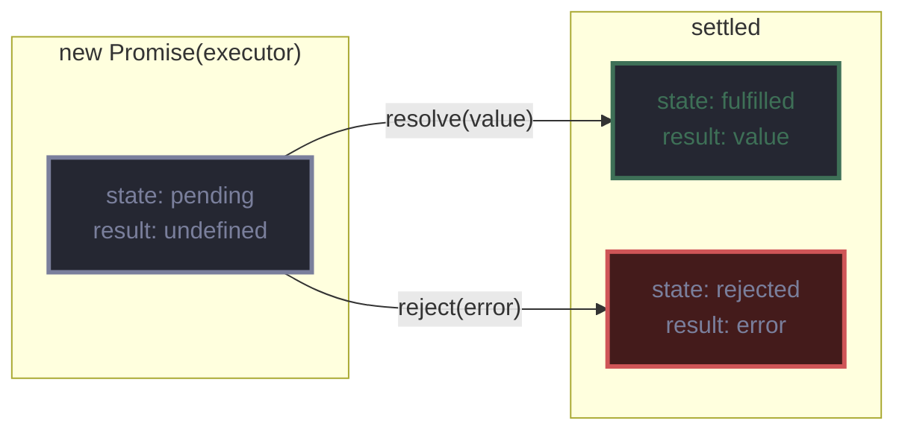

# 基础

## 标准

JavaScript 的标准化组织是 ECMA，这个欧洲信息与通信系统标准化协会提供基于 Javascript 的标准化方案。这种标准化版本的 JavaScript 被称作 ECMAScript，JavaScript 是区分大小写的语言，并且使用 Unicode 字符集。

## 标识符

JavaScript 标识符必须以字母、数字、下划线（`_`）和美元符号（`$`）组成，不可以用数字开头，不能用保留字作为标识符。

## 可选的分号

在 JavaScript 中，分号是可选的，分号用于结束语句，而不是结束块，缺少的分号通过**分号自动插入**（ASI）机制完成。如果在一个块后面添加一个分号，会被解释成一个空语句。ASI 的目标是使分号对行结束来说是可选的，帮助解析器来确定语句的结束。ASI 在遇到如下情况时会认定语句的结束：

- 行结束符后跟着一个非法 token。
- 遇到一个结束的花括号。
- 文件已达到结尾。

## 注释

```javascript
// 单行注释
/* 
 * 多行注释
 * 多行注释
 */
```

## 严格模式

ECMAScript 5 提供了严格模式，在严格模式中，JavaScript代码会更加简洁，会有更少不安全的特性，更多的警告和更加合理的代码。

在严格模式下，变量必须要被显式声明，对未显式声明的变量赋值将会抛出异常。在普通模式下，未显式声明的变量将会创建一个全局变量。

可以在 JavaScript 文件或者`<script>`标签的第一行添加以下代码来启用严格模模式：

```javascript
// 启用严格模式
'use strict';
// 为单个函数启用严格模式
function foo(){
    'use strict';
    ...
}
```

> 不支持ECMAScript 5 的引擎会忽略这一条声明。

## 数据类型

JavaScript 的数据类型分为两类：**原始类型**和**对象类型**。

1. 原始类型（*primitive type*）

   - boolean：有两个值`true`和`false`。
   - number：表示整数或浮点数。
   - string：表示字符串。
   - symbol：在 ECMAScript 6 中新添加的类型，一种实例是唯一且不可改变的数据类型。
   - null：表示`null`值的特殊关键字。
   - undefined：表示变量未赋值的特殊关键字。
   - bigInt：任意精度的整数，可以安全的存储和操作大整数，甚至可以超过数字的安全整数限制。

2. 对象类型（*object type*）

   对象是一种复合值，将很多值聚合在一起，可通过名字访问这些值。

### 数字

JavaScript 不区分整数值和浮点数值，数字均为双精度浮点类型，采用 IEEE 754 标准定义的64位浮点格式表示数字。

```javascript
// 2进制数字
0b10 或 0B10
// 8进制数字
0755 或 0o755
// 16进制
0xFF 或 0XFF
// 指数形式，由前面的实数乘以10的指数次幂
1e3
3.02e23
```

十进制数字可以用0开头，后面接其他十进制数字，但是如果下一个接的十进制数字小于8，那么该数字将会被当做八进制处理。在 ECMAScript 5 严格模式下禁止使用八进制语法，在 ECMAScript 6 中使用八进制数字是需要给一个数字添加前缀`0o`。

> 最好不要使用以0为前缀的整型字面量，因为不知道某些 JavaScript 的实现是否支持八进制的解析。

JavaScript 中的算术运算在溢出、下溢或被零整除时不会报错，当数字运算的结果超过了 JavaScript 所能表示的数字上限，结果为一个特殊的无穷大值`Infinity`，当负数的值超过了所能表示的数字上限时，结果为`-Infinity`。下溢是当运算结果无限接近与零并比 JavaScript 表示的最小值还小，这时将会返回`0`，当负数发生下溢时返回`-0`。

```javascript
1/0 				// Infinity
Number.MIN_VALUE/2	// 发生下溢，结果为0
-Number.MIN_VALUE/2 // -0
0/0					// NaN
```

被零整除在 JavaScript 并不报错，只是返回`Infinity`或者`-Infinity`，但是有一个例外，零除以零是没有意义的，返回一个非数字值，用`NaN`表示。`NaN`与任何值都不相等，包括自身，所以要判断一个值是否为`NaN`，应当使用`x != x`来判断，只有`x`为`NaN`的时候，表达式的结果才为`true`。

内置的`Number`对象有一些有关数字的常量属性：

| 属性                       | 描述           |
| -------------------------- | -------------- |
| `Number.MAX_VALUE`         | 可表示的最大值 |
| `Nubmer.MIN_VALUE`         | 可表示的最小值 |
| `Number.NaN`               | 非数字         |
| `Number.NEGATIVE_INFINITY` | 负无穷         |
| `Number.POSITIVE_INFINITY` | 正无穷         |
| `Number.MIN_SAFE_INTEGER`  | 最小安全整数   |
| `Number.MAX_SAFE_INTEGER`  | 最大安全整数   |

<!--  -->

最大安全安全整数等于 $2^{53}-1$​​​，因为根据 IEEE754 标准，符号位 S 占1位，指数位 E 占11位，尾数位 M 占52位，实际数字表示为：
$$
V=(-1)^S \times 2^E \times M
$$
由于尾数 M 第一位固定为1，所以 M 实际上最多可以表示53位，所以最大安全整数为 $2^{53}-1$。“安全”指的是能够精确表示整数并正确比较它们。

|          | $2^{53}-1$           | $2^{53}$             | $2^{53} + 1$         | $2^{53} + 2$         |
| -------- | -------------------- | -------------------- | -------------------- | -------------------- |
| 内存表示 | `0x433fffffffffffff` | `0x4340000000000000` | `0x4340000000000000` | `0x4340000000000001` |
| 精确     | Y                    | Y                    | N                    | Y                    |
| 安全     | Y                    | N                    | N                    | N                    |

IEEE 754 无法精确表示 $2^{53} + 1$，而是采用就近舍入和向零舍入时，会舍入到 $2^{53}$ ，所以在 JavaScript 中这两个值相等：

```javascript
Number.MAX_SAFE_INTEGER + 1 === Number.MAX_SAFE_INTEGER + 2 // true
```

`Number`类定义的`toString()`方法可以接收表示转换基数的可选参数：

```javascript
var n = 17;
var bin = n.toString(2); // 10001
var oct = n.toString(8); // 21
var dev = n.toString(); // 17，不指定则默认是10进制
var hex = n.toString(16); // 11
```

`Number`类中的`toFixed()`方法根据小数点后的指定位数将数字转换为字符串：

```javascript
var n = 123456.789;
n.toFixed(0); // 123456
n.toFixed(5); // 123456.78900
```

`Number`类中的`toExponential()`方法将数字转换为指数形式的字符串：

```javascript
var n = 123456.789;
n.toExponential(); // 1.23456789e+5
n.toExponential(3); // 1.235e+5
```

`Number`类中的`toPrecision()`方法根据指定的有效位数将数字转换为字符串：

```javascript
var n = 123456.789;
n.toPrecision(7); // 123456.8
n.toPrecision(10); // 123456.7890
```

`parseInt()`函数和`parseFloat()`函数可以解析整数和浮点数，它们是全局函数，ES6 中将这两个方法移植到`Number`对象上面，行为完全保持不变。`parseInt()`可以接收表示转换基数的可选参数，取值范围是2~36（因为`[0-9A-Z]`总共36个）。

```javascript
parseInt('zz',36); // 1295
```

### 字符串

字符串是一组由16位值组成的不可变的有序序列，每个字符通常来自于 Unicode 字符集，字符串的长度是其所含16位值的个数。JavaScript 采用 UTF-16 编码的 Unicode 字符集。

JavaScript 中字符串字面量是由单引号或双引号括起来的字符序列，在 ECMAScript 5 中，字符串字面量可以拆分为数行，每行必须以反斜杠结束。

```javascript
"hello world"
'hello world'
'name = "jack"'
"one\
log\
line"
```

### 布尔值

这个类型只有两个值，`true`和`false`。任意 JavaScript 值都可以转换为布尔值，下面这些值会被转换成`false`：

```javascript
undefined
null
0
-0
NaN
""  // 空字符串
```

所有其他值，包括所有对象都会转换为`true`。`false`和可以转换为`false`的值称做**假值**，其他值称为**真值**。

### `null`和`undefined`

`null`是 JavaScript 的关键字，用来描述空值，对`null`执行`typeof`运算，结果为`object`。

> `typeof null`会返回`object`这是 JavaScript 编程语言的一个 bug，实际上它并不是一个`object`。

`undefined`是预定义的全局变量（和`null`不一样，不是关键字），表示变量没有初始化，如果要查询的对象属性或数组元素的值时返回`undefined`则说明这个属性或元素不存在，如果函数没有返回任何值，则返回`undefined`。对`undefined`执行`typeof`运算，则返回`undefined`，表明这个值是这个类型的唯一成员。在 ECMAScript 3 中，`undefined`是可读写的变量，可以给它赋值，在 ECMAScript 5 中是只读的。

## 全局对象

全局对象的属性是全局定义的符号，JavaScript 程序可以直接使用，当 JavaScript 解释器启动时，它将创建一个新的全局对象，并给它一组定义的初始属性：

- 全局属性，例如`undefined`、`Infinity`和`NaN`。
- 全局函数，例如`isNaN()`、`parseInt()`和`eval()`。
- 构造函数，例如`Date()`、`RegExp()`、`String()`、`Object()`和`Array()`。
- 全局对象，例如`Math`和`JSON`。

ECMAScript 虽然没有指出如何访问全局对象，但 Web 浏览器都是将这个全局对象作为`window`对象的一部分加以实现的，因此在全局作用域中声明的所有变量和函数，就都成为了 window 对象的属性。在没有函数明确指明`this`值的情况下，`this`的值等于全局对象。

```javascript
var global = function(){
	return this;   
}
```

当初次创建时，全局对象定义了 JavaScript 中所有的预定义全局值，这个特殊对象同样包含了为程序定义的全局值。如果一个代码声明了一个全局变量，这个全局变量就是全局对象的一个属性。

当使用`var`声明一个变量时，创建的这个属性是不可配置的，也就是说这个变量无法通过`delete`运算符删除，如果没有使用严格模式并给一个未声明的变量赋值，JavaScript 会自动创建一个全局变量，用这种方式创建的变量是全局对象的正常的可配置属性，并可以删除。

```javascript
var a = 1;		// 声明一个不可删除的全局变量
b = 2;			// 创建全局对象的一个可删除的属性
this.c = 3;		// 同上
delete a;		// 没有删除
delete b;		// 变量被删除
delete this.c;	// 变量被删除
```

## 包装对象

JavaScript 对象是一种复合值，是属性或已命名值的集合，通过`.`符号来引用属性值，当属性值是一个函数的时候，称为方法。

```javascript
var s = "hello world";
var word = s.substring(s.indexOf(" ") + 1, s.length);
```

字符串不是对象，但是只要引用了字符串的属性，JavaScript 就会将字符串值通过调用`new String(s)`的方式转换为对象，这个对象继承了字符串的方法，并被用来处理属性的引用，一旦引用结束，这个新创建的对象就会被销毁（实现上并不一定创建或销毁这个临时对象，整个过程看起来是这样）。数字和布尔值也具有各自的方法，通过`Number()`和`Boolean()`构造函数创建一个临时对象，这些方法的调用均是来自于这个临时对象。

> `null`和`undefined`没有包装对象，访问属性会造成一个类型错误。

可以通过`String()`、`Number()`或`Boolean()`构造函数来显示创建包装对象：

```javascript
var s = new String("test");
var n = new Number(1);
var b = new Boolean(true);
```

## 类型转换

|             值             |                 字符串                  |                  数字                   | 布尔值  |                      对象                       |
| :------------------------: | :-------------------------------------: | :-------------------------------------: | :-----: | :---------------------------------------------: |
|        `undefined`         |              `"undefined"`              |                  `NaN`                  | `false` |               `throws TypeError`                |
|           `null`           |                `"null"`                 |                    0                    | `false` |               `throws TypeError`                |
|           `true`           |                `"true"`                 |                    1                    |         |               `new Boolean(true)`               |
|          `false`           |                `"false"`                |                    0                    |         |              `new Boolean(false)`               |
|      `""`（空字符串）      |                                         |                    0                    | `false` |                `new String("")`                 |
|   `"1.2"`（非空，数字）    |                                         |                   1.2                   | `true`  |               `new String("1.2")`               |
|  `"one"`（非空，非数字）   |                                         |                  `NaN`                  | `true`  |               `new String("one")`               |
|         `0`或-`0`          |              `"0"`或`"-0"`              |                                         | `false` |        `new Number(0)`或`new Number(-0)`        |
|           `NaN`            |                 `"NaN"`                 |                                         | `false` |                `new Number(NaN)`                |
|  `Infinity`或`-Infinity`   |       `"Infinity"`或`"-Infinity"`       |                                         | `true`  | `new Number(Infinity)`或`new Number(-Infinity)` |
|        `1`（非零）         |                  `"1"`                  |                                         | `true`  |                 `new Number(1)`                 |
|      `{}`（任意对象）      | [对象转换为原始值](###对象转换为原始值) | [对象转换为原始值](###对象转换为原始值) | `true`  |                                                 |
|            `[]`            |                  `""`                   |                    0                    | `true`  |                                                 |
|    `[9]`（1个数字元素）    |                  `"9"`                  |                    9                    | `true`  |                                                 |
|    `['a']`（其它数组）     |            使用`join()`方法             |                  `NaN`                  | `true`  |                                                 |
| `function(){}`（任意函数） | [对象转换为原始值](###对象转换为原始值) |                  `NaN`                  | `true`  |                                                 |

> 空单元格表示不必要也没有执行的转换。

那些以数字表示的字符串可以直接转换为数字，也允许在开始和结尾处带有空格，但在开始和结尾处的任意非空格字符都不会被当成数字直接量的一部分，进而造成字符串转化为数字的结果为`NaN`。

原始值到对象的转换，直接通过调用`String()`、`Number()`或`Boolean()`构造函数，转换为它们各自的包装对象。

### 显式类型转换

显式类型转换最简单的方法就是使用`String()`、`Number()`、`Boolean()`或`Object()`函数。当不通过`new`运算符调用这些函数时，他们会作为类型转换函数根据上表的规则进行类型转换。

```javascript
Number("3"); // 3
String(false); // "false"
Object(3); // new Number(3)
```

如果试图把`null`或`undefined`转换为对象，则会抛出一个类型错误，`Object()`函数在这种情况下不会抛出异常，仅返回一个空对象。

### 对象转换为原始值

所有的对象继承了两个转换方法：`toString()`和`valueOf()`。

`toString()`方法返回一个反映这个对象的字符串，默认的`toString()`方法返回`"[object Object]" `：

```javascript
({x:1, y:2}).toString(); // "[object Object]" 
```

很多类定义了更多特定版本的`toString()`方法，例如：

```javascript
[1, 2, 3].toString(); // "1,2,3"
(function(x){}).toString(); // "function(x){}"
/\d+/g.toString(); // "/\\d+/g"
new Date(1970,0,1).toString(); // "Thu Jan 01 1970 00:00:00 GMT+0800 (中国标准时间)"
```

另一个转换对象的函数是`valueOf()`方法，如果存在任意原始值，它就默认将对象转换为表示它的原始值，对象是复合值，大多数时候无法真正表示一个原始值，因此默认的`valueOf()`方法简单的返回对象本身。数组、函数和正则表达式简单的继承了这个默认方法，日期类定义的`valueOf()`方法返回它的一个内部表示：1970年1月1日以来的毫秒数。

---

对象到字符串的转换过程如下：

- 如果对象具有`toString()`方法，则调用这个方法，如果它返回一个原始值，将这个值转化为字符串（如果本身不是字符串），并返回这个字符串结果。
- 如果对象没有`toString()`方法，或者这个方法返回的不是一个原始值，那么会调用`valueOf()`方法，如果这个方法存在，则调用它，如果返回值是原始值，将这个值转换为字符串并返回结果。
- 否则，如果无法从`toString()`或`valueOf()`获得一个原始值，则抛出一个类型错误异常。

对象到数字的转换过程如下：

- 如果对象具有`valueOf()`方法，并返回了一个原始值，则将这个值转换为数字并返回。
- 否则，如果对象具有`toString()`方法，并返回了一个原始值，则将这个值转换为数字并返回。
- 否则，抛出一个类型错误异常。

> 空数组转换为数字会变成0：数组继承了默认的`valueOf()`方法，返回一个对象而不是原始值，则调用`toString()`方法，空数组转化为空字符串，然后空字符串转换为数字0。

## 变量声明

```javascript
var i; 			// 声明一个变量
var count, sum; // 同时声明多个变量
```

如果未在`var`声明语句中给变量指定初始值，那么初始值就是`undefined`。

## 变量作用域

全局变量拥有全局作用域，在 JavaScript 代码中任何地方都有定义。在函数内声明的变量只在函数体内有定义，是局部变量。函数参数也是局部变量，只在函数体内有定义。

在函数体内，局部变量的优先级高于同名的全局变量，如果在函数内声明的一个局部变量或者函数参数中带有的变量和全局变量重名，那么全局变量就会被局部变量覆盖。

```javascript
var scope = "global";
function checkscope(){
	var scope = "local";
	return scope;
}
checkscope(); // 返回"local"
```

JavaScript 中没有块级作用域，取而代之使用了**函数作用域**，变量在声明的函数体以及这个函数体嵌套的任何函数体内都是有定义的，这意味着变量在声明之前甚至已经可用，JavaScript 这个特性被非正式称为**提前声明**，即 JavaScript 函数里声明的所有变量都被提前至函数体的顶部。

```javascript
var scope = "global";
function f(){
	console.log(scope); // 输出"undefined"
	var scope = "local" // 变量在这赋初值，但变量在函数体内任何地方均是有定义的
	console.log(scope); // 输出"local"
}
```

## 作用域链

每一段 JavaScript 代码（全局代码或函数）都有一个与之关联的**作用域链**（*scope chain*），这个作用域链是一个对象列表或者链表，这组对象定义了这段代码作用域中的变量，当需要查找变量`x`的值时，会从链中的第一个对象开始查找，如果这个对象有一个`x`属性，则会直接使用这个属性的值，如果第一个对象不存在这个属性，则会查找链上的下一个对象，以此类推。如果作用域链上没有任何一个对象含有这个属性，则会认为这段代码的作用域上不存在这个属性，并最终抛出一个引用错误异常。

在 JavaScript 最顶层代码中（也就是不包含在任何函数定义内的代码），作用域链由一个全局对象组成；在不包含嵌套的函数体内，作用域链上有两个对象，第一个是定义函数函数和局部变量的对象，第二个是全局对象；在一个嵌套的函数体内，作用域链上至少有三个对象。

## 词法作用域

```javascript
function init() {
  var name = "Mozilla";
  function displayName() {
    alert(name); // 使用了父函数中声明的变量
  }
  displayName();
}
init();
```

这个词法作用域的例子描述了分析器如何在函数嵌套的情况下解析变量名。词法（*lexical*）一词指的是，**词法作用域**根据源代码中声明变量的位置来确定该变量在何处可用。嵌套函数可访问声明于它们外部作用域的变量。

## 执行上下文

当一段 JavaScript 代码在运行的时候，实际上是运行在**执行上下文**中，下面3种类型的代码会创建一个新的执行上下文：

- 全局上下文是为运行代码主体而创建的执行上下文，它是为那些存在于 JavaScript 函数之外的任何代码而创建的。
- 每个函数会在执行的时候创建自己的执行上下文。这个上下文就是通常说的“本地上下文”。
- 使用`eval()`函数也会创建一个新的执行上下文。

每一个上下文在本质上都是一种作用域层级，每个代码段开始执行的时候都会创建一个新的上下文来运行它，并且在代码退出的时候销毁掉。

# 表达式和运算符

## 算术表达式

基本的算术运算符是`*`、`/`、`%`、`+`、`-`。除了`+`运算符，其余的运算符只是在必要时将操作数转换为数字，然后进行对应的操作，所有无法转换为数字的操作数都转换为`NaN`，如果操作数是`NaN`，运算结果也是`NaN`。运算符`%`计算第一个操作数对第二个操作数的模，结果的符号和第一个操作数的符号保持一致，例如`-5%2`结果为`-1`。

### `+`运算符

二元运算符`+`可以对两个数字做加法，也可以用于字符串连接。加号的转换规则优先考虑字符串连接，如果其中一个操作数是字符串或者转换为字符串的对象，另一个操作数将会转换为字符串。如果两个操作数都不是字符串，那么将进行算术加法运算。加法运算符的行为如下：

1. 如果其中一个操作数是对象，则对象会遵循对象到原始值的转换规则转换为原始类值，日期对象通过`toString()`方法执行转换，其他对象则通过`valueOf()`方法执行转换（如果`valueOf()`方法返回一个原始值的话），由于多数对象都不具备可用的`valueOf()`方法，因此会通过`toString()`方法来执行转换。
2. 进行了对象到原始值的转换后，如果其中一个数是字符串的话，另一个操作数也会转换为字符串，然后进行字符串连接。
3. 否则，两个操作数都将转换为数字（或者`NaN`），然后进行加法操作。

> 对于所有非日期对象来说，对象到原始值的转换基本上是对象到数字的转换（即首先调用`valueOf()`），日期对象则使用对象到字符串的转换模式，这里的转换之前不完全一致：通过`valueOf()`和`toString()`返回的原始值将被直接使用，而不会被强制转换为数字或字符串。

### 一元算术运算符

- 一元加法`+`

    把操作数转换为数字（或者`NaN`），并返回这个数字。

- 一元减法`-`

    把操作数转换为数字。

- 递增`++`

    将操作数转换为数字然后给数字加1并重新赋值给变量。表达式`++x`并不总和`x=x+1`完全一样，`++x`从不进行字符串连接操作，例如：

    ```javascript
    var i = j = "1";
    ++i; // 结果为2
    j = j + 1; // 结果为'11'
    ```

- 递减`--`

    将操作数转换为数字然后给数字减1并重新赋值给变量。

### 位运算符

位运算符要求操作数是整数，这些整数表示为32位整型而不是64位浮点型，必要时位运算符先将操作数转换为数字并将数字强制表示为32位整型。移位运算符要求右操作数在0~31之间。

> 位运算符会将`NaN`、`Infinity`和`-Infinity`都转换为0。

- 按位与`&`：位运算符`&`对它的整型操作数逐位执行布尔与操作，只有两个操作数中相对应的位都是1，结果中的这一位才是1。
- 按位或`|`：位运算符`!`对它的整型操作数逐位执行布尔或操作，如果其中一个操作数相应的位为1，或者两个操作数相应位都是1，那么结果中的这一位就为1。
- 按位异或`^`：位运算符`^`对它的整型操作数逐位执行布尔异或操作，如果两个操作数中只有一个相应位为1，那么结果中的这一位就是1，否则就是0。
- 按位非`~`：位运算符`~`是一元运算符，它将操作数的所有位取反。
- 左移`<<`：将第一个操作数的所有二进制位进行左移操作，移动的位数由第二个操作数指定移动的位数是0~31之间的一个整数，新的第一位用0来补充。
- 带符号右移`>>`：将第一个操作数的所有位进行右移，移动的位数由第二个操作数指定移动的位数是0~31之间的一个整数，右边溢出的位将忽略，填补在左边的位由原操作数的符号决定，以便保持结果的符号与原操作数一致。
- 无符号右移`>>>`：运算符`>>>`和运算符`>>`一样，只是左边的高位总是填补0，与原来的操作数符号无关。

## 关系表达式

### 相等和不等运算符

`===`被称为严格相等运算符，首先计算其操作数的值，然后比较这两个值，比较过程不进行任何类型转换。相等运算符`==`的比较并不严格，如果两个操作数不是同一类型，那么相等运算符会进行一些类型转换，然后比较。

### 比较运算符

比较操作符的操作数可能是任意类型。然而，只有数字和字符串才能其正执行比较操作，因此那些不是数字和字符串的操作数都将进行类型转换，类型转换规则如下：

- 如果操作数为对象，如果`valueOf()`返回一个原始值，则直接使用这个原始值，否则使用`toString()`的转换结果进行比较操作。
- 在对象转换为原始值之后，如果两个操作数都是字符串，那么将依照字母表的顺序对两个字符串进行比较，这里提到的”字母表顺序“是指组成这个字符串的16位 Unicode 字符的索引顺序。
- 在对象转换为原始值之后，如果至少有一个操作数不是字符串，那么两个操作数都将转换为数字进行数值比较。0和-0是相等的。`Infinity`比其他任何数字都大（除了它本身），`-Infinity`比其他任何数字都小（除了它本身）。如果其中一个操作数是`NaN`，那么比较操作符总是返回`false`。

### `in`运算符

`in`运算符希望它的左操作数是一个字符串或可以转换为字符串，希望它的右操作数是一个对象。如果右侧的对象拥有一个名为左操作数值的属性名，那么表达式返回`true`，例如：

```javascript
var pointer = {
  x: 1,
  y: 2,
};
'x' in pointer; // true
var data = [1, 2, 3];
'0' in data; // 包含索引为'0'的元素
1 in data; // 数字转为字符串
3 in data; // 没有索引为3的元素
```

### `instanceof`运算符

`instanceof`运算符用于检测构造函数的`prototype`属性是否出现在某个实例对象的原型链上，`instanceof`运算符希望左操作数是一个对象，右操作数标识对象的类。如果左侧的对象是右侧类的实例，则表达式返回`true`，否则返回`false`。JavaScript 中对象的类是通过初始化它们的构造函数来定义的，所以`instanceof`的右操作数应当是一个函数。如果左操作数不是对象则返回`false`，如果右操作数不是函数则抛出一个类型异常。

```javascript
var d = new Date();
d instanceof Date;   // true，d是由Date()创建的
d instanceof Object; // true，所有的对象都是Object的实例
d instanceof Number; // false
var a = [1, 2, 3];
a instanceof Array;  // true，a是一个数组
a instanceof Object; // true，所有的数组都是对象
a instanceof RegExp; // false
```

## 逻辑表达式

- 逻辑与`&&`

    `&&`对真值和假值进行布尔与运算，如果左侧表达式结果是假值，那么整个表示式的结果也一定是假值，因此会直接返回左操作数的值，而不会对右操作数进行计算。当左侧表示式的结果是真值时，那么整个表达式的结果则依赖于右操作数的值。因此，当左操作数为真，整个表达式的结果为右操作数的值。

- 逻辑或`||`

  `||`对两个操作数做布尔或运算，如果其中一个或者两个操作数是真值，它返回一个真值。如果两个操作数都是假值，它返回一个假值。

- 逻辑非`!`

- 逻辑空赋值`??=`

    `x ??= y`仅在`x`是空值（`null`或`undefined`）时对其赋值。

- 空值合并运算符`??`

    当左侧的操作数为`null`或`undefined`时，返回其右侧操作数，否则返回左侧操作数。

    ```javascript
    const foo = null ?? 'default string'; // 'default string'
    const baz = 0 ?? 42; // 0
    ```

## 表达式计算

全局函数`eval()`可以解释运行由 JavaScript 源代码组成的字符串：

```javascript
eval("3 + 2") // 结果为5
```

`eval()`只有一个参数，如果传入的参数不是字符串，那么直接返回这个参数，如果参数是字符，它会把字符串当成 JavaScript 代码进行编译，如果编译失败则抛出一个语法错误异常。如果编译成功，则开始执行这段代码，并返回字符串中的最后一个表达式或语句的值，如果最后一个表达式或语句没有值，则最终返回`undefined`。`eval()`使用了调用它的变量作用域环境，如果一个函数定义了一个局部变量`x`，然后调用`eval("x")`，它会返回局部变量的值。

## 其他表达式

### 条件运算符

### `typeof`运算符

### `delete`运算符

### `void`运算符

### 逗号运算符

## 可选链运算符

可选链运算符`?.`允许读取位于连接对象链深处的属性的值，而不必明确验证链中的每个引用是否有效。`?.`运算符的功能类似于`.`链式运算符，不同之处在于，在引用为空（`null`或`undefined`）的情况下不会引起错误，该表达式短路返回值是`undefined`，与函数调用一起使用时，如果给定的函数不存在，则返回`undefined`。**可选链不能用于赋值。**

```javascript
const adventurer = {
  name: 'Alice',
  cat: {
    name: 'Dinah',
  },
};

const dogName = adventurer.dog?.name; // Expected output: undefined
adventurer.someNonExistentMethod?.(); // Expected output: undefined
```

# 语句

## `for/in`

`for/in`语句用来更方便的遍历对象属性成员，语法如下：

```javascript
for(variable in ojbect)
    statement
```

在执行过程中，解释器首先计算`object`表达式，如果表达式为`null`或者`undefined`，则会跳过循环并执行后续的代码。如果表达式等于一个原始值，则会被转换为对应的包装对象。然后会依次枚举对象的属性来执行循环，在每次循环之前，都会先计算`variable`表达式的值，并将属性名（一个字符串）赋值给它。

```javascript
var obj = {
  x: 1,
  y: 2,
  z: 3,
};
var arr = [], i = 0;
for(arr[i++] in obj); // 将对象所有属性复制到一个数组中
```

> 只要`for/in`循环中`variable`的值可以当做赋值表达式的左值，则可以是任意表达式。

`for/in`循环并不会遍历对象的所有属性，只有可枚举的属性才会遍历到。由 JavaScript 语言核心所定义的内置方法就不是可枚举属性，比如`toString()`这个属性。而代码中定义的所有属性和方法都是可枚举的，对象可以继承其他对象的属性，那些继承的自定义属性也可以使用`for/in`枚举出来。

如果`for/in`的循环体删除了还未枚举的属性，那么这个属性将不会再枚举到。如果循环体定义了对象的新属性，这些属性通常也不会枚举到（JavaScript 的有些实现是可以枚举那些在循环体中增加的继承属性的）。

## `with`语句


## `debugger`语句

`debugger`语句调用任何可用的调试功能，例如设置断点。如果没有调试功能可用，则此语句不起作用。

```javascript
debugger;
```

## `"use strict"`

`"use strict"`是 ECMAScript 5 引入的一条指令，


# 对象

## 创建对象

通过字面量直接创建，属性名可以是标识符，也可以是字符串字面量，属性值可以是任意类型的表达式。

```javascript
var point = {
  x: 0,
  y: 0,
};
var point1 = {
  x: point.x,
  y: point.y + 1,
};
var book = {
  "main title": "JavaScript", // 属性名有空格，必须用字符串表示
  "sub-title": "The Difinitive Guide", // 属性名有连字符，必须用字符串表示
  for: "all audiences", // ES5中保留字可以不带引号
  author: {
    firstName: "David",
    lastName: "Flanagan",
  }, // ES5中最后一个属性后面的逗号会被忽略
};
```

`new`运算符创建并初始化一个对象，`new`后面跟随一个函数调用，这个函数被称为**构造函数**。

```javascript
var obj = new Object(); // 创建一个空对象，相当于{}
var arr = new Array();  // 创建一个空数组，相当于[]
```

## 原型

每一个 JavaScript 对象（`null`除外）都从原型继承属性，所有通过对象字面量创建的对象都具有同一个**原型对象**，并可以通过`Object.prototype`获得对原型对象的引用。

通过`new`和构造函数创建的对象的原型就是构造函数的`protorype`属性的值，即`new Object()`创建的对象也继承自`Object.prototype`，`new Array()`创建的对象的原型就是`Array.prototype`，`new Date()`创建的对象的原型就是`Date.prototype`。

ECMA Script 定义了一个名为`Object.create()`的方法，可以创建一个新对象，其中第一个参数是这个对象的原型，第二个可选参数是对对象属性的描述。

```javascript
// obj1继承了属性x和y
var obj1 = Object.create({ x: 1, y: 2 });
// 创建一个普通的对象,相当于new Object()
var obj2 = Object.create(Object.prototype);
```

可以传入`null`来创建一个没有原型的对象，通过这种方式创建的对象不会继承任何东西，甚至不包括基础方法，如`toString()`，即不能和`+`运算符一起工作。

```javascript
// obj不继承任何属性和方法
var obj = Object.create(null);
```

## 继承

对象具有自有属性（*own property*），也有一些属性是从原型对象基础而来的。

如果要查询对象`o`的`x`属性，如果`o`中不存在`x`，那么将会继续在`o`的原型对象中查询属性`x`，如果原型对象中没有`x`，但是这个原型对象也有原型，那么会继续在这个原型对象的原型上执行查询，直到找到`x`或者查找到一个原型是`null`的对象为止。对象的原型属性构成了一个链，通过这个链可以实现属性的继承。

```javascript
var o = {}; // o继承Object.prototype
o.x = 1;
var p = Object.create(o); // p继承o和Object.prototype
p.y = 2;
var q = Object.create(p); // q继承p、o和Object.prototype
q.z = 3;
var s = q.toString(); // toString()继承Object.prototype
q.x + q.y; // x和y分别继承o和p
```

<!--  -->

如果给对象`obj`的属性`x`赋值，如果`obj`中已经有这个属性（不是继承来的），那么赋值操只改变这个已有属性。如果`obj`中不存在属性`x`，那么赋值操作将会添加一个`x`属性，如果`obj`存在继承的属性`x`，那么继承的属性会被新创建的同名属性覆盖。

赋值操作首先检查原型链，如果`obj`继承自一个只读属性`x`，那么赋值操作是不允许的。如果允许属性赋值操作，那么也总是在原始对象上创建属性或对已有的属性赋值，而不会修改原型链。

### 属性访问错误

## 删除属性

## 检测属性

## 枚举属性

## `getter`和`setter`

## 属性的特性

## 对象的三个属性

## 序列化对象

## 对象方法

# 数组


数组扁平化

# 函数


## 防抖和节流


```

```


# 类

JavaScript 中，类的实现是基于原型继承机制的，如果两个实例都从同一个原型对象上继承了属性，则称为同一个类的实例。

# Promise

Promise 是一个对象，它代表了一个异步操作的最终完成或者失败，本质上 Promise 是一个函数返回的对象，我们可以在它上面绑定回调函数，这样我们就不需要在一开始把回调函数作为参数传入这个函数了。

连续执行两个或者多个异步操作是一个常见的需求，在上一个操作执行成功之后，开始下一个的操作，并带着上一步操作所返回的结果。在旧的回调风格中，这种操作会导致经典的**回调地狱**：

```javascript
doSomething(function (result) {
  doSomethingElse(result, function (newResult) {
    doThirdThing(newResult, function (finalResult) {
      console.log(`${finalResult}`);
    }, failureCallback);
  }, failureCallback);
}, failureCallback);
```

有了 Promise，我们就可以通过一个 Promise 链来解决这个问题。这就是 Promise API 的优势，因为回调函数是附加到返回的 Promise 对象上的，而不是传入一个函数中。

```javascript
doSomething()
  .then((result) => doSomethingElse(result))
  .then((newResult) => doThirdThing(newResult))
  .then((finalResult) => {
    console.log(`${finalResult}`);
  })
  .catch(failureCallback);
```

一个 Promise 必然处于以下几种状态之一：

- 待定（*pending*）：初始状态，既没有被兑现，也没有被拒绝。
- 已兑现（*fulfilled*）：意味着操作成功完成。
- 已拒绝（*rejected*）：意味着操作失败。

> [!NOTE]
>
> 一个 *fulfilled* 或 *rejected* 的 Promise 都会被称为 *settled*。



## Promise 构造函数

当通过 `new` 关键字调用 Promise 构造函数时，它会返回一个 Promise 对象，它还会生成一对相应的 `resolve()` 和 `reject()` 函数，它们与 Promise 对象“绑定”在一起。

```javascript
let promise = new Promise(function(resolve, reject) {
  ...
});
```

`executor()` 是在构造函数中执行的函数，它接收两个函数作为参数：`resolve()` 和 `reject()`。`excutor()` 函数的返回值会被忽略，`executor()` 函数中的 `return` 语句仅影响控制流程，调整函数某个部分是否执行，但不会影响 Promise 的兑现值，如果 `executor()` 函数退出，且未来不可能调用 `resolve()` 或 `reject()`，那么 Promise 将永远保持 *pending* 状态。`executor()` 中抛出的任何错误都会导致 Promise 被拒绝。

`executor()` 中的代码有机会执行某些操作，异步任务的最终完成通过 `resolve()` 或 `reject()` 引起的副作用与 Promise 实例进行通信，这个副作用让 Promise 对象变为 *settled* 状态。如果先调用 `resolve()`，则 Promise 变为 *fulfilled* 状态，如果先调用 `reject()`，则 Promise 变为 *reject* 状态。

一旦 Promise 为 *settled*，它会异步的调用任何通过 `then()`、`catch()` 或 `finally()` 关联的进一步处理程序，最终的兑现值或拒绝原因在调用时作为输入参数传给兑现和拒绝处理程序。

### resolve

`resovle()` 函数具有以下行为：

- 如果它被调用时传入了新建的 Promise 对象本身（即它所“绑定”的 Promise 对象），则 Promise 对象会被拒绝。

- 如果它使用一个非 Thenable 的值（基本类型或者一个没有 `then` 属性或 `then` 属性不可调用的对象），则该 Promise 对象会被立即以该值兑现。

- 如果它被调用时传入了一个 Thenable 对象（包括另一个 Promise 实例），则该 Thenable 对象的 `then()` 方法将被保存并在未来被调用（它总是异步调用）。`then()` 方法将被调用并传入两个回调函数，这两个函数的行为与传递给 `executor()` 函数的 `resolve()` 和 `reject()` 函数完全相同。如果调用 `then()` 方法时出现错误，则当前的 Promise 对象会被拒绝并抛出这个错误。

    ```javascript
    new Promise((resolve, reject) => {
      resolve(thenable);
    });
    ```

    ```javascript
    new Promise((resolve, reject) => {
      try {
        thenable.then(
          (value) => resolve(value),
          (reason) => reject(reason),
        );
      } catch (e) {
        reject(e);
      }
    });
    ```


### reject

## Thenable

在 Promise 成为 JavaScript 语言的一部分之前，JavaScript 生态系统已经有了多种 Promise 实现。尽管它们在内部的表示方式不同，但至少所有类 Promise 的对象都实现了 Thenable 接口。Thenable 对象实现了`then()` 方法，该方法被调用时需要传入两个回调函数，一个用于 Promise 被兑现时调用 `onFulfilled`，一个用于 Promise 被拒绝时调用 `onRejected`。 Promise 也是 thenable 对象。

```javascript
promise.then(onFulfilled, onRejected){
  ...
}
```

> [!NOTE]
>
> 更多内容参考 [Promises/A+ 规范](https://promisesaplus.com/)。

## Promise 链式调用

- `then()`
- `catch()`
- `finally()`

## Promise 静态方法

`Promise` 类提供了四个静态方法来促进异步任务的并发：

1. `Promise.all()`
2. `Promise.allSettled()`
3. `Promise.any()`
4. `Promise.race()`


## then/catch/finally

Promise 对象充当的是 executor 和消费函数之间的连接，后者将接收结果或 error，可以使用`.then`和`.catch`方法注册消费函数。`.then`函数语法如下：

```javascript
promise.then(
  function(result) { /* handle a successful result */ },
  function(error) { /* handle an error */ }
);
```

`.then`的第一个参数是一个函数，该函数将在 promise resolved 且接收到结果后执行。`.then`的第二个参数也是一个函数，该函数将在 promise rejected 且接收到 error 信息后执行。

```javascript
new Promise(function (resolve, reject) {
  setTimeout(() => resolve("done!"), 1000);
}).then(
  (result) => console.log(result), // 1 秒后显示 "done!"
  (error) => console.log(error) // 不运行
);
```

如果只对一个结果感兴趣，可以只为`.then`提供一个参数：

```javascript
promise.then(alert);
promise.then(null, errorHandlingFunciton);
```

或者使用`.catch(errorHandlingFunciton)`来代替`.then(null, errorHandlingFunciton)`：

```javascript
promise.catch(alter);
```

调用`.finally(f)`，当 promise settled 时`f`就会执行。`finally`的功能是设置一个处理程序在前面的操作完成后，执行清理或终结。

```javascript
new Promise((resolve, reject) => {
  throw new Error("error");
}).finally(() => {
    // do something
}).then((result) => {
    // do something
},(error) => {
    // do something
});
```

> finally 处理程序没有参数，promise 的结果由下一个处理程序处理。`finally`处理程序也不应该返回任何内容，如果它返回了，返回的值会默认被忽略，例外的是当`finally`抛出 error 时，执行将转到最近的 error 的处理程序。

## Promise 链

Promise 链看起来像这样：

```javascript
new Promise((resolve) => {
  resolve(1);
})
.then((result) => {
  console.log(result);
  return result * 2;
})
.then((result) => {
  console.log(result);
  return result * 2;
})
.then((result) => {
  console.log(result);
});
```

它的想法是通过`.then`处理程序链传递 result，这样之所以可行，是因为每个对`.then`的调用都会返回了一个新的 promise，因此可以调用下一个`.then`，当处理程序返回一个值时，将成为该 promise 的 result。

### 返回 Promise

`.then(handler)`中的处理程序可以创建并返回一个 Promise，这种情况下，其他的处理程序将等待它的 settled 后再获取其结果。

```javascript
new Promise((resolve) => {
  setInterval(() => resolve(1), 1000);
})
.then((result) => {
  console.log(result);
  return new Promise((resolve) => {
    setInterval(() => resolve(result * 2), 1000);
  });
})
.then((result) => {
  console.log(result);
  return new Promise((resolve) => {
    setInterval(() => resolve(result * 2), 1000);
  });
})
.then((result) => {
  console.log(result);
});
```


## async/await

`async function`声明会创建一个`AsyncFunction`对象，每次调用异步函数时，都会返回一个新的`Promise`对象，该对象将会被解决为异步函数的返回值，或者被拒绝为异步函数中未捕获的异常。`AsyncFunction`不是全局对象，它可以通过以下代码获取：

```javascript
// AsyncFunction是Function的子类
const AsyncFunction = async function () {}.constructor;
```

异步函数可以包含多个`await`表达式，`await`操作符用于等待一个`Promise`兑现并获取它兑现之后的值，它只能在异步函数或者模块顶层中使用。`await`表达式通过暂停执行使返回`Promise`的函数表现得像同步函数一样，直到返回的`Promise`被兑现或拒绝。返回的`Promise`的解决值会被当作该`await`表达式的返回值。

异步函数总是返回一个`Promise`，如果一个异步函数的返回值看起来不是`Promise`，那么它将会被隐式地包装在一个`Promise`中：

```javascript
const p = new Promise((res, rej) => {
  res(1);
});

async function asyncReturn() {
  return p;
}

function basicReturn() {
  return Promise.resolve(p);
}

console.log(p === basicReturn()); // true
console.log(p === asyncReturn()); // false
```
