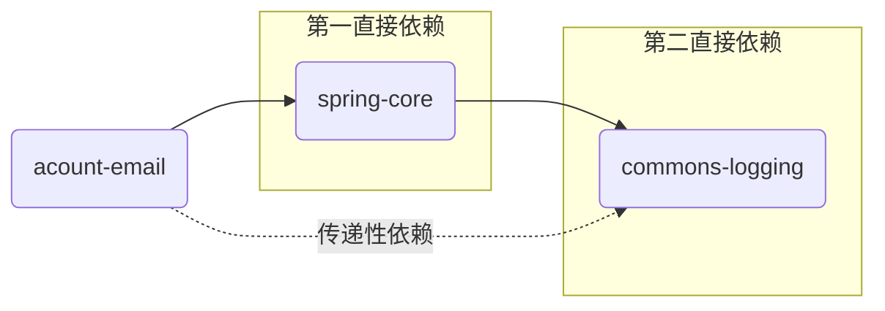
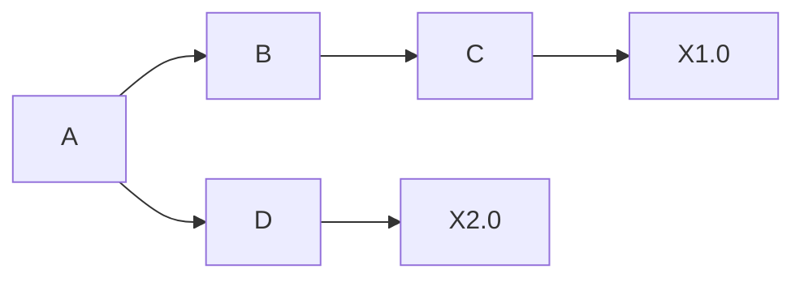
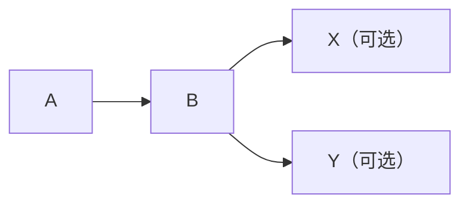
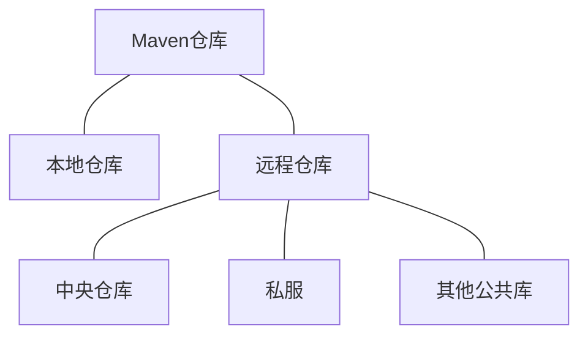
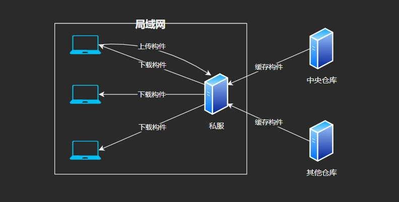

# 安装

下载 Maven 后将安装目录下的 `bin` 文件夹添加到环境变量中，使用 `mvn -v` 检查安装是否成功，安装目录内容如下：

```
maven
  ├── bin
  ├── boot
  ├── conf
  └── lib
```

- **bin**：包含了 mvn 运行脚本，这些脚本用来配置 Java 命令。其中 mvn 是基于 UNIX 平台的 shell 脚本，`mvn.bat` 是基于 Windows 平台的 bat 脚本。该目录还包含 `m2.conf` 文件，这是 classworlds 的配置文件。
- **boot**：该目录只有一个文件 `plexus-classworlds.jar`，这是一个类加载器框架，相对于默认的 Java 类加载器，它提供了更丰富的语法以方便配置，Maven 使用该框架加载自己的类库。
- **conf**：该目录包含 `setting.xml` 文件，这个文件可以全局定制 Maven 的行为。一般将这个文件复制到 `~/.m2` 目录下，然后修改文件，在用户范围内定制 Maven 的行为。前一个 `settings.xml` 也称为全局设置，后一个 `settings.xml` 称为用户设置，如果这两个文件都存在，它们的内容将被合并，用户设置的 `settings.xml` 将占主导地位。
- **lib**：该目录包含了所有 Maven 运行时需要的类库。

有时出于安全因素，需要使用通过安全认证的代理访问网络，为 Maven 配置 HTTP 代理让它正常访问外部仓库，修改 `~/.m2/setting.xml`文件，配置如下：

```xml
<proxies>
    <proxy>
        <id>optional</id>
        <!-- 表示激活该代理 -->
        <active>true</active>
        <protocol>http</protocol>
        <host>proxy.host.net</host>
        <port>80</port>
        <!-- 如果代理服务器需要认证则需要配置用户名和密码 -->
        <username>proxyuser</username>
        <password>proxypass</password>
        <!-- 指定哪些主机名不需要代理，可以使用|来分隔多个主机名，同时也支持通配符* -->
        <nonProxyHosts>local.net|some.host.com</nonProxyHosts>
    </proxy>
</proxies>
```

> [!TIP]
>
> 如果 proxies 下声明多个 proxy，默认第一个被激活的 proxy 会生效。

# POM

Maven 的核心是 `pom.xml` 文件，定义了项目的基本信息，用于描述项目如何构建，声明项目依赖等等，这是 POM 定义所允许的最小值：

```xml
<project xmlns="http://maven.apache.org/POM/4.0.0" xmlns:xsi="http://www.w3.org/2001/XMLSchema-instance" xsi:schemaLocation="http://maven.apache.org/POM/4.0.0 https://maven.apache.org/xsd/maven-4.0.0.xsd">
    <!-- 指定当前POM的版本 -->
    <modelVersion>4.0.0</modelVersion>
    <groupId>org.codehaus.mojo</groupId>
    <artifactId>my-project</artifactId>
    <version>1.0</version>
</project>
```

# Archetype

默认情况下，项目的主代码位于 `src/main/java` 目录中，而测试代码位于 `src/test/java` 中，`pom.xml` 文件放置在项目的根目录中：

```
project
 ├── src
 |    ├── main
 |	  |    ├── java
 |    |	   └── resources
 |    └── test
 |	       ├── java
 |     	   └── resources
 └── pom.xml
```

Maven 提供了 Archetype 来快速搭建项目骨架，在命令行输入：

```shell
mvn archetype:generate
```

# Maven Wrapper

Maven Wrapper 可以为项目提供一个指定版本的 Maven 来使用，来解决不同环境中 Maven 版本差异的问题。首先配置环境变量 `MAVEN_USER_HOME`，Maven Wrapper 将使用这个环境变量作为安装 Maven 发行版的根目录（默认情况下，Maven Wrapper 安装的 Maven 发行版在 `~/.m2/wrapper/dists` 下）。在项目根目录下通过 `mvn wrapper:wrapper` 命令来安装 Maven Wrapper。

```shell
# 指定使用 Maven 的版本，-N 表示包装器将只应用于当前目录的主项目，而不是任何子模块
mvn -N wrapper:wrapper -Dmaven=3.5.4
```

安装完成后可以使用 `mvnw` 来代替常规的 `mvn` 命令，在使用 `mvnw` 命令之前，Maven Wrapper 检查是否安装了指定版本的 Maven，如果没有则会自动下载所需的 Maven 版本（使用 `maven-wrapper.jar` 下载 Maven 发行版）。如果要更换 Maven 版本，可以在 `.mvn/wrapper/maven-wrapper.properties` 文件中指定要使用的 Maven 版本：

```properties
distributionUrl=https://repo1.maven.org/maven2/org/apache/maven/apache-maven/3.5.2/apache-maven-3.5.2-bin.zip
```

# 坐标和依赖

## 坐标

Maven 坐标（*coordinate*）为各种构件引入了秩序，任何一个构件必须明确自己的坐标，坐标元素包括：

- groupId

  定义当前 Maven 项目所隶属的实际项目。Maven 项目和实际项目不是一对一的关系，由于 Maven 中模块的概念，一个实际项目往往会有很多模块。groupId 通常与域名反向对应，例如 groupId 为 org.sonatype.nexus，表示 sonatype 公司的 nexus 这一实际项目。

- artifactId

  定义实际项目中的一个 Maven 项目（模块）。推荐做法是使用实际项目的名称作为前缀，例如 nexus-indexer。

- version

  定义 Maven 项目当前所处的版本。

- packaging

  定义 Maven 项目的打包方式。打包方式通常与所生成构件的文件扩展名对应，例如 packaging 为 jar，则最终文件名为 `nexus-indexer-2.0.0.jar`。当不定义 packaging 时，Maven 会使用默认值 jar。

- classifier

  定义构建输出的一些附属构件，附属构构件与主构件对应，例如主构件是 `nexus-indexer-2.0.0.jar`，该项目可能会通过一些插件生成 `nexus-indexer-2.0.0-javador.jar` 等等附属构件。不能直接定义项目的附属构件，因为附属构件不是项目直接生成的。

##  依赖配置

一个依赖声明可以包含如下的一些元素：

```xml
<dependencies>
  <dependency>
    <groupId>...</groupId>
    <artifactId>...</artifactId>
    <version>...</version>
    <type>...</type>
    <scope>...</scope>
    <optional>...</optional>
    <exclusions>
        <exclusion>...</exclusion>
        ...
    </exclusions>
  </dependency>
  ...
</dependencies>
```

- `type`：依赖的类型，对应于项目坐标定义的 packaging，大部分情况下不必声明，默认值为 jar。
- `scope`：依赖的范围。
- `optional`：标记依赖是否可选。
- `exclusions`：用来排除传递性依赖。

## 依赖范围

各种依赖范围与三种 classpath 的关系：

|  scope   | 编译classpath | 测试classpath | 运行时classpath |
| :------: | :-----------: | :-----------: | :-------------: |
| compile  |       ✅       |       ✅       |        ✅        |
|   test   |       —       |       ✅       |        —        |
| provided |       ✅       |       ✅       |        —        |
| runtime  |       —       |       ✅       |        ✅        |
|  system  |       ✅       |       ✅       |        —        |

Maven 在编译项目主代码时需要使用一套 classpath，在编译和执行测试时会使用另一套 classpath，最后在实际运行 Maven 项目的时候又会使用一套 classpath。依赖范围就是用来控制依赖与这三种 classpath 的关系，Maven 有以下几种依赖范围：

- compile

    编译依赖范围，如果没有指定则默认使用该依赖范围。使用此依赖范围的 Maven 依赖对编译、测试、运行三种 classpath 都有效，例如 spring-core。

- test

    测试依赖范围，使用此依赖范围的 Maven 依赖只对测试 classpath 有效，在编译主代码或者运行项目时无法使用此类依赖，例如 JUnit。

- provided

    已提供依赖范围，此类依赖对于编译和测试 classpath 有效，在运行时无效，例如 servlet-api。

- runtime

    运行时依赖范围，此类依赖对于测试和运行 classpath 有效，但在编译主代码时无效，例如 JDBC 驱动实现，在项目主代码编译时只需要 JDK 提供的 JDBC 接口，只有在测试或者运行时才需要实现接口具体的 JDBC 驱动。

- system

  系统依赖范围，该类依赖与 provided 依赖范围一致，使用 system 依赖时必须通过 systemPath 元素现时指定依赖文件的路径，由于此类依赖不是通过 Maven 仓库解析，可能造成构建的不可移植，systemPath 元素可以引用环境变量，例如：
  
  ```xml
  <dependency>
    <groupId>javax.sql</groupId>
    <artifactId>jdbc-stdext</artifactId>
    <version>2.0</version>
    <scope>system</scope>
    <systemPath>${java.home}/lib/rt.jar</systemPath>
  </dependency>
  ```
  
- import

  这个范围只支持在 `<dependencyManagement>` 中 `<type>` 为 `pom` 的依赖中使用，并且它们会被指定的 POM 文件中的 `<dependencyManagement>` 部分的有效依赖列表所替代。
  
  ```xml{7-8}
  <dependencyManagement>
      <dependencies>
          <dependency>
              <groupId>...</groupId>
              <artifactId>...</artifactId>
              <version>...</version>
              <type>pom</type>
              <scope>import</scope>
          </dependency>
          ...
      </dependencies>
  </dependencyManagement>
  ```

## 传递性依赖

依赖也有属于自己的依赖，Maven 会解析各个直接依赖的 POM，将那些必要的间接依赖以**传递性依赖**的形式引入到当前的项目中。



例如 acount-email 项目有一个 spring-core 的直接依赖，这是**第一直接依赖**，而spring-core 又有一个 commons-logging 的直接依赖，这是**第二直接依赖**，则 commons-logging 是 acount-email 的**传递性依赖**。第一和第二直接依赖的范围决定了传递性依赖的范围。

|              | compile  | test | provided | runtime  |
| :----------: | :------: | :--: | :------: | :------: |
| **compile**  | compile  |  —   |    —     | runtime  |
|   **test**   |   test   |  —   |    —     |   test   |
| **provided** | provided |  —   | provided | provided |
| **runtime**  | runtime  |  —   |    —     | runtime  |

> [!TIP]
>
> 表中左边第一列表示TIP第一直接依赖范围，第一行表示第二直接依赖范围，其中的元素表示传递性依赖的范围。

## 依赖调解

如果项目 A 有这样的依赖关系：



X 是 A 的传递性依赖，但是两条路径上有两个版本的 X，必须选择一个。Maven 根据依赖调解原则：

1. 路径最近者优先。
2. 如果路径一样，第一声明者优先，即在 POM 中依赖声明的顺序决定了谁会被解析使用。

## 可选依赖

如果项目 A 依赖于 B，而项目 B 又依赖于项目 X 和 Y，当 X 和 Y 成为可选依赖时，只会对当前项目 B 产生影响，当其他项目依赖于 B 的时候，这两个依赖不会被传递。



在项目 B 中的 POM 中使用 `<optional>` 元素声明使这两个依赖成为可选依赖，如果想要使用可选依赖，需要在项目 A 中显式声明这个依赖。

```xml{5}
<dependency>
    <groupId>...</groupId>
    <artifactId>...</artifactId>
    <version>...</version>
    <optional>true</optional>
<dependency>
```

## 排除依赖

想要排除某个传递性依赖，使用 `<exclusions>` 元素声明排除这个传递性依赖：

```xml
<exclusions>
    <exclusion>
        <gounpId>...</gounpId>
        <artifactId>...</artifactId>
    </exclusion>
</exclusions>
```

# 仓库

Maven 仓库有两类：本地仓库和远程仓库。当 Maven 根据坐标寻找构件时，首先会查找本地仓库，如果本地仓库存在此构件则直接使用，如果没有则去远程仓库查找，再下载到本地仓库使用。



## 本地仓库

一般来说，在 Maven 项目中，没有 `lib` 这样用来存放依赖文件的目录，当 Maven 在执行编译或者测试时，如果想要使用依赖文件，就会基于坐标使用本地仓库的依赖文件。

默认情况下，每个用户在自己的用户目录下都有一个名为 `.m2/repository` 的仓库目录，可以修改 `settings.xml` 文件中的配置，设置想要的仓库地址：

```xml
<settings>
	<localRepository>/path/to/local/repo</localRepository>
</settings>
```

一个构件只有在本地仓库中之后才能由其他 Maven 项目使用，可以使用从远程仓库下载构件，也可以将本地项目的构件安装到本地仓库中，使用 `mvn clean install` 命令将当前项目的构建输出文件安装到本地仓库。

> [!TIP]
>
> 默认情况下 `~/.m2/settings.xml` 文件是不存在的，用户需要从安装目录中复制 `settings.xml` 文件再进行编辑。

## 远程仓库

1. 中央仓库

   中央仓库是一个默认的远程仓库，Maven 安装文件自带了中央仓库的配置，中央仓库包含了这个世界上绝大多数流行的开源 Java 构件。

2. 私服

   私服是一种特殊的远程仓库，架设在局域网内的仓库服务，私服代理广域网上的远程仓库，供局域网内的 Maven 用户使用。当 Maven 需要下载构件时，会从私服请求，如果私服不存在构件，则从外部的远程仓库下载，缓存在私服上之后，再为 Maven 的下载请求提供服务。

   

## 配置远程仓库

### 远程仓库配置

如果默认的中央仓库无法满足项目的要求，需要的构件可能存在于另一个远程仓库中，这时可以在 POM 中配置一个远程仓库，在 `<repositories>` 元素下可以声明多个远程仓库。任何一个仓库声明的 id 必须是唯一的，Maven 自带的中央仓库使用的 id 是 central，如果其他的仓库声明也使用该 id，就会覆盖中央仓库的配置。

```xml
<repositories>
  <repository>
    <id>...</id>
    <url>...</url>
    <releases>
      <!-- 开启仓库的发布版本下载支持 -->
      <enabled>true</enabled>
    </releases>
    <snapshots>
      <!-- 开启仓库的快照版本下载支持 -->
      <enabled>true</enabled>
    </snapshots>
  </repository>
  ...
</repositories>
```

对于 `<releases>` 和 `<snapshots>` 元素，它们还包含另外两个子元素 `<updatePolicy>` 和 `<checksumPolicy>`。

- `<updatePolicy>`

  这个元素用来配置 Maven 从远程仓库更新的频率，值如下：

  | 值         | 含义                        |
  | :--------- | :-------------------------- |
  | daily      | 默认值，表示每天检查一次    |
  | never      | 从不检查更新                |
  | always     | 每次构建都检查更新          |
  | interval:n | 表示每隔 n 分钟检查一次更新 |

- `<checksumPolicy>`

  元素用来配置 Maven 检查校验和文件的策略，当构件被部署到 Maven 仓库中时，会同时部署对应的校验和文件。在下载构件的时候，Maven 会验证校验和文件，值如下：

  | 值     | 含义                                     |
  | ------ | ---------------------------------------- |
  | warn   | 默认值，校验和错误会在执行构建时输出警告 |
  | fail   | 校验和错误就让构建失败                   |
  | ignore | 完全忽略校验和错误                       |

### 远程仓库的认证

大部分远程仓库无需认证就能访问，考虑到安全方面的问题，有时需要提供一些认证信息才能访问一些远程仓库，配置认证信息必须在 `settings.xml` 文件中，因为 POM 往往是被提交到代码仓库中供所有成员访问的，而 `settings.xml` 文件一般只放在本机，因此这种方式更安全。`settings.xml` 文件中 server 元素的 id 必须和 POM 中需要认证的 repository 元素的 id 一致。

```xml
<servers>
  <server>
    <id>...</id>
    <username>...</username>
    <password>...</password>
  </server>
  ...
</servers>
```

### 部署到远程仓库

Maven 可以将项目生成的构建部署到远程仓库中，在 POM 中配置 `<distributionManagement>` 元素。配置完成后运行 `mvn clean deploy` 命令。

```xml
<distributionManagement>
  <!-- 发布版本构件的仓库 -->
  <repository>
    <id>...</id>
    <url>...</url>
  </repository>
  <!-- 快照版本构件的仓库 -->
  <snapshotRepository>
    <id>...</id>
    <url>...</url>
  </snapshotRepository>
</distributionManagement>
```

## 快照版本

假设模块 A 正在开发 `2.1` 版本，该版本还未正式发布，与模块 A 一同开发的还有模块 B，B 的功能依赖于 A，在开发的过程中，需要经常将模块 A 最新的构建输出，用于模块 B 的开发和集成调试。

Maven 的快照版本机制就是用来解决这个问题的，只需将模块 A 的版本设定为 `2.1-SNAPSHOT`，然后发布到私服中，在发布的过程中 Maven 会自动为构件打上时间戳，例如 `2.1-20091214.224141-13`，表示 2009/12/14-22:41:41 的第13次快照。有了时间戳 Maven 就能找到仓库中该构件 `2.1-SNAPSHOT` 版本最新的文件。

在模块 B 中配置对于模块 A 的 `2.1-SNAPSHOT` 版本的依赖，在每次构建模块 B 时，Maven 就会自动从仓库中检查模块 A 的 `2.1-SNAPSHOT` 的最新构件，当发现有更新时便下载，默认每天检查一次更新。

## 从仓库解析依赖的机制

当本地仓库没有依赖构件时，Maven 会自动从远程仓库下载，当依赖版本为快照版本时，Maven 会自动找到最新的快照，依赖解析机制如下：

1. 当依赖的范围是 system 时，Maven 直接从本地文件系统解析构件。
2. 根据依赖坐标计算仓库路径后，尝试直接从本地仓库寻找构件，如果存在则解析成功。
3. 如果不存在相应构件，如果依赖的版本是显式的发布版本构件，则遍历所有远程仓库下载并解析使用。
4. 如果依赖的版本是 SNAPSHOT，则基于更新策略读取所有远程仓库的元数据，将其与本地仓库的元数据合并后得到最新快照版本的值，然后基于该值检查本地仓库，或者从远程仓库下载。

## 镜像

如果仓库 A 可以提供仓库 B 存储的所有内容，那么就可以认为 A 是 B 的一个镜像，即任何一个可以从 B 中获取的构件都可以从它的镜像中获取。可以配置 Maven 使用该镜像来代替中央仓库，编辑`setting.xml`文件：

```xml
<mirrors>
  <mirror>
    <id>mirrorId</id>
    <mirrorOf>repositoryId</mirrorOf>
    <name>Human Readable Name for this Mirror.</name>
    <url>http://my.repository.com/repo/path</url>
  </mirror>
</mirrors>
```

`<mirrorOf>` 元素表示该配置为某仓库的镜像，任何对于该仓库的请求都会转至该镜像。可以配置值为`*`表示对于任何远程仓库的请求都会被转到这个镜像。

# 生命周期

Maven 的生命周期是对所有构建过程进行抽象和统一，生命周期本身不做任何实际的工作，在 Maven 的设计中，实际的任务都是交由插件来完成。每个构建步骤都可以绑定一个或者多个插件行为，而且 Maven 为大多数构建步骤编写并绑定了默认插件。当用户有特殊需要时，也可以配置插件定制构建行为，甚至自己编写插件。

Maven 拥有三套相互独立的生命周期`clean`、`default` 和 `site`，每个生命周期包含一些阶段，这些阶段是有顺序的，并且后面的阶段依赖于前面的阶段。

> [!TIP]
>
> 完整的生命周期阶段请参考[链接](https://maven.apache.org/guides/introduction/introduction-to-the-lifecycle.html#lifecycle-reference)。

从命令行执行 Maven 任务的主要方式就是调用 Maven 生命周期阶段，例如：

```shell
# 执行编译
mvn clean compile
# 执行测试
mvn clean test
# 打包项目
mvn clean package
# 安装项目到Maven本地仓库
mvn clean install
# 部署到远程仓库
mvn clean deploy
```

# 插件

Maven 的核心是一个插件执行框架，所有工作都由插件完成。插件往往能够完成多个任务，许多功能聚集在一个插件里，每个功能就是一个**插件目标**（*plugin goal*）。例如`mvn archetype:generate`、`mvn checkstyle:check`。有两种类型的插件：

- 构建插件（*Build Plugins*）

    构建插件将在构建过程中执行，并且应该在 POM 中的 `<build>` 元素中配置它们。

- 报告插件（*Reporting Plugins*）

    报告插件将在站点生成过程中执行，它们应该在 POM 的 `<reporting>` 元素中配置。由于报告插件的结果是生成的站点的一部分，因此报告插件应该同时进行国际化和本地化。

> [!TIP]
>
> 可用的[插件列表](https://maven.apache.org/plugins/index.html#supported-by-the-maven-project)。

## 插件绑定

Maven 的生命周期阶段与插件目标相互绑定，以完成某个具体的构建任务。Maven 核心在为一些主要的生命周期阶段绑定了许多插件目标，当用户调用生命周期阶段时，对应的插件目标就会执行相应的任务。

除了内置绑定外，用户还可以自己选择将某个插件目标绑定到生命周期的某个阶段上：

```xml
<plugin>
    <groupId>com.mycompany.example</groupId>
    <artifactId>display-maven-plugin</artifactId>
    <version>1.0</version>
    <executions>
        <execution>
            <phase>process-test-resources</phase>
            <goals>
                <goal>time</goal>
            </goals>
        </execution>
    </executions>
</plugin>
```

## 插件前缀

可以使用插件前缀来引用的插件，例如 `maven clean:clean`，一个前缀必须在插件构建时与它相关联。默认情况下，Maven 会通过移除插件的 artifactId 中被连字符包围的 “maven” 或 “plugin” 的来猜测要使用的插件前缀。常规的 artifactId 格式为：

- `maven-${prefix}-plugin`
- `${prefix}-maven-plugin`

> [!WARNING]
>
> `maven-${prefix}-plugin` 通常是官方插件，对于自己实现的插件，不能使用这个命名规则。

如果插件的 artifactId 符合这个模式，Maven 会自动将插件映射到元数据中的正确前缀，元数据存储在仓库的插件 groupId 路径中，Maven 会从远程仓库下载 `maven-metadata.xml` 到本地仓库的 groupId 路径中并且命名为 `maven-metadata-${repoId}.xml`。如果想自定义插件前缀，则可以直接通过插件 POM 中 `maven-plugin-plugin` 上的配置参数指定前缀：

```xml
<plugin>
    <artifactId>maven-plugin-plugin</artifactId>
    <version>3.13.1</version>
    <configuration>
        <goalPrefix>somePrefix</goalPrefix>
    </configuration>
</plugin>
```

默认情况下，Maven 会搜索 groupId 为 `org.apache.maven.plugins` 和 `org.codehaus.mojo` 来查找映射关系，对于第三方插件，需要配置搜索的 groupId。可以在 `${user.home}/.m2/settings.xml` 文件中配置：

```xml
<pluginGroups>
	<pluginGroup>org.codehaus.modello</pluginGroup>
</pluginGroups>
```

## 编译器插件

如果要使用不同的 JDK 来编译，可以配置指定的 JDK：

```xml
<plugin>
    <groupId>org.apache.maven.plugins</groupId>
    <artifactId>maven-compiler-plugin</artifactId>
    <version>3.13.0</version>
    <configuration>
      	<verbose>true</verbose>
      	<fork>true</fork>
      	<executable><!-- path-to-javac --></executable>
      	<compilerVersion><!-- compiler version --></compilerVersion>
    </configuration>
</plugin>
```

> [!NOTE]
> 更好的做法是使用[工具链](#工具链)。

javac 可以使用 `--source` 和 `--target`，分别表示**提供与指定发行版的源兼容性**和**生成特定 VM 版本的类文件**，编译器插件用于编译项目的源代码，可以配置在编译期间提供这些选项，默认的源设置是 1.8，默认的目标设置是 1.8，这与运行 Maven 的 JDK 无关。有时候可能需要将某个项目编译到指定的 Java 版本，可以有以下方式来配置：

- 使用 `<properties>` 来指定

    ```xml
    <properties>
    	<maven.compiler.source>1.8</maven.compiler.source>
    	<maven.compiler.target>1.8</maven.compiler.target>
    </properties>
    ```

- 直接配置插件

    ```xml
    <plugin>
        <groupId>org.apache.maven.plugins</groupId>
        <artifactId>maven-compiler-plugin</artifactId>
        <version>3.13.0</version>
        <configuration>
            <source>1.8</source>
            <target>1.8</target>
        </configuration>
    </plugin>
    ```

设置 `target` 并不能保证代码实际上能在具有指定版本的 JRE 上运行，如果无意中使用了只存在于后来的 JRE 中的 API，这将使代码在运行时因链接错误而失败，要避免此问题，可以配置编译器以匹配目标 JRE，或者更好地使用自 JDK 9 以来支持的 `--release` 选项。同样，设置 `source` 并不能保证代码实际上在具有指定版本的 JDK 上编译。

从 JDK 9 开始，javac 可以接受 `--release` 选项来指定您想要针对哪个 Java SE 版本构建项目。例如，使用 JDK 11 并由 Maven 使用，但希望针对 Java 8 构建项目，`--release` 选项确保代码是按照指定版本的编程语言规则编译的，并且生成的类针对该版本以及该版本的公共 API。与 `--source` 和 `--target` 选项不同，当使用以前版本中不存在的 API 时，编译器将检测并生成错误。从 3.6 版的编译插件开始，此选项可以通过属性提供：

```xml
<properties>
	<maven.compiler.release>8</maven.compiler.release>
</properties>
```

或者直接配置插件：

```xml
<plugins>
    <plugin>
        <groupId>org.apache.maven.plugins</groupId>
        <artifactId>maven-compiler-plugin</artifactId>
        <version>3.13.0</version>
        <configuration>
        	<release>8</release>
        </configuration>
    </plugin>
</plugins>
```

有时候需要给 javac 传递编译选项：

```xml
<plugin>
    <groupId>org.apache.maven.plugins</groupId>
    <artifactId>maven-compiler-plugin</artifactId>
    <version>3.13.0</version>
    <configuration>
        <compilerArgs>
            <arg>-verbose</arg>
            <arg>-Xlint:all,-options,-path</arg>
        </compilerArgs>
    </configuration>
</plugin>
```

## 工具链

Maven 工具链为项目提供了一种指定用于构建项目的 JDK（或其他工具）的方法，而无需在每个插件或每个 `pom.xml` 中配置。当使用 Maven 工具链指定 JDK 时，可以通过独立于 Maven 运行的 JDK 的特定版本来构建项目。要使用工具链，需要配置两个基本组件：

1. 在项目的 POM 中指定 `maven-toolchains-plugin` 插件。

   `maven-toolchains-plugin` 用于设置项目中的工具链感知插件所使用的工具链。

2. 配置 `toolchains.xml` 文件。

   `toolchains.xml` 文件是用于设置工具链安装路径的配置文件，此文件应放在 `${user.home}/.m2` 目录中，当 `maven-toolchains-plugin` 执行时，它会查找  `toolchains.xml` 文件，读取该文件并查找与插件中配置的工具链需求相匹配的工具链。

::: code-group

```xml [pom.xml]
<plugins>
 ...
  <plugin>
    <groupId>org.apache.maven.plugins</groupId>
    <artifactId>maven-compiler-plugin</artifactId>
    <version>3.1</version>
  </plugin>
  <plugin>
    <groupId>org.apache.maven.plugins</groupId>
    <artifactId>maven-toolchains-plugin</artifactId>
    <version>1.1</version>
    <executions>
      <execution>
        <goals>
          <goal>toolchain</goal>
        </goals>
      </execution>
    </executions>
    <configuration>
      <toolchains>
        <jdk>
          <version>1.8</version>
          <vendor>openjdk</vendor>
        </jdk>
      </toolchains>
    </configuration>
  </plugin>
  ...
</plugins>
```

```xml [toolchains.xml]
<toolchains>
  <!-- JDK toolchains -->
  <toolchain>
    <type>jdk</type>
    <provides>
      <version>1.8</version>
      <vendor>openjdk</vendor>
    </provides>
    <configuration>
      <jdkHome>/path/to/jdk/1.8</jdkHome>
    </configuration>
  </toolchain>
  <toolchain>
    <type>jdk</type>
    <provides>
      <version>17</version>
      <vendor>azul</vendor>
    </provides>
    <configuration>
      <jdkHome>/path/to/jdk/17</jdkHome>
    </configuration>
  </toolchain>
</toolchains>
```

:::

# 聚合

有时需要一次构建两个项目，而不是到两个模块的目录下分别执行 mvn 命令，Maven 聚合这一特性就是为该需求服务的。创建一个新的模块，然后通过该模块构建整个项目的所有模块，这个模块的 POM 例如：

```xml
<project xmlns="http://maven.apache.org/POM/4.0.0" xmlns:xsi="http://www.w3.org/2001/XMLSchema-instance" xsi:schemaLocation="http://maven.apache.org/POM/4.0.0 https://maven.apache.org/xsd/maven-4.0.0.xsd">
    <modelVersion>4.0.0</modelVersion>	
    <groupId>com.project</groupId>
    <artifactId>project-aggregaotr</artifactId>
    <version>1.0</version>
    <package>pom</package>
    <modules>
        <module>project-email</module>
        <module>project-persist</module>
    </modules>
</project>
```

> [!TIP]
> 通常将聚合模块放在项目的顶层，其他模块则作为聚合模块的子目录存在。如果使用平行结构，聚合模块的 POM 也需要修改，`<module>` 元素的值改为相对路径。

# 继承

通过在父模块 POM 中声明一些配置可以供子模块 POM 继承，父模块 POM 打包类型必须为 pom，子模块 POM 使用 `<parent>` 元素来继承父模块 POM。

```xml{5}
<parent>
    <artifactId>...</artifactId>
    <groupId>...</groupId>
    <version>...</version>
    <relativePath>../xxxx/pom.xml</relativePath>
</parent>
```

> [!TIP]
> 注意 `<relativePath>` 元素，它不是必需的，但可以用作 Maven 的一个标志，在搜索本地和远程存储库之前，首先搜索此路径作为此项目的父项目的路径。

任何一个 Maven 项目都隐式继承 Super POM，这个 POM 中定义了仓库和插件仓库，并且都关闭了 SNAPSHOT 的支持，同时也定义了项目结构，如主输出目录、主代码输出目录等等，这就是 Maven 项目结构的约定。

1. 依赖管理

    依赖也是可以继承的，Maven 提供了 `<dependencyManagement>` 元素既能让子模块继承到父模块的依赖配置，也能保证子模块依赖使用的灵活性。在 `<dependencyManagement>` 元素下的依赖声明不会引入实际的依赖，但能约束 `<dependencies>` 下的依赖使用。父模块中声明依赖后，子模块在使用依赖时无需声明版本，只需简单配置 gounpId 和 artifactId 就能获得对应的依赖。

    ```xml
    <dependencyManagement>
        <dependencies>
            <dependency>
                ...
            </dependency>
            ...
        </dependencies>
    </dependencyManagement>
    ```

2. 插件管理

    类似的，Maven 提供了 `<pluginManagement>` 元素帮助管理依赖，在该元素中配置的依赖不会造成实际的插件调用行为，当 POM 中配置了真正的 `<plugin>` 元素，并且其 groupId 和 artifactId 与 `<pluginManagement>` 中配置的插件匹配时，`<pluginManagement>` 的配置才会影响实际的插件行为。在父 POM 配置 `<pluginManagement>`：

    ```xml
    <build>
        <pluginManagement>
            <plugins>
                <plugin>
                    <groupId>...</groupId>
                    <artifactId>...</artifactId>
                    <version>...</version>
                </plugin>
                ...
            </plugins>
        </pluginManagement>
    </build>
    ```

# 灵活的构建

## Maven 属性

通过 `<properties>` 元素用户可以自定义一个或者多个 Maven 属性，然后在 POM 的其他地方使用 `${property_name}` 的方式引用该属性。Maven 属性分类如下：

- 内置属性

  ```
  ${basedir} 表示项目根目录
  ${version} 表示项目版本
  ```

- POM 属性

  用户可以使用该类属性引用 POM 文件对应元素的值，例如：

  ```
  ${project.grounpId}
  ${project.artifactId}
  ${project.version}
  ```

- 自定义属性

  通过 `<properties>` 元素用户可以自定义一个或者多个 Maven 属性，然后在 POM 的其他地方使用 `${value}` 的方式引用该属性，例如：

  ```xml
  <properties>
  	<springframework.version>2.5.6</springframework.version>
  </properties>
  
  <dependencies>
  	<dependency>
      	<grounpId>org.springframework</grounpId>
          <artifactId>spring-core</artifactId>
          <version>${springframework.version}</version>
      </dependency>
      ...
  </dependencies>
  ```

- Settings 属性

  用户使用 `settings.` 开头的属性引用 `settings.xml` 文件中 XML 元素的值，如 `${settings.localRepository}` 指向用户本地仓库。

## 资源过滤

有些项目会在 `src/main/resources` 目录下放置数据库配置文件，如果测试人员进行测试的时候往往需要使用不同的数据库。为了应对环境的变化，首先要使用 Maven 属性将这些会发生变化的部分提取出来，使用 Maven 属性来代替：

```properties
database.jdbc.driverClass = ${db.driver}
database.jdbc.url = ${db.url}
database.jdbc.username = ${db.username}
database.jdbc.password = #{db.password}
```

使用 profile 来定义 Maven 属性，同时为 `src/main/resources` 目录开启资源过滤，Maven 属性默认只有在 POM 中才会被解析，因此需要让 Maven 解析资源文件中的 Maven 属性。

```xml
<profiles>
    <profile>
        <id>dev</id>
        <activation>
            <activeByDefault>true</activeByDefault>
        </activation>
        <properties>
            <db.driver>com.mysql.jdbc.Driver</db.driver>
            <db.url>jdbc:mysql://localhost:3306/dev</db.url>
            <db.username>dev</db.username>
            <db.password>dev-password</db.password>
        </properties>
    </profile>
    <profile>
    	<id>test</id>
        ...
    </profile>
</profiles>

<build>
    <resources>
        <resource>
            <directory>src/main/resources</directory>
            <filtering>true</filtering>
        </resource>
    </resources>
</build>
```

## Profile

不同环境的构建可能是不同的，为了能让构建在各个环境下方便的移植，Maven 引入了 profile 概念，profile 能够在构建的时候修改 POM 的一个子集，或者添加额外配置元素，用户可以使用很多方式激活 profile，以实现构建在不同环境下的移植。

```xml
<profiles>
    <profile>
        <id>dev</id>
        <!-- 激活profile -->
        <activation>
        	<activeByDefault>true</activeByDefault>
        </activation>
        <properties>
            ...
        </properties>
    </profile>
    <profile>
        <id>test</id>
        <properties>
            ...
        </properties>
    </profile>
</profiles>
```

# 编写插件

编写插件的步骤如下：

1. 使用 maven-archetype-plugin 来创建一个插件项目。插件本身也是 Maven 项目，它的 `packaging` 必须是 `maven-plugin`。

2. 为插件编写目标，每个插件都必须包含一个或者多个目标，Maven 称之为 Mojo（*Maven Old Java Object*），编写插件的时候必须提供一个或多个继承自 `AbstractMojo` 的类。

3. 为目标提供配置点。大部分 Maven 插件及其目标都是可配置的，因此在编写 Mojo 的时候需要注意提供可配置的参数。

4. 编写代码实现目标的行为。

5. 错误处理及日志。

6. 测试插件。

## Mojo Archetype

创建一个新的插件工程，可以在命令行使用 `maven-archetype-plugin` 来生成一个插件工程：

```shell
mvn archetype:generate -DarchetypeArtifactId=maven-archetype-plugin
```

> [!NOTE]
> 通常 Maven 插件命名为 `${prefix}-maven-plugin`。

## 定义 Mojo

一个示例项目的 pom 文件：

```xml
<project>
  <modelVersion>4.0.0</modelVersion>

  <groupId>sample.plugin</groupId>
  <artifactId>hello-maven-plugin</artifactId>
  <version>1.0-SNAPSHOT</version>
  <!-- This must be set to "maven-plugin" -->
  <packaging>maven-plugin</packaging>

  <name>Sample Parameter-less Maven Plugin</name>

  <properties>
    <maven-plugin-tools.version>3.12.0</maven-plugin-tools.version>
  </properties>

  <dependencies>
    <dependency>
      <groupId>org.apache.maven</groupId>
      <artifactId>maven-plugin-api</artifactId>
      <version>3.0</version>
      <scope>provided</scope>
    </dependency>
    <!-- dependencies to annotations -->
    <dependency>
      <groupId>org.apache.maven.plugin-tools</groupId>
      <artifactId>maven-plugin-annotations</artifactId>
      <version>${maven-plugin-tools.version}</version>
      <scope>provided</scope>
    </dependency>
  </dependencies>
</project>
```

一个简单的 Mojo：

```java
package sample.plugin;

import org.apache.maven.plugin.AbstractMojo;
import org.apache.maven.plugin.MojoExecutionException;
import org.apache.maven.plugin.MojoFailureException;
import org.apache.maven.plugins.annotations.Mojo;

@Mojo(name = "sayhi")
public class GreetingMojo extends AbstractMojo {
    public void execute() throws MojoExecutionException, MojoFailureException {
        getLog().info("Hello, world.");
    }
}
```
