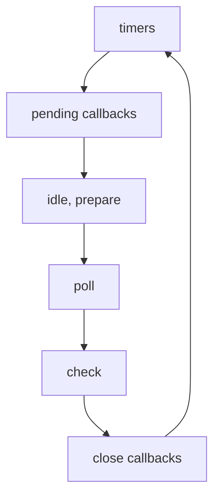

# CommonJS 模块

## 导入和导出

CommonJS 模块是为 Node.js 打包 JavaScript 代码的原始方式，在 Node.js 中每一个文件都被视为一个独立的模块。上下文提供了 `exports` 对象用于导出当前模块的方法或者变量，将方法挂载到 `exports` 对象即可导出定义的方法或者变量。在模块中还有一个 `module` 对象，表示的是模块自身，而 `exports` 是 `module` 的属性。

```javascript
exports.add = function(a, b){
	return a + b;
}
```

可以使用 `require()` 方法来导入一个模块：

```javascript
let math = require("math");
```

使用 `require()` 时，如果没有通过路径来指示一个文件（`/`、`../`、`./`），模块将尝试从核心模块，或者从 `node_modules` 文件夹加载。当文件夹作为一个模块时，`require()` 将会尝试加载文件夹根目录中 `package.json` 文件中 `main` 字段指定的文件，如果没有 `package.json` 文件或者没有 `main` 入口点，Node.js 将会尝试加载文件夹根目录中的 `index.js` 或者 `index.node` 文件。

如果 `require()` 指定的文件名没有查找到，Node.js 将会依次尝试加上  `.js`、`.json`、`.node` 文件扩展名来继续查找，`.json` 文件将会被解析为 JSON 文本文件，`.node` 文件会被解释为已经编译过的插件模块通过 `process.dlopen()` 来执行。

> [!NOTE]
>
> 若要查看 `require()` 加载的确切文件名，可以使用 `require.resolve()` 函数来查看。

## 模块包装器

在执行模块的代码之前，Node.js 将用一个看起来像如下的函数包装器包装它：

```javascript
(function(exports, require, module, __filename, __dirname) {
	// Module code actually lives in here
});
```

这样做之后实现了：

- 保证顶层变量（`var`、`const`、`let`）作用域到模块而不是全局对象。
- 提供一些实际特定于模块的全局变量，例如 `exports` 和 `require` 对象可以从模块导出值；`__filename` 和 `__dirname` 变量包含模块的绝对文件名和目录路径。

## 循环加载

当有循环的 `require()` 调用时，模块在返回时可能未完成执行。

::: code-group

```javascript [a.js]
console.log('a starting');
exports.done = false;
const b = require('./b.js');
console.log('in a, b.done = %j', b.done);
exports.done = true;
console.log('a done');
```

```javascript [b.js]
console.log('b starting');
exports.done = false;
const a = require('./a.js');
console.log('in b, a.done = %j', a.done);
exports.done = true;
console.log('b done');
```

```javascript [main.js]
// main starting
// a starting
// b starting
// in b, a.done = false
// b done
// in a, b.done = true
// a done
// in main, a.done = true, b.done = true
console.log('main starting');
const a = require('./a.js');
const b = require('./b.js');
console.log('in main, a.done = %j, b.done = %j', a.done, b.done);
```

:::

## 缓存

模块在第一次加载后可以被缓存，这意味着每次调用 `require()` 将会得到一个相同的对象，多次调用 `require()` 不会导致模块代码被执行多次。模块是基于它们被解析后的完整文件名进行缓存，由于模块可能根据调用模块的位置而解析到不同的文件，因此调用 `require()` 不保证将始终返回完全相同的对象。模块会被缓存到 `require.cache` 对象中，若要删除这个对象中已经缓存的模块，则下一次调用 `require()` 将会重新加载这个模块。

当通过 `require()` 加载模块时，Node.js 会先检查缓存，再检查内置模块，如果缓存中有一个与内置模块同名的模块，那么将返回缓存中的模块，只有显式的使用 `node:` 前缀来加载模块才会绕过缓存。

> [!WARNING]
>
> 对于大小写不敏感的文件系统或者操作系统，不同的被解析的文件名可以指向一个相同的文件，但是缓存仍然会将它们视为不同的模块并且将多次重新加载文件。例如 `require('./foo')` 和 `require('./Foo')` 将返回不同的对象，无论 `./foo` 和 `./Foo` 是否是同一个文件。

## 内置模块

Node.js 有几个模块被编译为二进制，这些被称为内置模块并且存储在 `lib/` 文件夹中。可以使用 `node:` 前缀识别内置模块，在这种情况下，它绕过了缓存。可以使用 `module.builtinModules` 属性来查看内置模块的列表：

```javascript
const builtin = require('node:module').builtinModules;
```

## 使用 `require()` 加载 ESM

当满足下面的条件时 `require()` 支持加载 ECMAScript 模块：

1. 模块代码全部都是同步的。
2. 满足下面条件之一：
   - 文件扩展名为 `.mjs`。
   - 文件扩展名为 `.js` 且最近的 `package.json` 文件 `type` 字段为 `module`。
   - 文件扩展名为 `.js` 且最近的 `package.json` 文件 `type` 字段不是 `commonjs`，且模块包含 ECMAScript 语法。

`require()` 加载 ESM 后将返回一个模块命名空间对象，默认导出将在放在 `.default` 属性中：

::: code-group


```javascript [distance.mjs]
export function distance(a, b) { 
  return Math.sqrt((b.x - a.x) ** 2 + (b.y - a.y) ** 2); 
}
```

```javascript [point.mjs]
export default class Point {
  constructor(x, y) { this.x = x; this.y = y; }
} 
```

```javascript [index.cjs]
const distance = require('./distance.mjs');
console.log(distance);
// [Module: null prototype] {
//   distance: [Function: distance]
// }

// 如果具有一个默认导出，返回的命名空间将包含一个 __esModule: true 属性
const point = require('./point.mjs');
console.log(point);
// [Module: null prototype] {
//   default: [class Point],
//   __esModule: true,
// }
```

:::

要自定义 `require(esm)` 应直接返回的内容，ES 模块可以使用 `module.exports` 导出所需值。当 ES 模块都包含了默认导出和具名导出，使用 `module.exports` 导出时，具名导出将不会被 CommonJS 使用，若要允许 CommonJS 访问具名导出，模块必须默认导出是一个对象且具名导出是其中的一个属性。

::: code-group

```javascript [point.mjs]
export default class Point {
  constructor(x, y) { this.x = x; this.y = y; }
}

// `distance` is lost to CommonJS consumers of this module, unless it's
// added to `Point` as a static property.
export function distance(a, b) { 
  return Math.sqrt((b.x - a.x) ** 2 + (b.y - a.y) ** 2);
}

export { Point as 'module.exports' }
```

```javascript [index.cjs]
const Point = require('./point.mjs');
console.log(Point); // [class Point]

// Named exports are lost when 'module.exports' is used
const { distance } = require('./point.mjs');
console.log(distance); // undefined
```

:::

::: code-group

```javascript [point.mjs]
export function distance(a, b) { return Math.sqrt((b.x - a.x) ** 2 + (b.y - a.y) ** 2); }

export default class Point {
  constructor(x, y) { this.x = x; this.y = y; }
  static distance = distance;
}

export { Point as 'module.exports' }
```

```javascript [index.cjs]
const Point = require('./point.mjs');
console.log(Point); // [class Point]

const { distance } = require('./point.mjs');
console.log(distance); // [Function: distance]
```

:::

# ECMAScription 模块

ESM 的设计思想是尽量的**静态化**，使得编译时就能确定模块的依赖关系，以及输入和输出的变量。ES6 的模块自动采用**严格模式**。模块功能主要由两个命令构成：`export` 和 `import`，`export` 命令用于规定模块的对外接口，`import` 命令用于输入其他模块提供的功能。`export`语句输出的接口，与其对应的值是动态绑定关系，即通过该接口，可以取到模块内部实时的值，这一点与 CommonJS 规范完全不同，CommonJS 模块输出的是值的缓存，不存在动态更新。

## 导入和导出

1. 具名导出

   导出先前声明的值：

   ```javascript
   const something = true;
   export { something };
   ```

   导出时重命名：

   ```javascript
   export { something as somethingElse };
   ```

   声明后立即导出值：

   ```javascript
   // var,let,const,class,function都是有效的
   export const something = true;
   ```

2. 默认导出

   导出单个值作为源模块的默认导出，仅当你的源模块只有一个导出时才推荐这种做法，尽管规范允许，但在同一个模块中混合默认和命名导出是不好的做法。

   ```javascript
   export default something;
   ```

使用 `export` 命令定义了模块的对外接口以后，其他 JS 文件就可以通过 `import` 命令加载这个模块。导入的值不能被重新分配，它们的行为类似于 `const` 声明。`import` 命令会被 JavaScript 引擎静态分析，先于模块内的其他语句执行。引擎处理 `import` 语句是在编译时，这时不会去分析或执行 `if` 语句，所以 `import` 语句放在 `if` 代码块之中毫无意义，因此会报句法错误，而不是执行时错误。也就是说，`import` 和 `export` 命令只能在模块的顶层，不能在代码块之中。

```javascript
// error
if (x === 2) {
  import something from './module.js';
}
```

`import` 命令具有提升效果，会提升到整个模块的头部，首先执行：

```javascript
// 不会报错，因为import命令是编译阶段执行的，在代码运行之前
foo();
import { foo } from 'my_module';
```

1. 具名导入

   ```javascript
   // 使用源模块中的原始名称进行导入
   import { something } from './module.js';
   // 从源模块导入特定项目，并在导入时分配自定义名称
   import { something as somethingElse } from './module.js';
   ```

2. 命名空间导入

   ```javascript
   // 将源模块中的所有内容作为一个对象导入，如果存在默认导出，则可以通过 module.default 访问它
   import * as module from './module.js';
   ```

3. 默认导入

   ```javascript
   // 导入源模块的 default export
   import something from './module.js';
   ```

4. 无命名导入

   ```javascript
   // 加载模块代码，但不要使任何新对象可用
   import './module.js';
   ```

5. 动态导入

   `import()` 表示式返回一个 `Promise` 对象。`import()` 类似于的 `require()` 方法，区别主要是前者是异步加载，后者是同步加载。在 CommonJS 和 ES 模块中都支持，在 CommonJS 模块中，它可用于加载 ES 模块。

   ```javascript
   // 使用动态导入API导入模块
   import('./modules.js').then(({ default: DefaultExport, NamedExport }) => {
   	// do something...
   });
   ```

## `import` 说明符和属性

`import` 语句的说明符是 `from` 后面的关键字，同样也用作 `export from` 语句以及 `import()` 表达式的参数。说明符有三种类型：

- 相对说明符，例如 `./startup.js`。
- 绝对说明符，例如 `file:///opt/nodejs/config.js`
- 基本说明符，例如 `some-package` 或者 `some-package/shuffle`，通过 `node_modules` 目录查找，可以通过包名来引用包的主要入口点。

> [!NOTE]
>
> 当使用 `import` 关键字解析相对或绝对说明符时，必须提供文件扩展名。基本说明符会通过 Node.js 模块解析和加载算法处理，其他的说明符仅通过标准相对 URL 解析。

`import` 属性是模块导入语句的内联语法，以便将更多信息与模块说明符一起传递。

```javascript
import fooData from './foo.json' with { type: 'json' };

const { default: barData } = await import('./bar.json', { with: { type: 'json' } });
```

> [!NOTE]
>
> JSON 文件可以被 `import` 引用，这时候 JSON 会被暴露为默认导出，当被导入时，一个缓存条目会在 CommonJS 缓存中创建以避免重复。如果 JSON 模块已经从同一路径导入，则会在 CommonJS 中返回相同的对象。

ES 模块被解析且被缓存为 URL，这意味着特殊字符必须是百分比编码的，例如 `#` 被编译为 `%23`， `?` 被编译为 `%3F`。Node.js 支持三种类型的 URL 方案：

- `file:`

  如果用于解析它们的导入说明符具有不同的查询或片段，则模块将多次加载。

  ```javascript
  import './foo.mjs?query=1'; // loads ./foo.mjs with query of "?query=1"
  import './foo.mjs?query=2'; // loads ./foo.mjs with query of "?query=2"
  ```

- `data:`

  支持导入以下 MIME 类型：

  - `text/javascript` for ES modules
  - `application/json` for JSON
  - `application/wasm` for Wasm

  ```javascript
  import 'data:text/javascript,console.log("hello!");';
  import _ from 'data:application/json,"world!"' with { type: 'json' };
  ```

- `node:`

  加载 Node.js 内置模块。

  ```javascript
  import fs from 'node:fs/promises';
  ```

## `import.meta`

这个属性是包含以下属性的对象，它仅在ES模块中支持：

- `import.meta.dirname`

  当前模块的目录名称。

- `import.meta.filename`

  当前模块的完整绝对路径和文件名。

- `import.meta.url`

  模块的 URL（绝对路径 `file:`）。

- `import.meta.main`

  当前模块是当前进程的入口点时为 `true`，否则为 `false`。

- `import.meta.resolve(specifier)`

  `specifier` 表示相对于当前模块的说明符，返回值为说明符将解析到的绝对 URL 字符串。

  ```javascript
  const dependencyAsset = import.meta.resolve('component-lib/asset.css');
  // file:///app/node_modules/component-lib/asset.css
  import.meta.resolve('./dep.js');
  // file:///app/dep.js
  ```

## 使用 `import` 加载 CommonJS 模块

从 ECMAScript 模块导入 CommonJS 时，构造了 CommonJS 模块的命名空间包装器，包装器提供一个默认导出指向 CommonJS 的 `module.exports` 值。

::: code-group

```javascript [cjs.cjs]
exports.name = 'exported';
```

```javascript [index.mjs]
import { name } from './cjs.cjs';
console.log(name); // Prints: 'exported'

import { default as cjs } from './cjs.cjs';
// Identical to the above
import cjs from './cjs.cjs';
console.log(cjs); // Prints: { name: 'exported' }

import * as m from './cjs.cjs';
console.log(m);
// Prints:
//   [Module] {
//     default: { name: 'exported' },
//     'module.exports': { name: 'exported' },
//     name: 'exported'
//   }
```

:::

# 确定模块系统

Node.js 将传递给 `node` 命令作为初始输入，或在被 `import` 语句或 `import()` 表达式引用时，将以下内容视为 ES Modules：

- 文件扩展名为 `.mjs`。
- 文件扩展名为 `.js` 且最近的父级 `package.json` 文件 `type` 字段为 `module`。
- 使用 `--input-type=modul`，字符串作为参数传入 `--eavl` 或 `--print`，或通过 STDIN 管道到 `node`。

Node.js 将传递给 `node` 命令作为初始输入，或在被 `import` 语句或 `import()` 表达式引用时，将以下内容视为 CommonJS：

- 文件扩展名为 `.cjs`。
- 文件扩展名为 `.js` 且最近的父级 `package.json` 文件 `type` 字段为 `commonjs`。
- 使用 `--input-type=commonjs`，字符串作为参数传入 `--eavl` 或 `--print`，或通过 STDIN 管道到 `node`。
- 文件扩展名为 `.js` 或者没有扩展名，且最近的父级 `package.json` 文件不包含 `type` 字段或者在任何父文件夹中都没有 `package.json`，并且代码可以被评估为 CommonJS。换句话说，Node.js 将首先尝试用 CommonJS 来运行这样的模糊文件，如果解析失败将会使用 ES Modules 来解析。

> [!WARNING]
>
> 在模糊文件中编写 ES module 语法会产生性能成本，因此编写代码时要尽可能明确模块。例如在 `package.json` 文件中明确 `type` 字段。

# 包入口点

在包的 `package.json` 文件中，`main` 和 `exports` 字段都可以定义一个包的入口点，这两个字段都适用于 ES 模块和 CommonJS 模块入口点。`main` 字段在所有版本的 Node.js 中都支持，但它只定义了包的主要入口点，而 `exports` 字段提供了一种代替 `main` 字段的现代方案，允许定义多个入口点。如果 `exports` 和 `main` 都被定义，则 `exports` 将会优先于 `main`。

编写新包时，建议使用 `exports` 字段，当定义 `exports` 后，所有包的子路径都会被封装，不能够被导入使用。例如使用 `require('pkg/subpath.js')` 会抛出一个 `ERR_PACKAGE_PATH_NOT_EXPORTED` 错误。

```json
{
  "exports": "./index.js"
}
```

使用 `exports` 字段时，可以通过将主入口点定义为 `.` 路径，与主入口点一起定义自定义子路径：

```json
{
  "exports": {
    ".": "./index.js",
    "./submodule.js": "./src/submodule.js"
  }
}
```

```javascript
// Loads ./node_modules/es-module-package/src/submodule.js
import submodule from 'es-module-package/submodule.js';
```

**条件导出**提供了一种根据特定条件映射到不同路径的方法。例如当一个包同时提供了两种不同模块的导出：

```json
{
  "exports": {
    "import": "./index-module.js",
    "require": "./index-require.cjs"
  }
}
```

条件导出也可以扩展到次级路径，例如：

```json
{
  "exports": {
    ".": "./index.js",
    "./feature.js": {
      "node": "./feature-node.js",
      "default": "./feature.js"
    }
  }
}
```

> [!NOTE]
>
> 更多有关条件导出的内容，请看[这里](https://nodejs.org/docs/latest/api/packages.html#conditional-exports)。

# 事件循环

Node.js 的执行模型称为**事件循环**，在进程启动时，Node.js 会初始化一个事件循环，处理提供的输入脚本，该脚本可以进行异步 API 调用、调度计时器或调用 `process.nextTick()`，然后开始处理事件循环。每执行一次循环体的过程称为 Tick。每个 Tick 的过程就是查看是否有事件待处理，如果有就取出事件及其相关的回调函数，如果存在关联的回调函数就执行它们，然后进入下个循环，如果没有事件处理，就退出进程。



每个阶段都有一个需要执行的回调的 FIFO 队列。在每个事件循环期间，Node.js 会检查是否在等待任何异步 I/O 或计时器，如果没有，则会干净地关闭。

- timers

  这个阶段执行 `setTimeout()` 和 `setInterval()` 的回调。计时器指定了回调函数可以执行的阈值时间，而不是希望执行它的确切时间，回调函数会在指定的时间过后尽早运行。操作系统的调度或者其他回调函数可能会延迟计时器回调函数的执行。

- pending callbacks

  这个阶段会执行一些来自操作系统的回调，例如 TCP 错误。

- idle, prepare

  仅供 Node.js 内部使用，不执行用户代码。

- poll

  这个阶段会计算应该阻塞和轮询 I/O 多长时间，然后会处理 poll 队列中的事件。当事件循环进入 poll 阶段时，如果 poll 队列不为空，事件循环将迭代其回调队列，同步执行它们，直到队列用尽或达到系统依赖的硬限制；如果 poll 队列为空，当脚本有 `setImmediate()` 安排，则事件循环将结束轮询，并继续进入 check 阶段以执行这些计划的脚本，当脚本没有 `setImmediate()` 执行的安排，事件循环将等待回调添加到队列中，然后立即执行它们。

  一旦轮询队列为空，事件循环将检查已达到时间阈值的计时器。如果一个或多个计时器已准备就绪，事件循环将返回计时器阶段，以执行这些计时器的回调。

- check

  执行 `setImmediate()` 的回调。这个阶段允许事件循环在 poll 阶段完成后立即执行回调。如果 poll 阶段变得闲置，并且脚本使用了 `setImmediate()` ，则事件循环可能会继续到检查阶段，而不是等待。

- close callbacks

  这个阶段专门用于执行与资源关闭相关的回调函数。这个阶段处理那些在资源（如socket、文件描述符等）完全关闭后需要执行的回调。

## 在事件循环中调度任务

除了 Promise 之外，Node.js 还提供了其他几个机制，用于在事件循环中安排任务：

- `queueMicrotask()`

  用于安排微任务，这是一个轻量级任务，在当前执行的脚本之后运行，但在任何其他 I/O 事件或计时器之前运行。微任务包括 Promise 和其他优先于常规任务的异步操作等任务。

  ```javascript
  queueMicrotask(() => {
    console.log('Microtask is executed');
  });
  
  console.log('Synchronous task is executed');
  ```

- `process.nextTick()`

  用于安排在当前**操作**完成后立即执行回调，这对于您想要确保尽快执行回调，但仍在当前执行上下文之后的情况很有用。`process.nextTick()` 在技术上不是事件循环的一部分，nextTickQueue 将在当前**操作**完成后处理，无论事件循环的当前阶段如何（这里的操作被定义为从底层 C/C++ 处理程序过渡，并处理需要执行的 JavaScript）。

- `setImmediate()`

  用于安排在事件循环的 check 阶段执行回调。

  ```javascript
  // process.nextTick 的回调函数优先执行
  process.nextTick(() => {
    console.log('process.nextTick callback executed.');
  });
  setImmediate(() => {
    console.log('setImmediate callback executed.');
  });
  ```

- `setTimeout()` 和 `setInterval()` 

  这两个函数与浏览器中的 API 是一致的，分别用于单次和多次定时执行任务。它们的实现原理与异步 I/O 比较类似，只是不需要 I/O 线程池的参与，它们创建的定时器会被插入到定时器观察者内部的一个红黑树中，每次执行 Tick 时会从该红黑树中迭代取出定时器对象，检查是否超过定时时间，如果超过就形成一个事件，然后对应的回调函数将立即执行。

  > [!WARNING]
  >
  > 定时器并非是精准的，如果某一次循环占用的时间比较多那么下一次循环时也许超时了很久。

# I/O

多线程的代价在于创建线程和执行期线程上下文切换开销较大，但是多线程在多核 CPU 上能够有效提升 CPU 的利用率。单线程顺序执行任务的方式易于表达，但是缺点在于性能。通常 I/O 和 CPU 计算之间是可以并行执行的，但是同步模型的问题 I/O 会让后续任务等待，导致资源不能更好的利用。Node.js 使用了单线程和异步 I/O，利用单线程避免多线程死锁、状态同步的问题。

## 阻塞 I/O 和非阻塞 I/O

操作系统内核对于 I/O 只有两种方式：阻塞和非阻塞。在调用阻塞 I/O 后一定要等到系统内核层面完成所有操作后调用才结束，例如读取磁盘文件，系统内核在完成磁盘寻道、读取数据、复制数据到内存中之后这个调用才结束。阻塞 I/O 造成 CPU 等待 I/O，CPU 的处理能力得不到充分利用，为了提高性能，内核提供了非阻塞 I/O，调用后会立即返回。

非阻塞 I/O 也存在一些问题，由于完整的 I/O 并没有完成，立即返回的并不是业务层期望的数据，而仅仅是当前调用的状态，为了获取完整的数据，应用程序需要重复调用 I/O 操作来确认数据是否完成，这种重复调用判断操作是否完成的技术叫做**轮询**，例如 read、select、epoll。

## Node.js 的异步 I/O

理想情况下的异步 I/O 是应用程序发起非阻塞调用，无需通过轮询的方式，可以直接处理下一个任务，只需要在 I/O 完成后通过信号或者回调将数据传递给应用程序即可。

 在 Linux/Unix 平台下，Node.js 使用了线程池来完成异步 I/O，而在 Windows 平台下则采用了 IOCP 实现了异步 I/O。由于不同平台的差异，Node.js 提供了 libuv 作为抽象封装层，使得所有平台兼容性判断都是由这一层来完成，保证了上层的 Node.js 与下层的实现之间相互独立。

 对于一般的函数，由开发者自行调用，而对于 Node.js 中的异步 I/O 调用而言，回调函数不是由开发者来调用，从发起调用到内核执行完成 I/O 操作的过渡过程中，存在一种中间产物叫做**请求对象**。JavaScript 调用 Node.js 的 C++ 核心模块，并创建了一个请求对象，其中包含了 JavaScript 层传入的参数和回调函数，然后将这个请求对象传递给 libuv 层，libuv 接收这个请求，并将其放入一个工作队列，如果线程池有空闲线程，则唤醒一个线程来处理这个 I/O 请求。此时，Node.js 的主线程就可以继续处理其他 JavaScript 任务了，实现了异步。在工作线程完成 I/O 后会通知 libuv，然后会将之前创建的请求对象标记已完成并填充结果，放在一个完成队列中，事件循环会在 poll 阶段检查这个队列。

